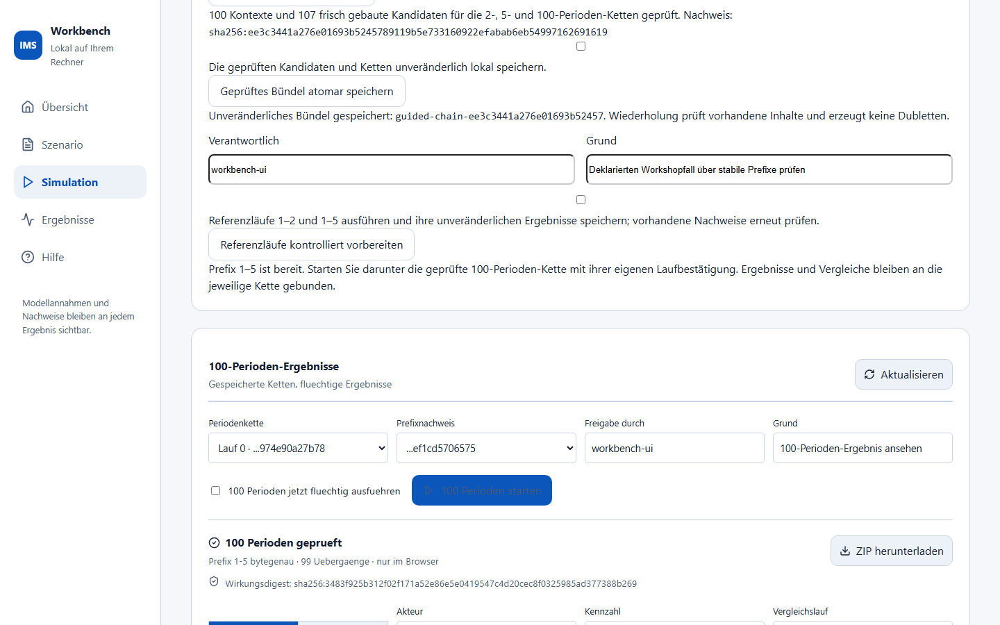
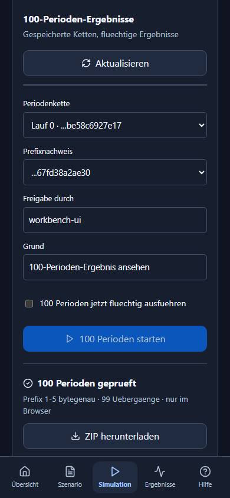
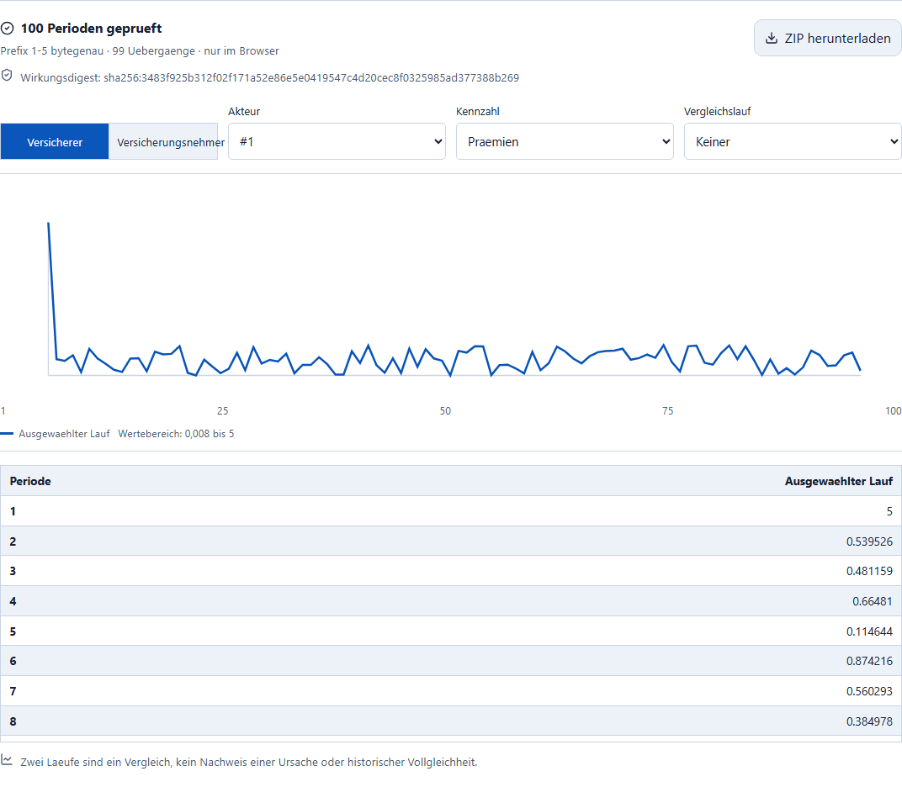

# Einen 100-Perioden-Fall selbst aufbauen

Öffnen Sie **Simulation → 100-Perioden-Lauf**.

1. Geben Sie einen Seed an und erzeugen Sie 100 vollständige Kontexte.
   Laufindex 0 ist die aktuelle freigegebene Grenze des gemeinsamen Prefixwegs.
2. Prüfen Sie die sichtbare Herkunft. Im Expertenmodus können Sie alle
   Periodenprofile, Schocks, Zufallswerte, Zuweisungen und Übergänge bearbeiten.
3. **Alle Periodenkontexte prüfen** baut jeden Kandidaten frisch. Eine falsche
   späte Periode verhindert das gesamte Bündel, ohne Teilkette oder Lauf.
4. Bestätigen Sie die unveränderliche lokale Speicherung und speichern Sie
   atomar. Erneutes Speichern erzeugt keine Dubletten; beschädigte vorhandene
   Inhalte werden als Fehler gemeldet.
5. Geben Sie Verantwortlichen und Grund an. Bestätigen Sie die Referenzläufe
   1–2 und 1–5 und bereiten Sie sie kontrolliert vor. Vorhandene Nachweise werden
   erneut geprüft.
6. Wählen Sie darunter die passende 100er-Kette und den zugehörigen Prefix.
   Bestätigen Sie ausdrücklich den flüchtigen 100-Perioden-Lauf und starten Sie.
7. Filtern Sie Akteur/Kennzahl und speichern Sie das ZIP des sichtbaren
   Ergebnisses. Die 100 Zeilen und der Wirkungsdigest gehören zu dieser Kette.

Die Aufnahme zeigt einen gespeicherten neuen Fall und den nach echtem Lauf
geprüften bytegleichen Prefix 1–5. Erzeugung allein hätte diesen Nachweis nicht
geliefert; der ZIP-Export ist an das darunter angezeigte Ergebnis gebunden.

Die historische Kennzahl „Prämien“ zeigt hier VU-Regelziele. Ihr Verlauf ist
noch keine gebuchte Gesamtprämieneinnahme der modernen Spartenbilanz. Deshalb
bleiben Preis-/Expositions-/Abrechnungsannahmen eine eigene fachliche Grundlage
für die folgende Strategiekopplung.

Für eine Variante bearbeiten Sie Kontexte ab Periode 6, prüfen/speichern das
neue Bündel und führen es mit demselben unveränderten Prefix aus. Zwei bereits
berechnete Läufe mit demselben Prefixnachweis können verglichen werden. Der
Vergleich beweist weder historische Vollgleichheit noch eine Kausalität allein
aus unterschiedlichen Kennzahlen. Änderungen des Expertenentwurfs entwerten
seine Bau-/Speicherfreigaben; früher gespeicherte Ketten bleiben nachvollziehbar.

Die zwei anonymen historischen Positionen sind keine automatisch identifizierten
Kfz-/Sach-Sparten. Mehrere historische Laufindizes benötigen einen zusätzlichen
Zeitvertrag. Die gemeinsame moderne Vier-Sparten-Rechnung ist ein eigener
AP3-Meilenstein.
