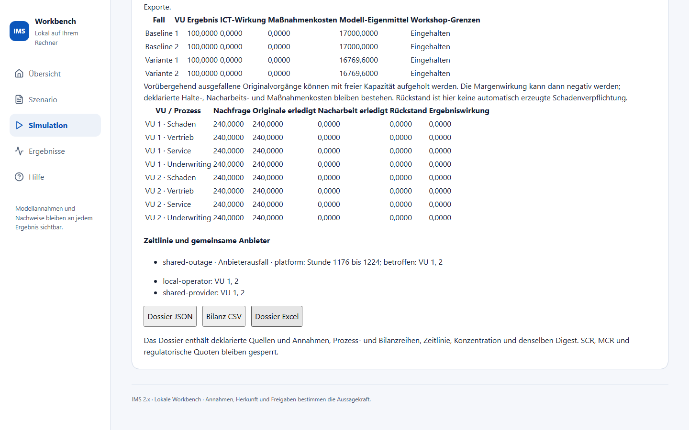
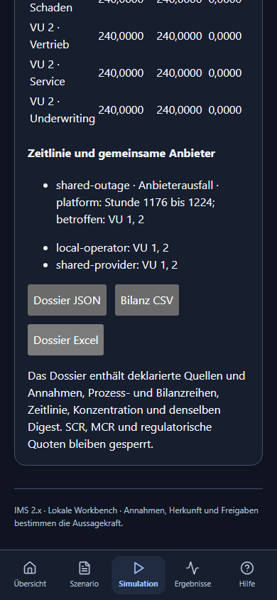

# ICT-Wirkung in der Workbench

Unter **Simulation → ICT-Wirkung** liegt ein ausdrücklich deklarierter
100-Perioden-Workshopfall mit zwei VUs und einem gemeinsamen Anbieter.

1. Prüfen Sie Periodenzahl und Stunden je Periode. Die Dauer der historischen
   IMS-Periode ist nicht als reale Stundenlänge belegt.
2. Wählen Sie Ereignis und Ziel. Beginn und Dauer werden in Stunden ab 0
   eingegeben. Teilkapazität und Datenintegrität haben getrennte Wirkungen.
3. Wählen Sie bei Bedarf Prävention, Wiederanlauf oder Fallback. Prüfen Sie
   Asset, Aktivierungsfenster, Wirksamkeit und Kosten der sichtbaren Beispielwerte.
4. Unter **Prozessannahmen und Herkunft** bearbeiten Sie Nachfrage, Kapazität,
   Marge, Rückstand und Kosten. Der Expertenmodus erlaubt den vollständigen
   Quellenvertrag; übernehmen Sie ihn erst nach erfolgreicher Prüfung.
5. **Baseline und ICT-Variante berechnen** erzeugt beide Rechnungen. Fehler
   liefern keine Teilresultate. Wählen Sie eine Ergebnisperiode und vergleichen
   Sie Ergebnis, Rückstand, Maßnahmenkosten und Eigenmittel-Proxy.
6. Speichern Sie **Dossier JSON**, **Bilanz CSV** oder **Dossier Excel**. Die
   Downloads enthalten denselben Ergebnisnachweis. Jede Eingabeänderung
   entwertet das vorherige Ergebnis und verlangt eine neue Rechnung.

Gemeinsame Ausfälle wirken auf alle abhängigen Assets. Ein lokaler Fallback
hilft seinem Asset, nicht automatisch allen VUs. Rückstände können später mit
freier Kapazität aufgeholt werden; Nacharbeit erzeugt keine zusätzliche Marge.
Halte-, Nacharbeits- und Maßnahmenkosten bleiben sichtbar.

Die angezeigten Workshop-Grenzen sind selbst gesetzte Grenzen. Die Rechnung
liefert keine regulatorischen SCR/MCR-Werte, DORA-Konformität oder historische
Marktgleichheit. Die automatische Vier-Sparten-Kopplung gehört zu späteren
AP3-Meilensteinen und ist hier noch nicht abgenommen.

Tatsächliche Browseransichten der geprüften Rechnung:

