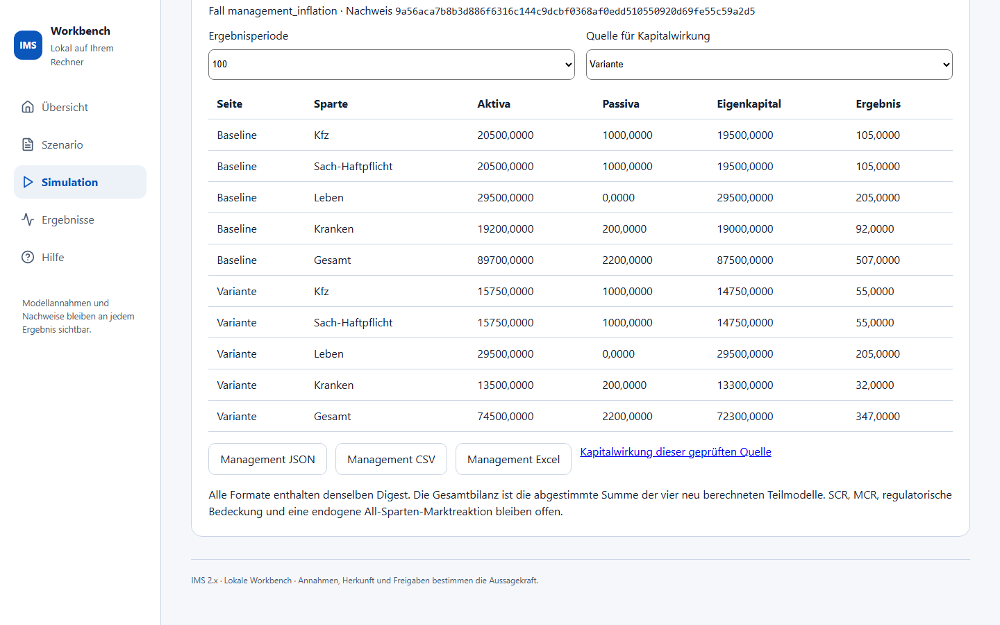
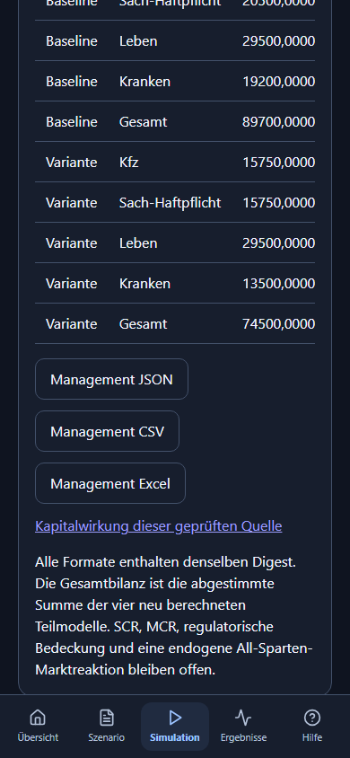

# Vier Sparten über 100 Perioden vergleichen

Öffnen Sie **Simulation → 100er-Gesamtbilanz**.

1. Wählen Sie den deklarierten Fall, einen Horizont und eine VU-ID.
2. **Gemeinsame Quellen erzeugen** stellt vollständige Eingaben für Baseline
   und Variante bereit. Lesen Sie die Annahme zur Zusammengehörigkeit.
3. Bestätigen Sie ausdrücklich, dass diese Quellen wirtschaftlich gemeinsam
   betrachtet werden sollen. **Vier Sparten gemeinsam berechnen** prüft beide
   Seiten vollständig; ein Fehler gibt keine Teilbilanz frei.
4. Wählen Sie die Ergebnisperiode. Die Tabelle zeigt für beide Seiten die vier
   Sparten und ihre Gesamtbilanz mit Aktiva, Verpflichtungen, Eigenkapital und
   Periodenergebnis. In der Baseline beträgt das Eigenkapital nach Periode 100
   **87.500,0000 Modellwährung**.
5. Speichern Sie JSON, CSV oder Excel. Der angezeigte Inhaltsnachweis gehört
   auch zu den exportierten Zahlen. JSON und Excel enthalten die vollständigen
   Quellen. Geänderte Eingaben benötigen eine neue Rechnung.
6. Wählen Sie die Quelle für Kapitalwirkung und öffnen Sie den gleichnamigen
   Link. Wählen Sie dort dieselbe Modellperiode und bestätigen Sie die
   Modellannahmen. Die Kapitalwirkung verwendet genau die geprüfte Seite;
   regulatorische Kennzahlen bleiben gesperrt.

Die Kostenvariante endet hier mit 72.300,0000 Modell-Eigenkapital. Der niedrigere
Periodenertrag trägt sich ab Periode 6 fort; Leben bleibt in diesem Fall gleich.
Die Aufnahme zeigt die tatsächliche Rechnung und ihren Inhaltsnachweis.

Auf schmalen Ansichten lässt sich die beschriftete Tabelle innerhalb ihres
Bereichs seitlich bewegen; die gesamte Seite bleibt innerhalb der Bildschirmbreite.

Die Vorlagen ändern Schaden-/Leistungskosten, Prämieneingänge oder Anlageerträge
erst ab Periode 6. Die ersten fünf Perioden bilden einen gemeinsamen Anfang.
Die Fälle zeigen einen deklarierten Eingabevergleich; sie führen noch keine
Katalogstrategie aus. Modellwährung, Bestand und Anfangsbilanzen sind
Workshopannahmen, keine historischen Unternehmensdaten.

Im Expertenmodus können Sie den vollständigen Quellenvertrag bearbeiten.
Jede Änderung entwertet die bisherigen Ergebnisse. Bestätigen Sie erneut die
wirtschaftliche Zusammengehörigkeit und wählen Sie **Geänderte Quellen prüfen
und neu binden**. Nach erfolgreicher Prüfung ist für die neue Rechnung eine
weitere ausdrückliche Bestätigung nötig. VU-, Szenario- und Variantenidentitäten
werden dabei nicht still korrigiert. Ein Fehler muss in der Eingabe behoben werden.

Die Gesamtbilanz ist die abgestimmte Summe der neu berechneten Teilmodelle.
Sie belegt keine vollständig gekoppelte Marktreaktion, historische
Spartenidentität, gesetzliche Bilanz oder aufsichtsrechtliche Kapitaldeckung.
