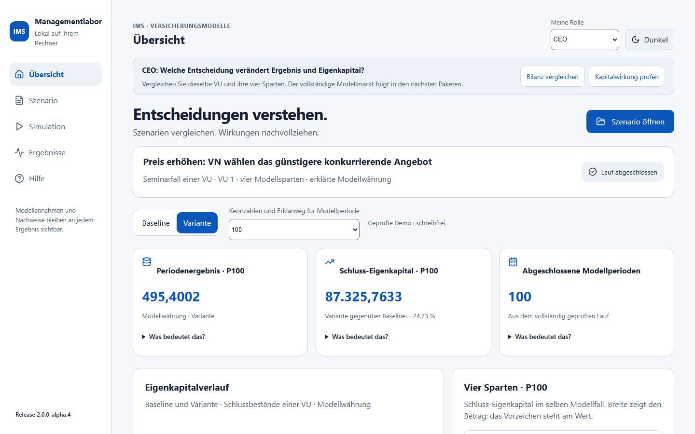
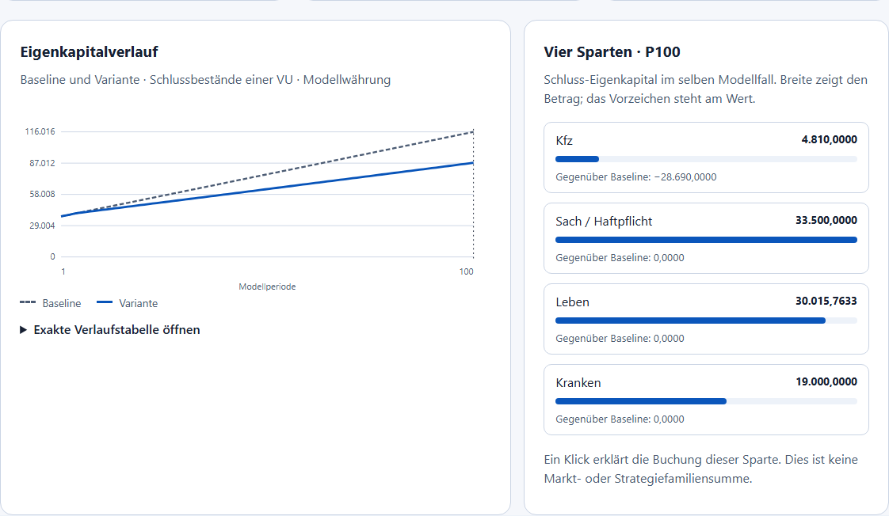
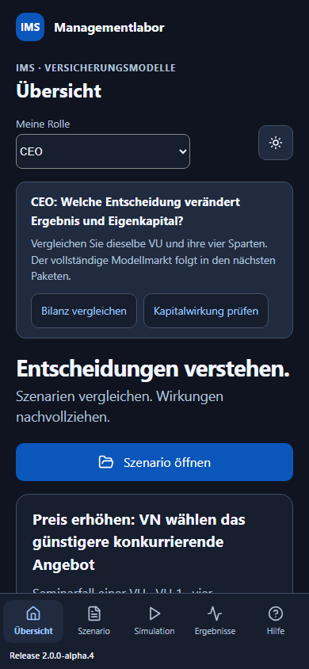

# IMS Managementlabor – Einsteigen und Entscheidungen verstehen

Anleitung für AP4, Produktfassung **2.0.0-alpha.4**. Sie können ohne Quellcode,
JSON-Datei oder eigene Installation von Python beginnen. Die vorbereiteten
Fälle sind erklärte, unkalibrierte Seminarannahmen. IMS zeigt die tatsächlich
berechneten Werte dieser Sitzung; eine Rolle ist eine andere Sicht auf denselben
Fall und kein Benutzerrecht.

## Der erste Start

Starten Sie IMS Workbench über das Windows-Startmenü. Unten links steht die
Release-Nummer. Sie muss mit Ihrem Installer und der Anwendung übereinstimmen.
Eine Meldung über unterschiedliche Versionen bedeutet: IMS neu starten und
die Browserseite neu laden. Mit der Hauptnavigation kommen Sie immer zu
Übersicht, Markt und Strategien, Fallablage, Modellwerkzeuge, Ergebnisse und Hilfe zurück.

Die **Übersicht** ist der direkte Einstieg in die vorhandenen Seminarfälle.
**Szenario** verwaltet lokale Metadaten; ein Metadatensatz führt noch keine
Rechnung aus. **Simulation** enthält die einzelnen Modellpfade und das
Managementseminar. **Ergebnisse** zeigt ihre geprüften Ergebnisse. Unter
**Hilfe** erreichen Sie diese Anleitung auch ohne Internet.

## Eine Übung mit dem Ziel von 15 Minuten

15 Minuten sind ein Ziel für den Einstieg, keine gemessene Benutzer- oder
Rechenzeit. Bei der späteren Benutzerabnahme werden tatsächliche Dauer und
offene Verständnisfragen getrennt erfasst.

1. Wählen Sie oben **Meine Rolle → CEO**. Öffnen Sie unter **Szenario öffnen**
   die Demo **Preis und Anbieterwechsel**. Warten Sie auf **Lauf abgeschlossen**.
   Alle Quellen werden frisch geprüft und gerechnet; die Demo speichert keine
   neuen Ergebnis- oder Kandidatendaten in der Datenbank.
2. Vergleichen Sie **Baseline** und **Variante**. Für P100 hat die Variante
   Schluss-Eigenkapital 87.325,7633; die Baseline 116.015,7633 Modellwährung.
   Die Modellwährung ist nicht ohne Umrechnung Euro.
3. Wählen Sie **Übersichtsperiode → 6**. Die ersten fünf Perioden sind gleich.
   Ab P6 wirkt die geänderte Preis-/Werbestrategie. Ein Diagramm zeigt immer
   den vollständigen geprüften Lauf; Kennzahlen und Erklärung beziehen sich
   auf die ausdrücklich ausgewählte Periode.
4. Klicken Sie auf **Kfz erklären** oder öffnen Sie bei einer Kennzahl
   **Was bedeutet das? → Warum verändert sich …?**. Lesen Sie Eingabe,
   ausgeführte Regel, Kundenentscheidung, Buchung und Bilanz in dieser Reihenfolge.
5. Wechseln Sie zu **CSO Vertrieb**. Ergebnis und Eingaben bleiben erhalten;
   der Wechsel startet keinen neuen Lauf. Erklären Sie einer anderen Person,
   warum ein höheres Preisziel hier keine höhere eigene Prämieneinnahme bewirkt.
6. Wählen Sie wieder P100. Prüfen Sie −302 × 95 = −28.690 anhand der gebuchten
   Ergebnisdifferenzen. Öffnen Sie die exakte Verlaufstabelle und vergleichen
   Sie deren letzte Zeile mit den Kennzahlen.
7. Öffnen Sie **Managementseminar öffnen**. Dort können Sie die Einzel-VU-
   Ergebnisse als JSON, CSV oder Excel herunterladen. Zurück zur Übersicht
   bleiben Ergebnis, gewählte Rolle und Vergleichsansicht erhalten.

## Die drei vorhandenen Demos

| Demo | Was ist vorgegeben? | Was unterscheidet die Variante? | Erste Frage |
| --- | --- | --- | --- |
| Preis und Anbieterwechsel | Zwei benannte Kfz-Kundengruppen mit je 50 Expositionen, Preisangebot VU1 3,00 und VU2 3,20. | Ab P6 eigenes Preisziel 3,60 und Werbung 2,00 je Periode. | Weshalb wechseln die Kunden und welche Prämie bleibt bei VU1? |
| Kosten und Beitragsreaktion | Erklärte höhere Schaden-/Leistungskosten ab P6 in beiden Vergleichsseiten. | Begrenzte Nichtleben- und Kranken-Beitragsreaktion. | Was stammt aus dem Kostenschock, was aus der Entscheidung? |
| Lebens-Anlageentscheidung | Garantien und Altbestand bleiben erhalten. Baseline-Anlagesatz 0,0005. | Ab P6 Satz 0,001 auf die tatsächlichen Anfangsaktiva. | Wie verstärkt die Fortschreibung die spätere Wirkung? |

Die vollständigen Quellen liegen lokal im Installer. Jede Demo ist zunächst
schreibfrei. Im Managementseminar können Sie **Als bearbeitbare Sitzung
übernehmen** wählen. Änderungen entwerten Ergebnis, abhängige Quellen und
Bestätigungen. Übernehmen Sie einen Parameterentwurf, erklären Sie die
Annahmen über die vorhandene Checkbox und rechnen Sie den vollständigen Fall
neu. Der Expertenmodus ist für diese ersten Schritte nicht nötig.

Die neuen Demos zu Google/Kfz, Lebens-Nachfrage, hypothetischem DORA 2.0 und
gemeinsamem US-Hyperscaler-Ausfall sind spätere AP7-Lieferungen. Der deutsche
40er-Modellmarkt ist ebenfalls ein Folgepaket. Die aktuelle Übersicht heißt
deshalb ausdrücklich **Seminarfall einer VU**.

## Vier Rollen auf denselben Fall

| Rolle | Einstiegsfrage | Verfügbarer Weg in AP4 |
| --- | --- | --- |
| CEO | Welche Entscheidung verändert Ergebnis und Eigenkapital? | Übersicht, vier Sparten, Erklärweg und gesonderte Kapitalwirkung. |
| CIO | Welche technische Abhängigkeit gefährdet das Geschäft? | DORA / ICT verstehen öffnet den bestehenden gesonderten ICT-Workshop. |
| COO | Wie entstehen Rückstand, Nacharbeit und Wiederanlauf? | Prozesse und Rückstand öffnet denselben vorhandenen Prozesspfad. |
| CSO Vertrieb | Warum wählen Kunden ein anderes Angebot? | Preis-/Kundengruppe, gedeckte Menge, Prämie und bearbeitbare Strategie. |

Die Persona ordnet Fragen und nächste Schritte. Sie ersetzt keine explizite
Bestätigung, Speicherung oder Ausführungsfreigabe. Sie verändert keinen
Parameter und keinen Inhaltsnachweis. Andere Modellfälle und alle fünf
Grundbereiche bleiben zugänglich.

**DORA finden:** Meine Rolle → CIO → **DORA / ICT verstehen**. Im ICT-Workshop
rechnen Sie Baseline und ICT-Variante über den vorhandenen Button. Anbieter,
Ausfall, Rückstand, Wiederanlauf und Maßnahmen sind deklarierte Workshopgrößen.
Die ICT-Rechnung ist ein eigener Pfad; ihre Verluste stecken nicht schon in
der Seminarbilanz. Der spätere gekoppelte Drei-VU-DORA-Fall ist noch nicht
implementiert. Es wird keine DORA-Konformität oder Benchmark-Kalibrierung behauptet.

## Drei verschiedene Arten von Werten

| Wert | Bedeutung | Vergleich |
| --- | --- | --- |
| Periodenergebnis | Ergebnis dieser einen Modellperiode. | Variante minus Baseline in derselben Periode. |
| Schluss-Eigenkapital | Bestand am Ende der ausgewählten Periode: Aktiva minus Passiva. | Gleiche VU, gleicher Anfang, gleiche Periode. Die Prozentdifferenz nutzt den Betrag der Baseline als Nenner. Bei Baseline 0 ist sie nicht definiert. |
| Kumulierte gezeigte Flüsse | Gebuchte Prämien/Beiträge, Werbung und Lebens-Anlageertrag von P1 bis zur Auswahl, separat addiert. | Einzelne Flüsse; keine vollständige Ergebnis- oder Kapitalrechnung. Andere Kosten, Schäden und Kapitalbewegungen fehlen in dieser kleinen Flussauswahl. |

**Abgeschlossene Modellperioden** stammt aus dem erfolgreichen tatsächlichen
Lauf. Wenn Sie P6 betrachten, bleibt ein abgeschlossener 100er-Lauf trotzdem
100 Perioden lang. Die Verlaufstabelle enthält seine echten Zeilen. Eine
Modellperiode ist nicht automatisch ein Tag oder ein Versicherungsjahr.
ICT kann dagegen eine ausdrücklich deklarierte Stundenabbildung besitzen.

Die Spartenbalken zeigen den Betrag des Schluss-Eigenkapitals; das Vorzeichen
steht am Zahlenwert. Klicken Sie auf eine Sparte, um ihre Buchung zu erklären.
Sie sehen eine Unternehmensbilanz, keine Marktsumme oder Strategiefamilie.

## Den Preisfall selbst nachrechnen

Im kontrollierten Fall sind die VU-Ziehungen 0,5. Für das eigene Kfz-Angebot
liefert der gültige Preisfaktor 7,2 das Ziel 3,60. Das konkurrierende Angebot
3,20 ist günstiger. Die benannten Kunden wählen mit der vorhandenen Regel
Beste Information VU2. Die gedeckte Exposition bei der bilanzierten VU1 ist
dann 0, obwohl die Gruppen weiterhin je 50 Expositionen repräsentieren.

Baseline: 3,00 × 100 = 300,00 eigene Prämie. Variante: 3,60 × 0 = 0,00 eigene
Prämie, zusätzlich 2,00 Werbeaufwand. Ergebnisdifferenz je veränderter Periode:
−300 − 2 = −302. Von P6 bis P100 sind es einschließlich der Grenzen 95
Perioden, daher −302 × 95 = −28.690. Die gebuchten Werte und die Bilanzdifferenz
werden im Erklärweg abgestimmt. Bei eigenen Änderungen passt sich die
Abstimmung an die tatsächlichen Zeilen an; es wird kein fester Beispielwert gezeigt.

Schäden und Leistungen bleiben in AP3 exogene Eingaben, auch nach einem
Kundenwechsel. VU2 liefert ein konkurrierendes Angebot, aber keine zweite
vollständige Bilanz. Aus der heutigen Rechnung folgt deshalb noch keine
Aussage über den Gewinn des gesamten Versicherungsmarkts.

Bei Leben wird der Anlagesatz mit den tatsächlichen Anfangsaktiva multipliziert.
Carryover bedeutet Fortschreibung: Der Schlussbestand von P6 wird der Anfang
von P7. Die Anzeige trennt diesen Bestand von dem einmal gebuchten Anlagefluss.
Eigenkapital wird als Anfang plus Ergebnis plus Kapitalzuführung minus
Ausschüttung abgestimmt; Aktiva = Passiva + Eigenkapital bleibt sichtbar.

## Zustände und Fehler verstehen

| Anzeige | Bedeutung / nächster Schritt |
| --- | --- |
| Noch kein Szenario geöffnet | Ein Demo öffnen; es gibt keine angezeigten Beispiel-Kennzahlen. |
| Eingaben geladen – noch kein Lauf | Annahmen bestätigen und im Managementseminar rechnen. |
| Quellen werden geprüft und gerechnet | Auf die vollständige Prüfung warten. |
| Lauf abgeschlossen | Die Quellen sind geprüft; Werte und Inhaltsnachweise sind verfügbar. |
| Ergebnis veraltet – neu berechnen | Eingaben wurden geändert. Alte Diagramme und Kennzahlen bleiben ausgeblendet. |
| Prüfung fehlgeschlagen | Meldung lesen, Eingabe korrigieren oder den Demofall erneut öffnen. Es wird keine Teilrechnung als Ergebnis gezeigt. |

Hell/Dunkel wählen Sie oben. Tabulator bewegt den Fokus, Enter aktiviert
Buttons/Links, Pfeiltasten bedienen Auswahllisten. **Zum Inhalt** überspringt
die Navigation. Breite Datentabellen scrollen in ihrer eigenen Fläche;
fokussieren Sie die Tabelle und verwenden Sie die Pfeiltasten.

## Begriffskarte für Einsteiger und Altprogrammierer

| Früherer Begriff | Heutige Lesart | Grenze / Herkunft |
| --- | --- | --- |
| VU | Anbieter / Versicherungsunternehmen | Im AP3-Seminar wird eine ausgewählte VU bilanziert. |
| VN | Kunden / Versicherungsnehmer | Benannte Gruppen mit erklärten Expositionsgewichten, keine kalibrierten Kundenzahlen. |
| BAV | Historischer Markt- und Koordinationskontext | Keine heutige aufsichtsrechtliche Kapitalrechnung. |
| Verhaltensregel / Strategie | Ausgeführte Regel mit Parametern, Gruppe, Sparte und inklusivem Zeitfenster | Vrvu01: Preis/Werbung; Vrvn06: Beste Information. Weitere Katalogregeln werden nicht still aktiviert. |
| Periode / logische Zeit | Modellperiode und Reihenfolge von Aktionen | ESS.C sy_simltp/sy_xaktion bilden den historischen Kontext; die moderne Brücke prüft ihren eigenen Zeitvertrag. |
| Preis / Prämie | Preis je gedeckter Exposition / gesamte gebuchte Einnahme | IMSDATA.C Pr und Wa sind getrennte Größen; Preis ist keine Markt-Prämiensumme. |
| Carryover | Schlussbestand wird Anfangsbestand der nächsten Periode | Die Vier-Sparten-Bilanz prüft die Fortschreibung. |
| Baseline / Variante | Gleicher Anfang und erklärte Vergleichsänderung | Der moderne AP3-Vertrag erzwingt den gemeinsamen tatsächlichen Anfang P1–P5. |
| Inhaltsnachweis / Digest | Zuordnung zum vollständig geprüften Quellen- und Ergebnisstand | Keine Autorensignatur und keine unabhängige Modellvalidierung. |

Für den Wiedereinstieg lesen Sie zuerst diesen Preisfall, danach die
[ausführliche AP3-Seminaranleitung](seminar_ap3.html). In der Oberfläche öffnen
Sie **Technische Herkunft und Grenzen** erst, wenn Sie den fachlichen Weg
verstanden haben. Vollständige Quellen und Exporte bleiben im Managementseminar
erreichbar; sie sind für den Einstieg nicht erforderlich.

Aktuelle Grenzen: keine historische Vollgleichheit, keine gesetzliche Bilanz,
keine SCR/MCR-/Bedeckungsquote, keine vollständige Marktbilanz, keine ausgeführte
Lebens-Kundennachfrage und keine unbemerkte zweite ICT-Buchung. Dokumentierte
technische Prüfungen und unabhängige Benutzerabnahme bleiben getrennt.
