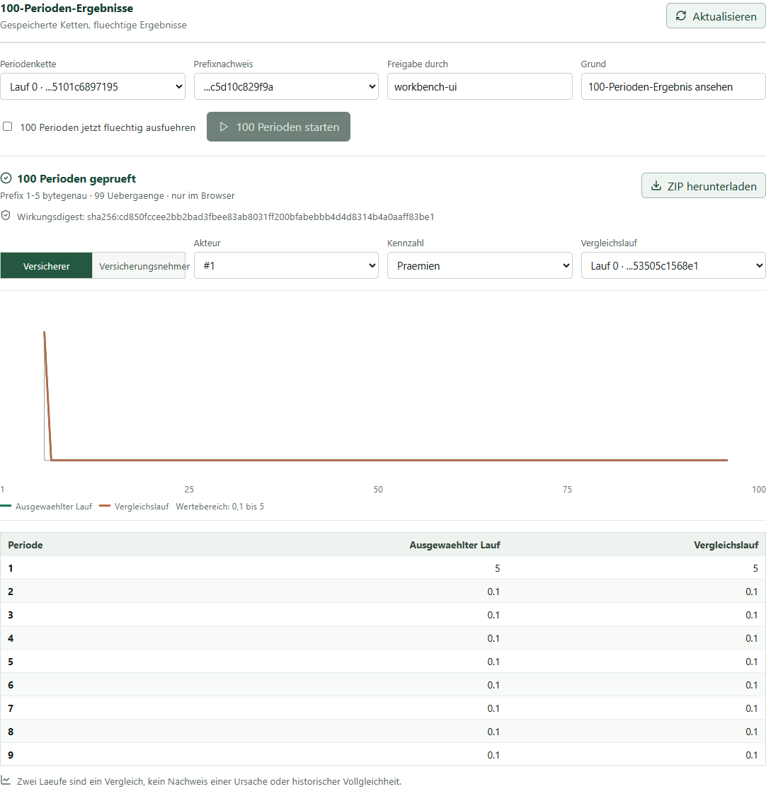
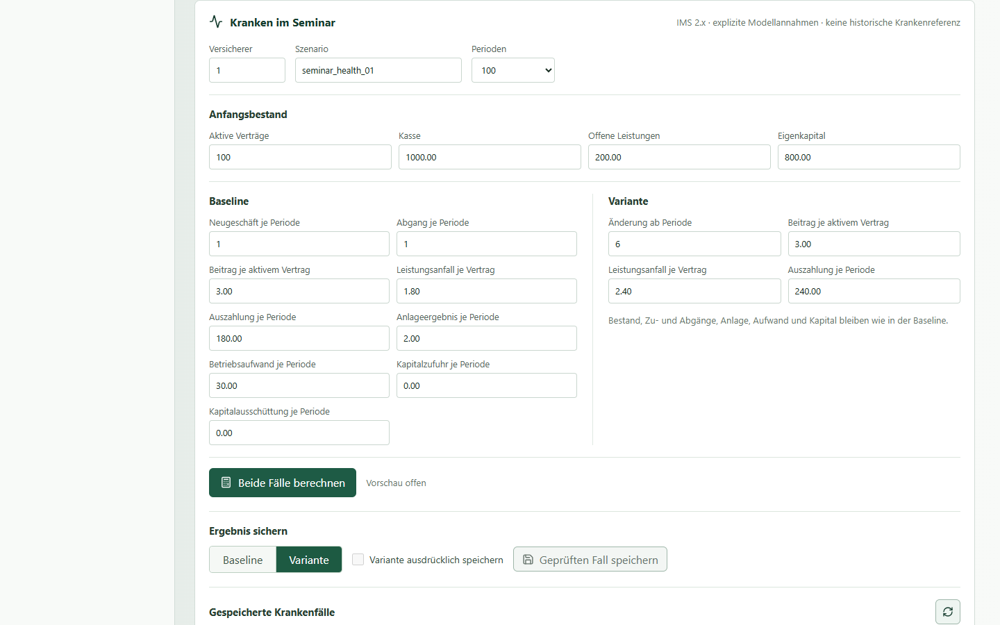
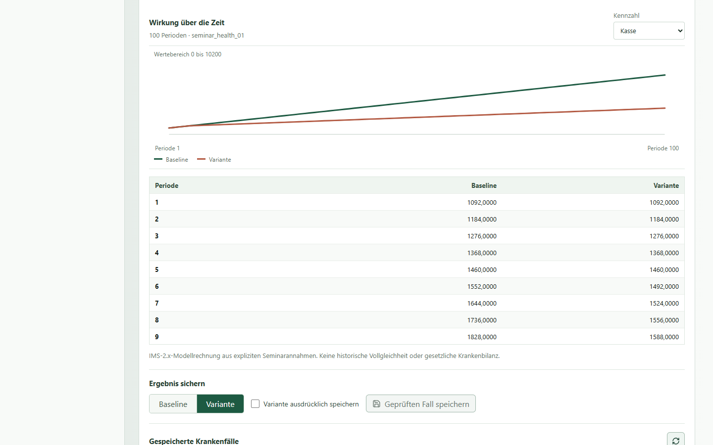
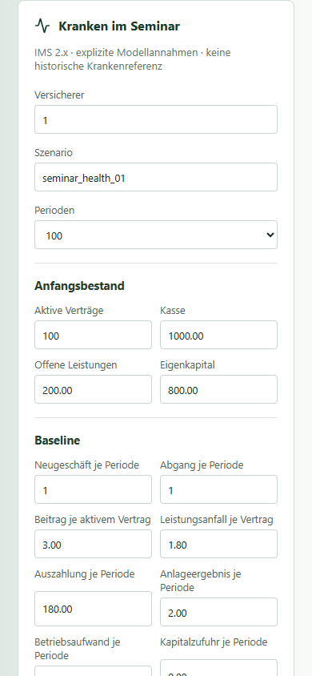
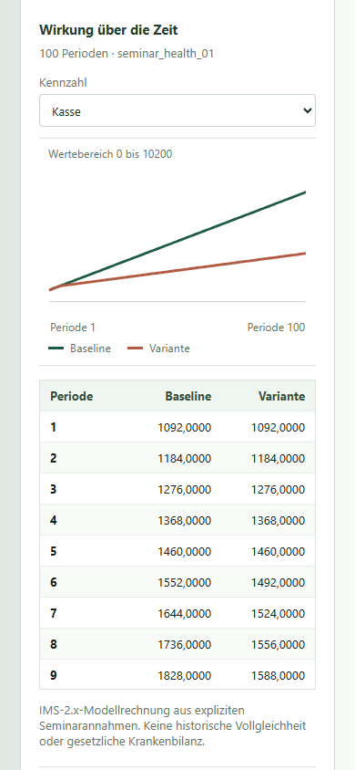
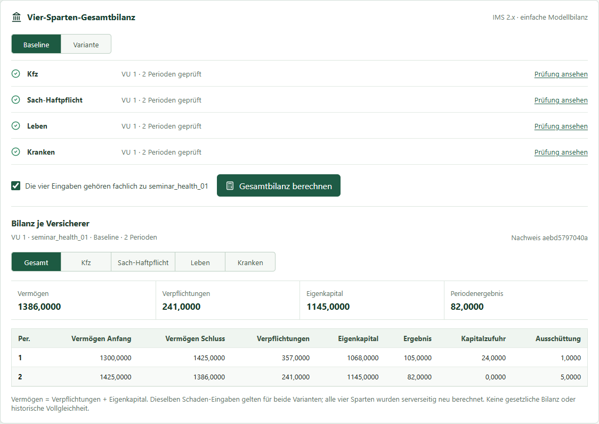
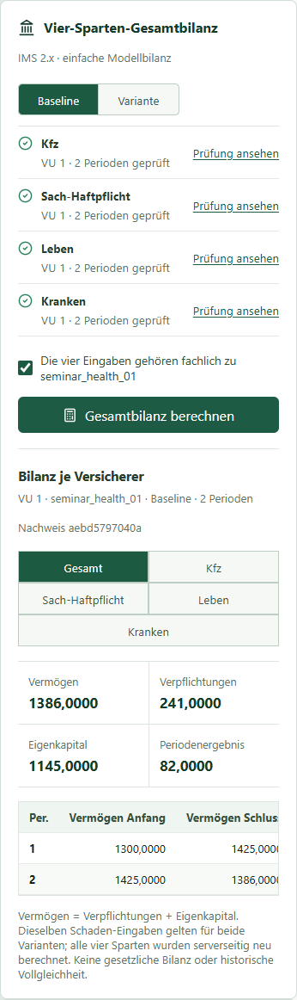
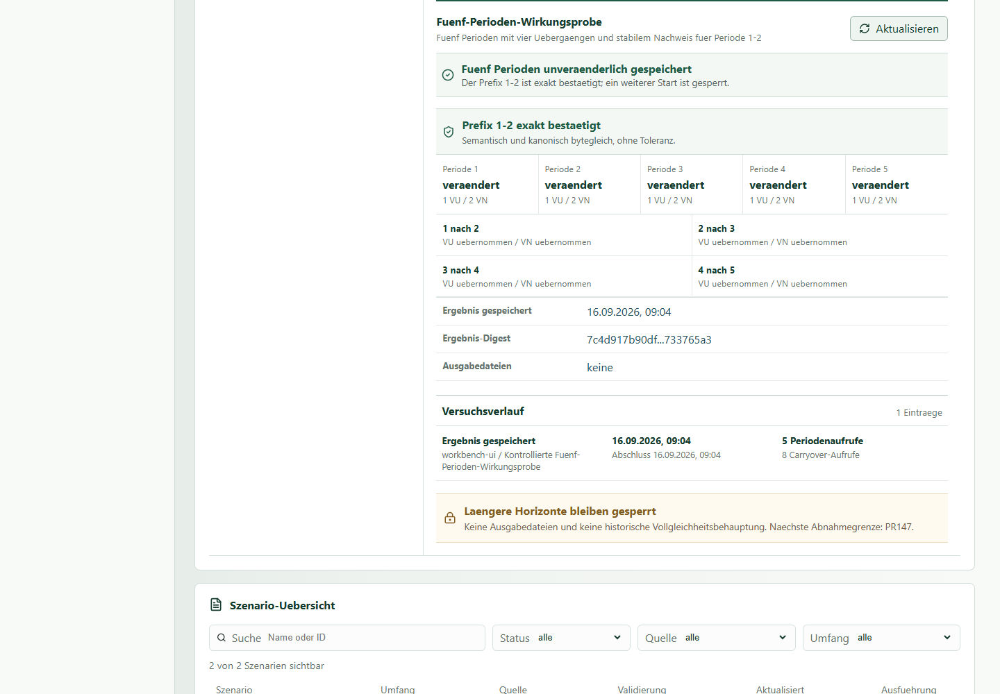
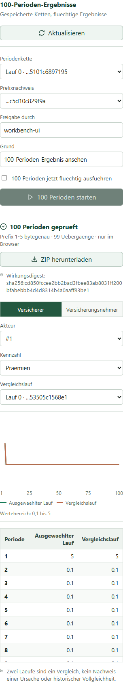
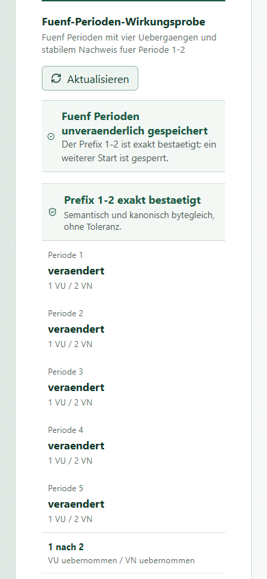

# IMS im Managementseminar

Stand: 2026-09-18
Handbuchschnitt: PR178a (Seminar-Vertiefung)
Zielgruppe: Fuehrungskraefte, Lehrende und Seminargruppen ohne Kenntnis der
Dissertation oder des Quellcodes

Der verbindliche Einstieg und die aktuellen Bediengrenzen stehen in
[IMS in zehn Seiten verstehen und bedienen](user_guide_test_package.md).
Dieses Kapitel ist das zusaetzliche Arbeitsblatt fuer eine moderierte Gruppe.

## Wozu IMS dient

IMS ist ein Labor fuer Versicherungsmaerkte. Es zeigt nicht nur, wie sich ein
einzelnes Unternehmen entscheidet, sondern wie viele Versicherer,
Vermittler, Kundenreaktionen und Marktinformationen ueber mehrere Perioden
zusammenwirken.

Im Seminar hilft IMS bei Fragen wie:

- Welche unmittelbaren und mittelbaren Folgen hat ein Schock?
- Reagieren alle Versicherer gleich oder entstehen Gewinner und Verlierer?
- Wann stabilisiert sich der Markt, und welche Anpassung kostet Zeit?
- Welche Strategie wirkt fuer ein Unternehmen sinnvoll, kann aber den Markt
  insgesamt destabilisieren?
- Wie unterscheiden sich Wirkung, Risiko und Kapitalbedarf zwischen Sparten?
- Wie kann ein ICT-Ausfall ueber Prozesse, Kunden und Bilanz bis zum Kapital
  weiterwirken?

IMS liefert keine sichere Zukunftsprognose. Es macht Annahmen, Mechanismen,
Zeitverlaeufe und Zielkonflikte sichtbar, damit eine Gruppe bessere Fragen
stellt und Entscheidungen nachvollziehbar vergleicht.

*Abbildung 1: Der Grundgedanke aus der Dissertation. Entscheidungen,
Marktwirkung, neue Informationen und die naechste Periode bilden einen
wiederholten Prozess.*

## Was heute bereits geht

Die heutige Workbench kann:

- den Modell- und Validierungsstand lesbar anzeigen;
- Szenarien und vorhandene Strategien untersuchen;
- Strategiezuordnungen und Parameterentwuerfe pruefen;
- kontrollierte Kandidaten fuer Versicherer und Vermittler bilden;
- eine Ein- oder Zwei-Perioden-Wirkungsprobe ausdruecklich freigeben,
  ausfuehren und unveraenderlich ablegen;
- den Uebergang von Periode 1 nach Periode 2 nachvollziehbar zeigen.
- vorbereitete 100-Perioden-Ketten fluechtig starten und vorhandene
  VU-/VN-Zustandsfelder als Zeitreihe und Tabelle lesen;
- zwei gleich praefixierte Laeufe vergleichen und ein JSON-/CSV-/XLSX-ZIP
  mit geprueftem Wirkungsdigest herunterladen.
- fuer einen Versicherer Kfz und Sach-Haftpflicht als einfache
  Modellbilanz aus eigenen Werten berechnen, getrennt und zusammen ansehen
  und als XLSX herunterladen.
- einen kleinen Lebensfall ueber zwei Perioden als Baseline und Variante
  vergleichen, ausdruecklich speichern und als XLSX ausgeben.
- einen eigenen Kranken-Modellfall als Baseline und Variante ueber bis zu
  100 Perioden vergleichen, ausdruecklich speichern und als CSV, JSON
  oder XLSX herunterladen.
- vier explizite IMS-2.x-Sparteneingaben je Versicherer und Periode
  ueber zwei Perioden als einfache Gesamtbilanz im Browser abstimmen,
  die vier Allokationen vergleichen und fehlerhafte Zuordnungen erkennen.
- aus dieser geprueften Bilanz deklarierte Kapital-Modellstresse und
  Workshop-Grenzen berechnen und als JSON/XLSX herunterladen; SCR, MCR
  und Bedeckungsquoten bleiben dabei gesperrt.

Noch nicht verfuegbar sind:

- ein gefuehrter Aufbau der 100 Einzelkandidaten und der Kette;
- eine dauerhafte Ablage der allgemeinen VU-/VN-100-Periodenlaeufe;
- der automatische Anschluss der benannten Sparten an historische Laeufe;
- ein gemeinsamer Vier-Sparten-Editor und ein bedienbarer
  100-Perioden-Mehrspartenlauf;
- eine regulatorisch freigegebene SCR-/MCR-Rechnung;
- ein DORA-Szenarioeditor mit durchgaengiger Wirkungskette.

Diese Funktionen sind in der aktiven
[Produkt-Roadmap](../plans/ims_2x_all_lines_management_lab_roadmap.md)
in kleinen Schritten geplant. Die Trennung ist wichtig: Der Leitfaden zeigt
den vorgesehenen Nutzen, ohne den heutigen Stand groesser darzustellen, als
er ist.

*Die gezeigten Reihen stammen aus einem kleinen kontrollierten Teststand.
Die gleiche Wirkung kann als ZIP heruntergeladen werden; ein frei
konfigurierbarer Markt- oder Regulierungsschock ist damit noch nicht belegt.*

## Eine Versichererbilanz ausprobieren

In **Bilanz** stehen zwei editierbare Sparten mit Beispielwerten bereit:
Kfz und Sach-Haftpflicht. Fuer einen eigenen Fall waehlt man die
Versicherer-ID und traegt je Sparte die drei Anfangsbestaende sowie
Praemien, Zins, Schaeden, Zahlungen, Aufwand und Kapitalbewegungen pro
Periode ein. **Bilanz berechnen** zeigt die Einzelsparten und die
abgestimmte Summe. Der XLSX-Download enthaelt alle drei Sichten und die
Herkunft; er ist erst nach einer gueltigen Berechnung moeglich.

Die Ansicht beantwortet die einfache Frage, wie vorgegebene Zahlungs-
und Schadenverlaeufe Cash, offene Schaeden und Eigenkapital veraendern.
Sie speist sich **noch nicht** aus den simulierten Marktergebnissen.
Die Beispielwerte sind weder historische IMS-Daten noch eine reale
Versichererbilanz; auch eine Solvency-II-Bedeckungsquote entsteht hier
nicht. Excel zeigt die Betraege als Text, damit ihre Dezimalstellen exakt
bleiben; fuer eigene Formeln muessen sie bewusst in Zahlen umgewandelt
werden.

## Einen Lebensfall im Seminar vergleichen

In **Leben** stehen drei einfache Faelle zur Wahl: **Todesfall**,
**Neugeschaeft** und **Anlage und Kapital**. Alle beginnen mit denselben
drei Policen und derselben Modellbilanz. Die **Baseline** laesst diesen
Ausgangspunkt unveraendert; die **Variante** zeigt eine gezielte
Aenderung. Der Fall laeuft ueber zwei Perioden. So kann die Gruppe erst
den Mechanismus verstehen, bevor sie ueber groessere Maerkte spricht.

1. Einen Seminarfall waehlen und den Anfangsbestand lesen. Die drei
   Policen, ihre Garantie, Laufzeit und die anfaenglichen Aktiva sind
   sichtbar, in dieser Stufe aber noch nicht frei editierbar.
2. Unter **Variante** beispielsweise den Todesfall A2 einschalten oder
   einen neuen Vertrag C1 aufnehmen. Anlageergebnis, laufenden Aufwand,
   Kapitalzufuhr und -ausschuettung kann man je Periode aendern. Unter
   **Policenfluesse** stehen Beitraege und Leistungen je Vertrag.
3. **Beide Faelle berechnen** waehlen. **Wirkung ueber die Zeit** zeigt
   Baseline und Variante als Linien; die Tabelle darunter enthaelt die
   exakten Werte fuer Policenzahl, Beitraege, Todes- und Ablaufleistungen,
   Aktiva, Garantieverpflichtung, Eigenkapital und Ergebnis. Die Kennzahl
   ueber dem Diagramm kann gewechselt werden.
4. Zuerst die Ausgangsfrage beantworten: Was hat sich in Periode 1
   geaendert, und welche Folge zeigt Periode 2? Im vorbereiteten
   Todesfall zahlt die Variante in Periode 1 eine Todesfallleistung von
   65; zugleich wird die Verpflichtung fuer A2 freigesetzt. Das
   Eigenkapital ist deshalb nicht einfach um 65 niedriger.
5. Fuer ein dauerhaftes Ergebnis die gewaehlte Seite ausdruecklich
   freigeben und **Geprueften Fall speichern** waehlen. Das setzt eine
   lokale SQLite-Ergebnisablage voraus. Im Verlauf laesst sich der
   gepruefte Fall erneut aufrufen und als Excel-Datei ausgeben.

Ein ungueltiger Wert wird vor dem Speichern angezeigt; es entsteht kein
Teilergebnis. Die Zahlen sind ein IMS-2.x-Modellfall mit expliziten
Annahmen, keine historische Lebensreferenz, gesetzliche Bilanz oder
Solvency-II-Berechnung. Freie Anfangsbestands- und Laufzeitgestaltung,
Rueckkauf und Bonus fehlen noch. Derselbe gepruefte Zwei-Perioden-Fall
kann jetzt in die Vier-Sparten-Gesamtbilanz uebernommen werden. Der
Lebens-XLSX-Export schreibt
Dezimalwerte als Text, damit keine stillen Rundungen in Excel entstehen.

## Einen Krankenfall ueber 100 Perioden vergleichen

Unter **Kranken** beginnt ein eigener IMS-2.x-Modellfall mit 100 aktiven
Vertraegen, einer einfachen Anfangsbilanz und ausdruecklichen Annahmen
fuer Beitrag, Leistungsanfall und Auszahlung. Die **Baseline** laesst
diese Werte konstant. Die **Variante** veraendert im vorbereiteten Fall
ab Periode 6 den Leistungsanfall und die Auszahlung; Neugeschaeft und
Abgang bleiben in beiden Faellen gleich. Das ist ein Seminarvergleich,
keine historische IMS-Krankenreferenz und keine Prognose des realen
Krankenversicherungsmarkts.

1. Versicherer, Szenario und 1, 2, 5, 10, 25, 50 oder 100 Perioden
   waehlen. Im Anfangsbestand muss die Kasse gleich offenen Leistungen
   plus Eigenkapital sein. Neugeschaeft und Abgang wirken erst auf den
   Bestand der naechsten Periode.
2. In **Baseline** Beitrag je aktivem Vertrag, Leistungsanfall je
   Vertrag und Auszahlung je Periode lesen oder aendern. Leistungsanfall
   mindert das Ergebnis und erhoeht die offene Verpflichtung;
   Auszahlungen senken Verpflichtung und Kasse. Dazu kommen Anlage,
   Aufwand und Kapitalbewegungen als explizite Werte.
3. In **Variante** die Aenderungsperiode und die drei geaenderten
   Werte setzen. Eine Leistungsannahme ist hier ein aeusserer
   Szenariowert, keine automatisch berechnete Versichererstrategie.
   Liegt der Variantenbeginn hinter dem Horizont, bleiben beide
   Zeitreihen bis dahin gleich.
4. **Beide Faelle berechnen** zeigt Kurven und eine Tabelle mit den
   genauen Werten. Die Kennzahl kann gewechselt werden. Im Beispiel
   ist die Kasse in Periode 6 in der Baseline `1552,0000`, in der
   Variante `1492,0000`. Die Tabelle kann durch alle 100 Perioden
   gescrollt werden.

5. Nur fuer einen dauerhaft benoetigten Fall **Baseline** oder
   **Variante** waehlen, die Speicherung ausdruecklich bestaetigen und
   **Geprueften Fall speichern** druecken. Das braucht eine lokale
   Ergebnisablage. Unter **Gespeicherte Krankenfaelle** laesst sich der
   Fall erneut oeffnen und als CSV, JSON oder Excel herunterladen.
   Ohne Ergebnisablage sind Vorschau und Vergleich weiterhin moeglich.

Auch auf einem schmalen Bildschirm bleiben Eingabe und Zeitreihe lesbar:

Die Excel-Betraege sind bewusst Text, damit die Dezimalstellen nicht
stillschweigend gerundet werden. Diese Modellrechnung ist weder eine
gesetzliche Krankenbilanz noch eine Solvency-II- oder DORA-Bewertung.
Fuer die heutige Vier-Sparten-Workbench waehlt man hier zwei Perioden;
die eigenstaendige Krankenrechnung kann weiterhin bis 100 Perioden laufen.

## Vier Sparten zu einer Versichererbilanz verbinden

In **Gesamtbilanz** sieht man, welche Teilrechnungen fuer den gemeinsamen
Fall bereitstehen. Die neue Sicht beantwortet: Wie verteilen sich
Vermoegen, Verpflichtungen, Eigenkapital und Periodenergebnis auf Kfz,
Sach-Haftpflicht, Leben und Kranken? Sie addiert keine Policenzahlen oder
unterschiedlich definierten Leistungsfluesse.

1. Unter **Bilanz** Kfz und Sach-Haftpflicht fuer denselben Versicherer
   ueber zwei Perioden berechnen. Diese Schadenwerte gelten in der
   Gesamtbilanz fuer Baseline und Variante gleich.
2. Unter **Leben** den Seminarfall waehlen und **Beide Faelle berechnen**.
   Unter **Kranken** dieselbe Versicherer-ID und **2 Perioden** einstellen
   und ebenfalls beide Faelle berechnen. Die farbigen Quellmarken in
   **Gesamtbilanz** zeigen, welche Eingaben geprueft sind.
3. **Baseline** oder **Variante** waehlen. Stimmen Versicherer-ID oder
   Periodenzahl nicht ueberein, steht dort der Sperrgrund. Die drei
   Teilbereiche muessen mit ihren Annahmen fachlich zusammengehoeren;
   das kann die Software fuer die Schaden- und Lebenswerte noch nicht
   selbst beweisen. Diese Zusammengehoerigkeit deshalb ausdruecklich
   bestaetigen und **Gesamtbilanz berechnen** waehlen.
4. Unter **Gesamt** Vermoegen, Verpflichtungen, Eigenkapital und Ergebnis
   je Periode lesen. Mit **Kfz**, **Sach-Haftpflicht**, **Leben** und
   **Kranken** sieht man die vier Anteile. Vermoegen ist jeweils die
   Summe aus Verpflichtungen und Eigenkapital. Ein Fehler gibt keine
   Teilbilanz frei; aendert man einen der Eingangsfaelle, verschwindet
   die bisherige Gesamtbilanz bis zur erneuten Pruefung.

Die Betragswerte sind exakte Dezimaltexte aus expliziten IMS-2.x-
Seminarannahmen. Die Gesamtbilanz wird hier weder gespeichert noch als
Datei exportiert. Sie ist keine gesetzliche Bilanz, keine
Solvency-II-Rechnung und kein Nachweis der Uebereinstimmung mit alten
Zufallslaeufen. Ein gemeinsamer Lauf ueber 100 Perioden bleibt offen.

## Sieben Vorteile im Fuehrungskraefteseminar

1. **Markt statt Einzelrechnung:** Entscheidungen werden zusammen mit
   Wettbewerbern, Vermittlern und Rueckwirkungen betrachtet.
2. **Zeit statt Momentaufnahme:** Anpassungen, Verzoegerungen und Carryover
   werden periodisch sichtbar.
3. **Strategien statt Einheitsverhalten:** Gruppen von Versicherern und
   Vermittlern koennen unterschiedlich reagieren.
4. **Schocks statt statischer Planung:** Eine Gruppe kann direkte,
   veraenderte und mittelbare Wirkungen getrennt diskutieren.
5. **Unternehmen und Markt gemeinsam:** Die vorhandenen Sparten-, Bilanz-
   und Kapital-Modellansichten ergaenzen die historische Mikroperspektive;
   ein durchgaengender Vier-Sparten-Marktprozess ist noch offen.
6. **Nachvollziehbarkeit statt Black Box:** Szenario, Annahmen, Version und
   Ergebnis bleiben zusammen; eine Pruefsumme schuetzt den verwendeten Stand.
7. **Gemeinsames Lernen:** Teams koennen vor dem Lauf Hypothesen formulieren,
   Ergebnisse vergleichen und Abweichungen als Erkenntnis nutzen.

## Die drei Arten eines Schocks

Ein Schock ist eine kontrollierte Veraenderung der Ausgangslage oder der
Umwelt des Modells. Fuer die Diskussion helfen drei Blickwinkel:

| Blickwinkel | Einfache Frage | Beispiel |
| --- | --- | --- |
| Aktivierung | Wer tritt neu in den Markt ein? | Ein VU oder VN wird erst ab einer spaeteren Periode aktiv. |
| Veraenderung | Welcher bestehende Wert wird anders? | Ein Akteur wechselt seinen vorbereiteten Regel-Parametersatz. |
| Indirekte Wirkung | Was folgt erst durch Reaktionen anderer? | Preise, Nachfrage, Vermittlerverhalten oder Marktanteile verschieben sich. |

*Abbildung 2: Ein Schock ist nicht nur ein einzelner geaenderter Wert. Fuer
Managementfragen ist meist die Kette aus direkter und indirekter Wirkung
entscheidend.*

## Ein Seminar in 90 Minuten

| Zeit | Arbeitsschritt | Ergebnis der Gruppe |
| --- | --- | --- |
| 0-10 Minuten | Gemeinsames Marktbild | gleiche Begriffe und eine klare Fragestellung |
| 10-25 Minuten | Schock oder Intervention beschreiben | Baseline, Ausloeser und betroffene Akteure |
| 25-40 Minuten | Wirkungen vorhersagen | schriftliche Hypothesen zu Richtung, Staerke und Zeit |
| 40-55 Minuten | Kontrollierten IMS-Pfad zeigen | sichtbare Eingaben, Freigabe, Lauf und Ergebnis |
| 55-70 Minuten | Unternehmen, Gruppen und Markt vergleichen | Gewinner, Verlierer, Anpassung und Nebenwirkungen |
| 70-85 Minuten | Auf das eigene Unternehmen uebertragen | Handlungsoptionen, Fruehindikatoren und offene Daten |
| 85-90 Minuten | Abschluss | Entscheidung, Annahmen und naechster Testfall |

Fuer den heutigen Stand sollte die Moderation einen vorbereiteten
100-Perioden-Fall verwenden. Wo die dafuer noetigen 100 Kandidaten und der
Prefix fehlen, bleibt die gespeicherte Zwei- oder Fuenf-Perioden-Probe
der kleinere Demonstrationsfall. Einen neuen Fall frei zusammenzustellen
ist noch keine Seminarfunktion.

## Die Arbeitsansichten

| Ansicht | Was die Gruppe dort klaert |
| --- | --- |
| Dashboard | Ist die Arbeitsumgebung bereit, und welcher Stand wird gezeigt? |
| Szenarien | Welche Ausgangslage und welche Vergleichsfrage verwenden wir? |
| Strategien | Wer folgt wann welcher Regel, und welche Parameter unterscheiden Gruppen? |
| Bilanz | Wie veraendern explizite Kfz- und Sach-Haftpflicht-Fluesse die Modellbilanz? |
| Leben | Was bewirken Tod, Neugeschaeft, Anlage und Kapital im kleinen Policenfall? |
| Kranken | Wie wirken Beitrag und Leistungsannahmen ueber bis zu 100 Perioden? |
| Gesamtbilanz | Wie verteilen sich Vermoegen und Verpflichtungen auf vier Sparten? |
| Kapitalwirkung | Was bewirken deklarierte Modellstresse und Workshop-Grenzen, ohne eine SCR-Zahl zu erzeugen? |
| Validierung | Was ist belegt, was nur diagnostisch und was noch offen? |
| Runs | Welcher Versuch wurde wirklich gestartet, und welches Ergebnis gehoert dazu? |

Die sichtbare Navigation soll die Diskussion fuehren. Technische
Vertragsnamen, interne Datenfelder und Entwicklungsbefehle gehoeren nicht in
den Seminarablauf.

*Abbildung 3: Die Workbench zeigt den vorbereiteten Fuenf-Perioden-Fall,
den stabilen Prefix 1-2, vier Uebergaenge, Ergebnis und Verlauf in einer
gemeinsamen Arbeitsansicht.*

## Die heutige Fuenf-Perioden-Probe bedienen

1. In **Strategien** den Abschnitt **Periodenkette** oeffnen.
2. Pruefen, dass Periode 1 bis 5 sowie vier Uebergaenge vollstaendig
   angezeigt werden und ein Vergleich fuer Periode 1-2 vorhanden ist.
3. Namen und Begruendung der Freigabe eintragen.
4. Die ausdrueckliche Bestaetigung setzen und **Fuenf Perioden starten**
   waehlen.
5. Die Wirkung aller Perioden, vier Uebergaenge und den exakten Prefix 1-2
   lesen.
6. Das Ergebnis neu laden und pruefen, dass derselbe Versuch erhalten bleibt.

Die angezeigte Pruefsumme ist der Fingerabdruck des vorbereiteten Falls. Sie
hilft festzustellen, ob beim erneuten Laden wirklich derselbe Fall betrachtet
wird. Sie ist kein fachliches Guetesiegel.

## Den vorbereiteten 100-Perioden-Fall lesen

1. Unter **Strategien -> Ergebnisse** eine vorbereitete 100er-Kette und
   ihren gespeicherten Fuenf-Perioden-Nachweis waehlen.
2. Freigabe begruenden, bestaetigen und den fluechtigen Lauf starten.
3. Versicherer oder Versicherungsnehmer, Akteur, Kennzahl und bei
   Vektorwerten die Position auswaehlen. Diagramm und Tabelle zeigen
   dieselben vorhandenen Werte ueber 100 Perioden.
4. Einen zweiten Lauf nur bei gleichem Prefix danebenstellen. Unterschiede
   beschreiben, aber nicht automatisch als Schockwirkung ausgeben.
5. Das ZIP herunterladen. Der Server rechnet erneut und sperrt den
   Download, wenn der Wirkungsdigest nicht zum sichtbaren Lauf passt.

Das Ergebnis wird nach einem Browser-Neuladen nicht wiederhergestellt.
Der Moderator sollte das ZIP vor dem Seminar sichern.

*Die schmale Ansicht zeigt dieselben Filter und Zahlen ohne seitliches
Scrollen. Das Beispiel stammt aus einem kontrollierten Teststand.*

*Abbildung 4: Derselbe kontrollierte Fuenf-Perioden-Pfad bleibt auf einem schmalen
Bildschirm lesbar. Fuer ein Seminar ist ein breiter Bildschirm dennoch
uebersichtlicher.*

## Arbeitsblatt fuer eine Wirkungskette

Vor dem Lauf fuellt jede Gruppe eine Zeile aus. Danach wird nicht nur gefragt,
ob die Zahl richtig geraten wurde, sondern welcher Mechanismus die
Abweichung erklaert.

| Frage | Eintrag der Gruppe |
| --- | --- |
| Was ist der Ausloeser? |  |
| Welche Sparte oder welcher Prozess ist zuerst betroffen? |  |
| Welche Entscheidung aendert ein Versicherer unmittelbar? |  |
| Wie reagieren Wettbewerber, Vermittler oder Kunden? |  |
| Welche Kennzahl sollte zuerst sichtbar reagieren? |  |
| Was erwarten wir fuer Unternehmen, Gruppe und Gesamtmarkt? |  |
| Nach wie vielen Perioden erwarten wir die groesste Wirkung? |  |
| Welche Annahme ist fuer das Ergebnis am unsichersten? |  |
| Welche Managemententscheidung wuerden wir vom Ergebnis abhaengig machen? |  |

## Geeignete Seminarfaelle

Die folgenden Faelle beschreiben die geplante fachliche Richtung. Sie sind
nicht alle im heutigen Stand ausfuehrbar.

### Schadeninflation in Kfz

Eine anhaltende Erhoehung von Reparatur- und Schadenkosten trifft
Versicherer unterschiedlich. Die Gruppe vergleicht Preisreaktion,
Bestandswirkung, Ergebnis, Marktanteil und spaeter Kapitalbedeckung.

### Preiswettbewerb in Sach-Haftpflicht

Ein Teil des Marktes senkt Preise, andere Unternehmen halten Marge oder
reduzieren Wachstum. Die Gruppe untersucht, wann eine einzelwirtschaftlich
plausible Strategie zu Konzentration oder Instabilitaet fuehrt.

### Kapitaldruck ueber mehrere Sparten

Schaden, Leben und Kranken reagieren auf Zins-, Leistungs- oder
Bestandsschocks verschieden. Die Gruppe verfolgt Einzelsparten,
konsolidierte Bilanz, Risikotreiber und Bedeckungsquote.

### ICT-Dienstleister faellt aus

Ein gemeinsamer Anbieter beeintraechtigt Schadenbearbeitung, Vertrieb oder
Kundenservice. Die Gruppe zeichnet die Kette von Kapazitaetsverlust und
Rueckstand ueber Kundenreaktion und Kosten bis zu Bilanz und Kapital nach.
Sie bewertet Wiederanlauf, Fallback und Drittparteienkonzentration, nicht die
rechtliche DORA-Konformitaet.

## Ergebnisse richtig lesen

Bei jeder Auswertung helfen sechs Fragen:

1. **Richtung:** Steigt oder faellt die Kennzahl gegenueber der Baseline?
2. **Groesse:** Ist der Unterschied wirtschaftlich relevant oder nur klein?
3. **Zeit:** Wann beginnt, gipfelt und endet die Wirkung?
4. **Verteilung:** Welche Unternehmen, Gruppen oder Sparten tragen sie?
5. **Robustheit:** Bleibt die Aussage bei anderen plausiblen Annahmen oder
   Zufallsfolgen bestehen?
6. **Grenze:** Welche Daten oder Modellmechanismen fehlen fuer die konkrete
   Entscheidung?

*Abbildung 5: Ergebnisse koennen auf unterschiedlichen Ebenen gelesen
werden. Eine Gesamtmarktzahl allein erklaert nicht, welche Gruppe oder
welches Unternehmen die Wirkung traegt.*

## Wann die Gruppe stoppen sollte

Ein Ergebnis darf nicht als Entscheidungsgrundlage ausgegeben werden, wenn:

- die Baseline oder der Schock nicht fachlich beschrieben ist;
- eine benoetigte Sparte oder Wirkungskette im Modell noch fehlt;
- Bilanz- oder Bestandsidentitaeten verletzt sind;
- das Resultat bei identischem modernen Versuch nicht reproduzierbar ist;
- eine regulatorische Modellgroesse mit einer aufsichtsrechtlich validierten
  Meldung verwechselt wird;
- aus historischen Zufallszahlen eine unbelegte Vollgleichheit abgeleitet
  wird.

## Was als Naechstes hinzukommt

Die aktive Roadmap liefert in dieser Reihenfolge:

1. einen gefuehrten Aufbau eigener 100-Perioden-Faelle und eine dauerhafte
   Ergebnisablage; der vorbereitete fluechtige Bedienpfad ist vorhanden;
2. einen gemeinsamen Szenarioeditor und kontrollierten
   100-Perioden-Mehrspartenlauf sowie spaeter Strategien je Sparte;
3. nach der vorhandenen Kapital-Modellansicht nur mit gesondertem
   Fachplan und freigegebenen Daten eine echte SCR-/MCR-Rechnung;
4. DORA-Wirkungsketten von ICT-Abhaengigkeiten bis zu Bilanz und Kapital;
5. einen gefuehrten Szenarioassistenten und kuratierte Seminarfaelle.

Die technische Installation und die detaillierten Bediennachweise bleiben in
den uebrigen Kapiteln dieses Handbuchs erhalten. Dieser Leitfaden ist der
fachliche Einstieg fuer Menschen, die IMS anwenden und diskutieren wollen,
nicht seine innere Implementierung studieren muessen.
