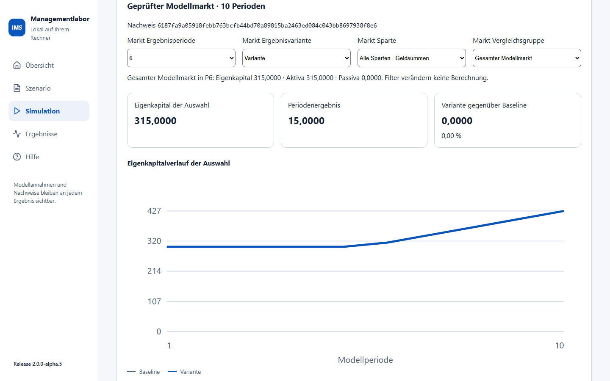
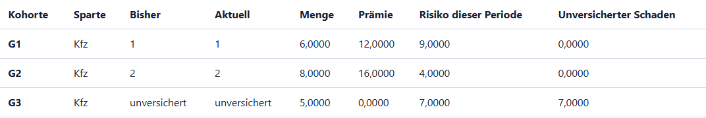
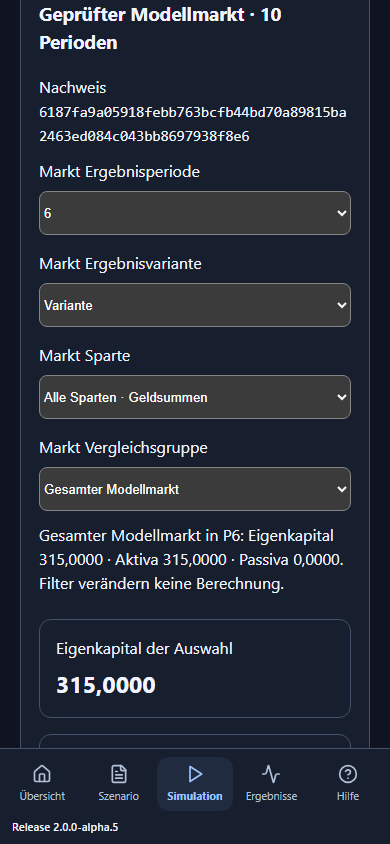

# IMS: Markt und Strategiefamilien verstehen

Menüführung für Produktfassung **2.0.0-alpha.9**, Fachumfang AP5. AP5 erweitert das Managementlabor um
einen gemeinsam berechneten Modellmarkt. Die bisherigen AP3-Seminarfälle
und die AP4-Einstiegsübersicht bleiben über ihre eigenen Menüpunkte erreichbar.
Eine Modellperiode ist kein automatisch festgelegter Monat oder Kalenderjahr.
Mit zwei oder fünf Perioden prüfen Sie den gemeinsamen Anfang. Für eine
Variante ab Periode 6 wählen Sie mindestens zehn Perioden.

## Der erste kleine Markt: fünf Minuten zum Handfall

1. In der Hauptnavigation **Markt und Familien** wählen, dann den Arbeitsbereich
   **Quellen und Handfälle**. Auf der Übersicht führt **Markt und Familien öffnen**
   zum selben Marktbereich.
2. **Marktfall → Wechsel mit Altreserve** und **Marktperioden → 10** wählen.
   **Modellmarkt laden** öffnet die vollständigen synthetischen Quellen.
3. **Gemeinsamen Markt berechnen** wählen. Nach erfolgreicher Prüfung erscheinen
   Nachweis, Verlauf, Gruppenfilter und Buchungstabellen. Die Ergebnisperiode
   ist zunächst 6.
4. **Baseline** oder **Variante** zeigt in diesem Handfall dieselbe Rechnung.
   Die ersten fünf Perioden sind ein bewusst neutraler gemeinsamer Anfang.
   In Periode 6 wechseln zehn Kundeneinheiten von VU1 zu VU2.
5. Unter **Kundenwahl und Risiko** steht VU2 mit Prämie 20 und neuem Schaden 40.
   Unter **Marktbuchung** stehen Aktiva 172, Passiva 15, Eigenkapital 157.
   Die Identität ist 172 = 15 + 157.
6. **Anbieter für Variante und Einzel-VU-Excel → Handfall VU1** und
   **Einzel-VU 1 in Excel** wählen.
   Ihre alte Schadenzahlung ist 5, ihre verbliebene Verbindlichkeit 15.
   Die neue Prämie und der neue Schaden werden bei VU2 gebucht. Alte Reserven
   wandern durch einen Kundenwechsel nicht mit.

Der erste Handfall erklärt die Zuordnung; er ist keine Prognose eines echten
Versicherers. Prämien und Schäden sind erklärte Modellbeträge.

## Kapazität und unversicherte Kunden sehen

**Marktfall → Kapazität und unversicherte Nachfrage**, zehn Perioden laden und
berechnen. In Periode 6 gelten Preise 2/2/3 und Kapazitäten 6/8/4.
G1/G2/G3 haben Mengen 6/8/5 und Schäden 9/4/7.

| Kohorte | Ergebnis der Wahl | Gebuchte Prämie | Neuer Schaden |
| --- | --- | ---: | ---: |
| G1, Menge 6 | VU1; Preisgleichstand entscheidet die kleinere VU-ID | 12 | 9 bei VU1 |
| G2, Menge 8 | VU2; VU1 ist voll | 16 | 4 bei VU2 |
| G3, Menge 5 | Unversichert; VU3 kann nur 4 aufnehmen | 0 | 7 außerhalb der VU-Bilanzen |

19 Nachfrageeinheiten = 14 gedeckt + 5 unversichert. Risiko 20 = 13 versichert
+ 7 unversichert. Der Markt schließt mit Aktiva/Eigenkapital 315, Passiva 0.
Die ganze homogene Kundengruppe wird aufgenommen oder dem nächsten geeigneten
Anbieter angeboten. Eine Teilung in mehrere Anbieter ist in diesem Vertrag
nicht vorgesehen. Die stabile Gruppenreihenfolge ist eine Workshop-Annahme.

## Vier Gruppenbegriffe auseinanderhalten

| Begriff | Wozu dient er? | Was darf ich addieren? |
| --- | --- | --- |
| Versicherungsgruppe | Zuordnung von Modell-VUs zu einer Mutter-/Gruppenkennung | Jede VU wird genau einmal zugeordnet. |
| VU-Vergleichsgruppe | Frei erklärte Auswahl mehrerer VUs für einen Vergleich | Gruppen können sich überlappen; ihre Ergebnisse nicht zum Markt addieren. |
| VN-Kundengruppe | Homogene Kundenkohorte mit Menge, Risiko und Auswahlregel | Innerhalb derselben Sparte sind gedeckte/unversicherte Mengen nachvollziehbar. |
| Strategiefamilie | Ausgeführte Regel mit Parameterprofil, Sparte und Zeitfenster | Disjunkte VU-/Spartenbuchungen ergeben zusammen den Modellmarkt. |

Im Kapazitäts-Handfall ist die Vergleichsgruppe VU1/VU2 gleich 215 und
VU2/VU3 gleich 212. Zusammen wären das 427, weil VU2 doppelt vorkäme.
Der Modellmarkt bleibt 315. Ein Gruppenfilter ändert die Ansicht; derselbe
Nachweis und die Gesamtsumme bleiben sichtbar.

Die folgende echte IMS-Ansicht zeigt den Kapazitäts-Handfall in Periode 6:

## Den 40er-Markt erkunden

**Synthetischer Modellmarkt**, 100 Perioden und 40 oder 41 Modellanbieter laden
und berechnen. Die Anbieter heißen bewusst Modellversicherer 01 usw.; der
belegte deutsche Top-40-Fall ist ein eigenes späteres Paket.
Im Muster betreibt jede VU vier Sparten. Eine eigene Marktdatei kann nur
benötigte Sparten enthalten. Nicht betriebene Sparten bleiben null Aktivität;
unbekannte notwendige Daten verhindern einen gültigen Lauf.

Im Muster starten Kfz und Sach mit synthetischen Cashbeständen und erklärten
Kundenrisiken. Leben verwendet einen geschlossenen Policenbestand und einen
Anlagesatz; Kranken verwendet erklärte Preise, Neu-/Abgänge und Leistungen.
Die Kfz-/Sach-Kundenwahl erzeugt keine neue Lebens-Nachfrage und überträgt
keine Lebens-/Krankenpolicen.

**Markt Ergebnisperiode**, **Ergebnisvariante**, **Sparte** und
**Vergleichsgruppe** filtern den abgeschlossenen Lauf. Das Diagramm zeigt
Schluss-Eigenkapital; die Verlaufstabelle enthält genaue vierstellige Beträge.
Periodenergebnis ist ein Fluss, Schluss-Eigenkapital ein Bestand.
Die Prozentdifferenz verwendet den Betrag der Baseline als Nenner; bei
Baseline null steht **Nicht definiert (Baseline 0)**.

Der Familienvergleich unterhalb des Diagramms bezieht sich auf den ganzen
Modellmarkt der gewählten Sparte, auch wenn darüber eine Vergleichsgruppe
gewählt ist. Familien ohne Aktivität in der Sparte haben keine Buchungen.
Mengenpreis = gebuchte Prämie / tatsächlich gedeckte Menge, bei Menge null
undefiniert. Über alle Sparten werden Geldbeträge summiert; Expositionen und
Policenzahlen werden nicht zu einer erfundenen gemeinsamen Menge addiert.
Lebens-Versicherungsaufwand enthält die vorhandene Reserve-/Garantiebewegung;
er ist nicht bloß eine heutige Schadenzahlung.

## Eine Strategie zuordnen und eine Maßnahme vergleichen

Unter **Kfz-Variante ab Periode 6** den Modellanbieter und eine bereits
ausführbare Strategiefamilie wählen. Das Familienende gilt einschließlich.
**Familie für Variante übernehmen** ändert die Eingabe und entwertet den
vorherigen Ergebnisstand. Danach neu berechnen. Nach dem Ende gilt wieder
das vorher erklärte Familienprofil. Erst Übernehmen ändert den Rechenfall;
eine noch nicht übernommene Auswahl im Editor ist ein Entwurf.

Die Vorlage ordnet VU1 in der Variante von Periode 6 bis 20 ein konstantes
Kfz-Preisprofil zu, ab 21 wieder die kartierte Zufall-I-Regel. Andere VUs
verwenden erklärte feste Angebote oder Vrvu01. Die Familie ist eine Regel
mit Parametern, keine Aussage über die echte Strategie eines Unternehmens.

**Aufnahme mit Kosten und Vorlauf erweitern** öffnet den Maßnahmeneditor.
Die Entscheidung findet hier in Periode 6 statt. Im Muster:

| Periode | Kosten | Aufnahmekapazität VU1 Kfz |
| --- | ---: | ---: |
| 6 | 3, einmalig | 30 |
| 7 | 0 | 30 |
| 8–10 | 0 | 60 |
| ab 11 | 0 | wieder 30 |

Vorlauf 2, Wirkdauer 3. Bei Vorlauf null wirkt die Maßnahme bereits vor der
Kundenwahl derselben Entscheidungsperiode. Kosten fließen als Betriebsaufwand
und Cashabgang einmal ein, auch wenn ihre Wirkung später nicht gebraucht wird.
Unvereinbare überlappende Maßnahmen werden zurückgewiesen. Der Editor ersetzt
die Kfz-Aufnahmemaßnahme dieser VU in der Variante; komplette Maßnahmenpläne
können in den vollständigen Eingaben bearbeitet werden.

VU-Entscheidungen kennen nur den abgeschlossenen Vorperiodenstand. Kunden
kennen die aktuellen öffentlichen Angebote. Zukünftige Schäden beeinflussen
die Wahl nicht im Voraus. Zufallswerte sind an Seed, VU, Periode und Kanal
gebunden: der zusätzliche Anbieter verändert die Ziehungen alter VUs nicht.
Eine echte neue Konkurrenz kann ihre Kunden- und Risikozuordnung verändern.

## Dateien, genaue Werte und Fehlermeldungen

**Einzel-VU in Excel** enthält ausschließlich die ausgewählte VU für
Baseline/Variante, ihre Kundenbuchungen, Gruppenzuordnung und Herkunft.
Markt-, Familien- und Vergleichsgruppen werden direkt in IMS ausgewertet.
Die vollständige Marktquelle liegt für Reproduzierbarkeit im Herkunftsblatt;
die Detailbilanz bleibt die ausgewählte VU. Vier Nachkommastellen sind erhalten.
Die Zellen enthalten Dezimaltext, damit Excel große Beträge und die vier
Nachkommastellen nicht still rundet. Für eigene Excel-Formeln eine Arbeitskopie
anlegen und dort die benötigten Dezimaltexte passend zur Spracheinstellung
in Zahlen konvertieren; der ursprüngliche Export hält die geprüften Werte fest.

**Marktquelle als JSON sichern** speichert den vollständig geprüften Eingangsfall.
**Marktdatei öffnen** liest ihn offline wieder ein und rechnet frisch.
Ein unveränderter Fall erhält denselben Inhaltsnachweis. Neue Eingaben
entwerten alte Ergebnisse und Exporte; die API akzeptiert nur den aktuellen
gleichen Nachweis. Rollen-/Ansichtswechsel löschen den Fall nicht.

Auf kleinen Bildschirmen bleibt die Navigation unten erreichbar. Lange
Tabellen lassen sich waagerecht scrollen; mit Tastatur die Tabelle fokussieren
und die Pfeiltasten verwenden. Die dunkle Ansicht zeigt denselben Lauf:

Ein ungültiger Gesamtlauf zeigt eine Meldung und keine Teilbilanz. Häufige
Ursachen sind fehlende Spartenwerte, sich überschneidende Familienfenster,
ein überbuchter Anfangsvertrag, Altzahlung über der Anfangsreserve oder
negativer Cashbestand. Zahlen als Dezimalstrings eingeben; keine NaN-Werte.
Eine unbekannte Größe ist kein automatisch geschätzter Nullwert.

## Grenzen und Herkunft

Das Modell verbindet kartierte historische Preis-/Werbe- und VN-Auswahlkerne
mit ausdrücklich angenommenen modernen Buchungs-/Kapazitätsregeln. Es belegt
keine vollständige historische Gleichheit. Kein regulatorisches SCR/MCR,
keine dynamische Insolvenz, keine Querverrechnung zwischen Sparten und kein
gekoppelter Markt-/ICT-Schock sind enthalten. Der vorhandene DORA-/ICT-
Workshop bleibt separat erreichbar. Die bereitgestellte DORA-Umsetzungserhebung
liefert keine Ausfallwahrscheinlichkeit oder AP5-Schadenkalibrierung.

Der neue Vertrag trägt eine eigene Schemafassung; die Anwender-Releasekennung
erscheint unten links. Die vier bisher verwendeten historischen 25er-
Validatoren wurden für bestehende Fälle nicht pauschal erweitert. Die
moderne Rechnung hält stabile VU-IDs außerhalb isolierter vorhandener
Lebens-/Kranken-Rechenkontexte. Technische Herkunft und Modellgrenzen bleiben
in API, Ergebnis und Einzel-VU-Excel überprüfbar.
