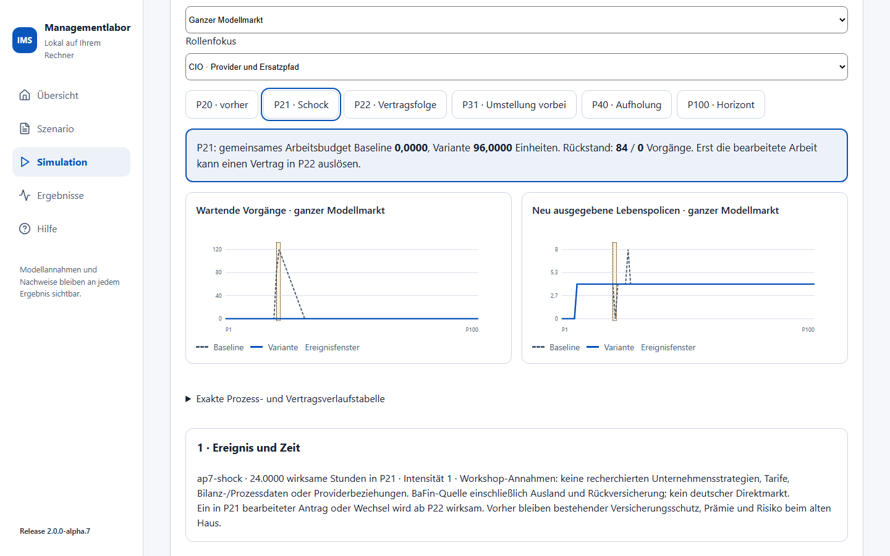
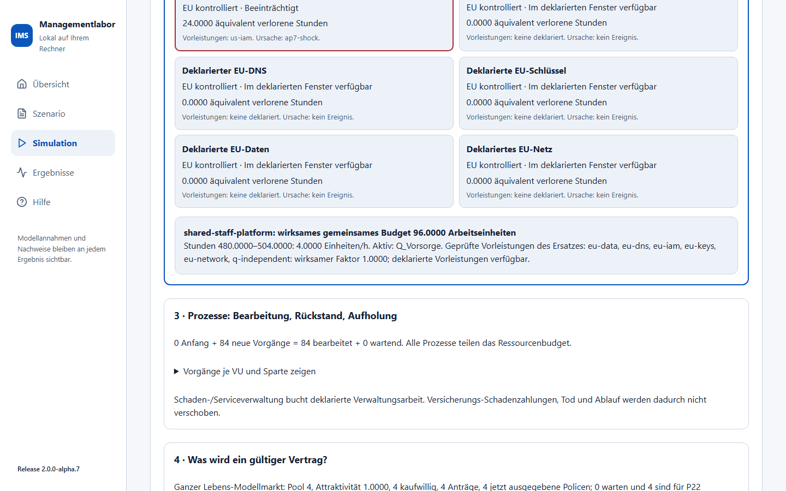
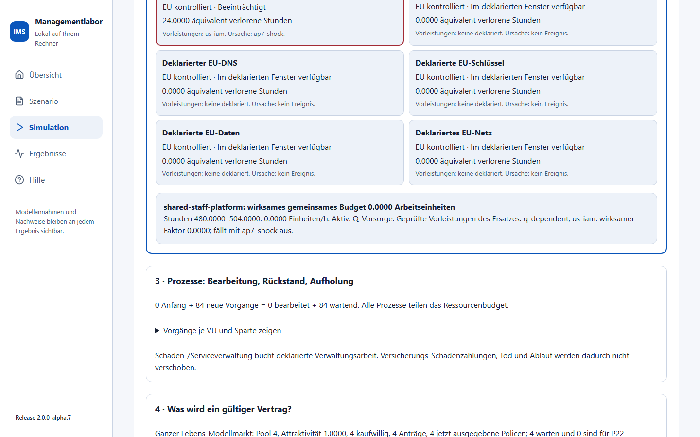
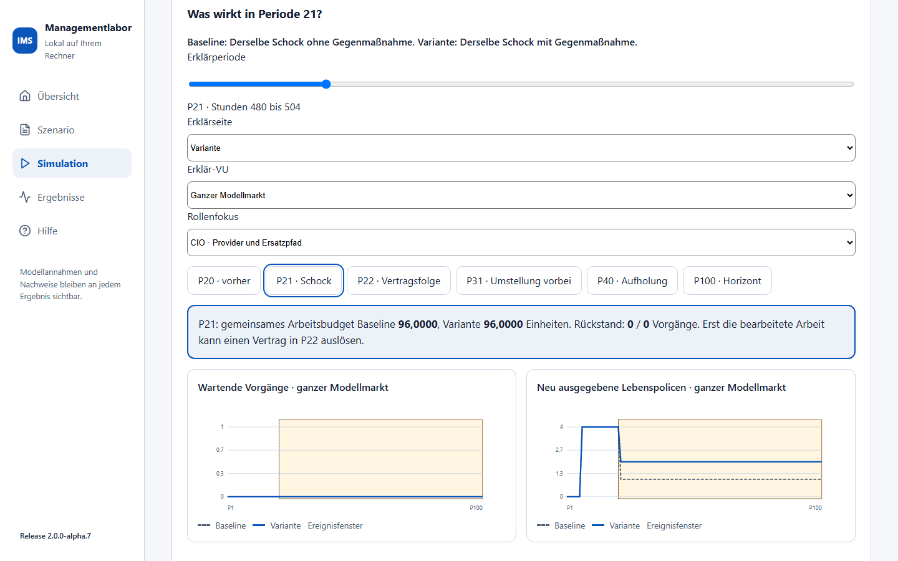
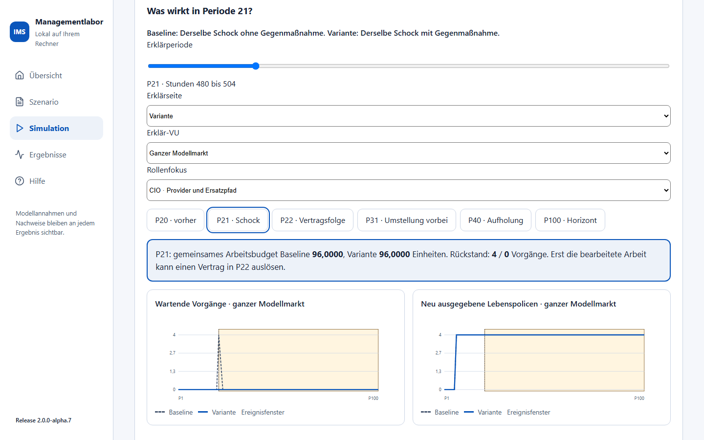
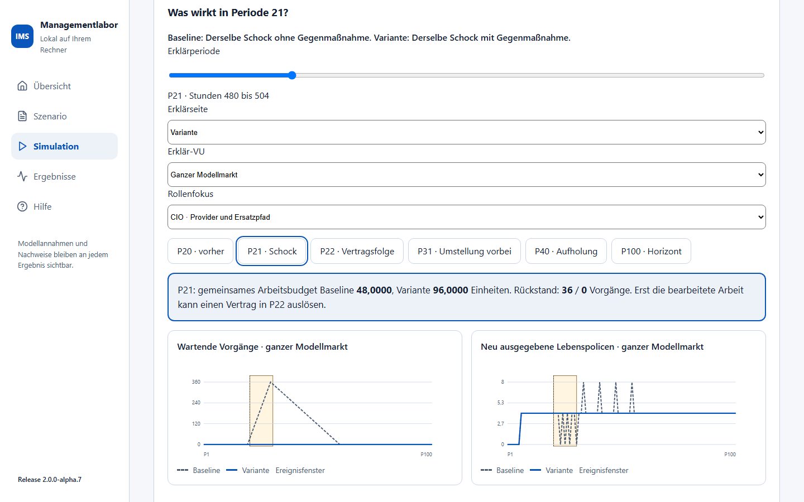
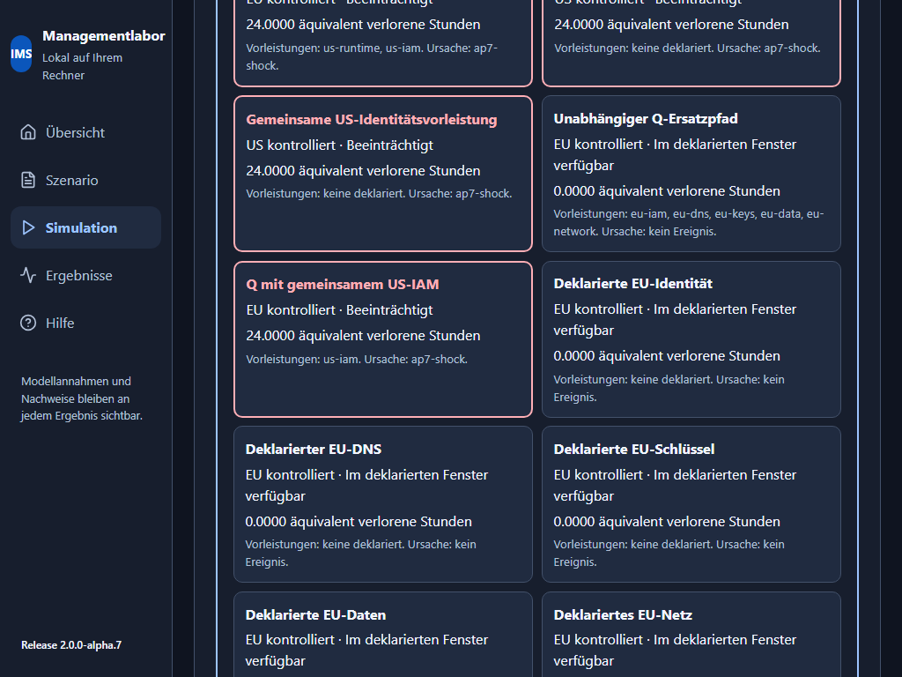
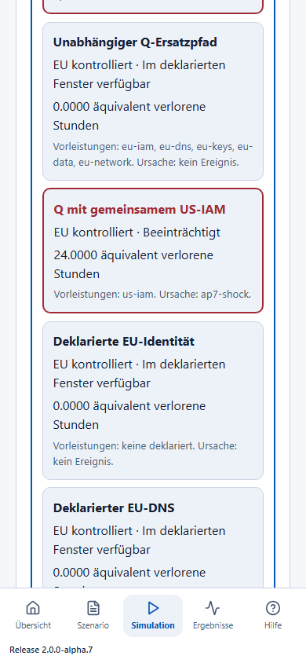

# Vier Schockfälle erklären: Markt und ICT

IMS 2.0.0-alpha.9 · Fachumfang AP7 · Workshop mit der BaFin-Gruppenauswertung 2024.
Diese Anleitung gehört zur angenommenen begrenzten Markt-/ICT-Kopplung.
Die BaFin-Basis umfasst verdiente Beiträge einschließlich Ausland und
übernommener Rückversicherung sowie redaktionelle Gruppensummen ohne
konzerninterne Eliminierung. Sie ist kein belegter deutscher Direktmarkt.
Produkte, Strategien, Kapital, Prozessmengen und Provider sind Modellannahmen.

## In fünf Minuten anfangen

1. In der Hauptnavigation **Markt und Familien** öffnen, dann den Arbeitsbereich
   **Schock bearbeiten**. Dort steht **Vier Schockfälle: Markt und ICT erklären**.
2. **Alle US-Hyperscaler fallen aus** und **100 Schockperioden** auswählen, **Schockdemo laden** klicken. Das Original bleibt schreibfrei.
3. **Schockfall frisch berechnen** klicken. Ein vollständiger Fall kann mehrere Minuten benötigen. Währenddessen zeigt IMS den Prüfstatus; es liefert kein unvollständiges Ergebnis.
4. **P20 · vorher**, **P21 · Schock** und **P22 · Vertragsfolge** vergleichen. Eine Periode bedeutet 24 deklarierte Prozessstunden. P21 umfasst Stunden 480 bis 504; der 36-Stunden-Ausfall endet in P22 bei Stunde 516.
5. Mit **Erklärseite** Baseline und Variante wählen. Die obere Wirkungskarte zeigt Arbeitsbudget und Rückstand beider Seiten. Die Kurven zeigen alle Perioden, die Verlaufstabelle enthält die exakten Mengen. VU-/Prozess-, Vertrags- und Kostentabellen lassen sich direkt im jeweiligen Erklärungsschritt aufklappen.
6. Im **Rollenfokus** CIO, COO, CSO Vertrieb oder CEO wählen. Die Auswahl führt den Fokus zum passenden hervorgehobenen Abschnitt. **Erklär-VU** beschränkt Prozess-/Bilanz-/Kostenzeilen auf ein Haus; Markt-Kurven und Markt-Eigenkapital bleiben ausdrücklich Marktwerte.

Ein kurzer Horizont von 25 Perioden eignet sich zum Erkunden. Bei 2, 5 oder 10
liegt der Standardschock P21 außerhalb des Horizonts; das ist eine ausdrücklich
angezeigte Anfangsprüfung, keine vollständige Schockgeschichte.

## Die Wirkungskette lesen

| Schritt | Sichtbare Prüfung | Bedeutung |
| --- | --- | --- |
| 1 Ereignis und Zeit | ID, wirksame Stunden, Intensität und Annahmenhinweis je Periode | Halboffenes Fenster: am exakten Ende entfällt die Wirkung. Früher erzeugte Rückstände können weiterbestehen. |
| 2 Abhängigkeiten | Rote beeinträchtigte Providerkarten, direkte Vorleistungen, Ursachen-IDs und verlorene Stunden | Alle Verbindungen sind deklariert. EU-Standort allein belegt keine Unabhängigkeit. |
| 2 Ersatzpfad | Geprüfte transitive Vorleistungsmenge, Verfügbarkeit, wirksamer Faktor und Aktivierungsfenster | Ein Ersatz muss einschließlich IAM, DNS, Schlüsseln, Daten und Netz verfügbar sein. Die Menge ist keine behauptete lineare Reihenfolge der Abhängigkeiten. |
| 3 Prozesse | Anfang + neue Vorgänge = bearbeitet + wartend; ein gemeinsames Ressourcenbudget | Personal-/Plattformkapazität wird für alle Queues zusammen verbraucht. FIFO und Teilfortschritt bleiben über Zeitkanten erhalten. |
| 4 Verträge | Kaufwillige, Anträge, Ausgabe, Warteschlange und nächste Periode | Bearbeitung in Pp wirkt ab Pp+1. Ein wartender Neuantrag ist unversichert; ein wartender Wechsel behält den alten Schutz. |
| 5 Buchung | Eindeutige Kosten-ID, VU/Sparte, Gewicht und Anteil; A = L + E | Tatsächliche Versicherungsflüsse und Prozesskosten erscheinen einmal in der Marktbilanz. Kein zusätzlicher pauschaler ICT-Margenabzug. |

Im US-Standardfall fallen die deklarierten US-Rechen-/Daten- und US-IAM-Pfade
für 36 Stunden gemeinsam aus. Die EU-Portalwurzel und **Q mit gemeinsamem
US-IAM** sind deshalb ebenfalls beeinträchtigt. Ohne Ersatz beträgt das
gemeinsame Arbeitsbudget in P21 **0**, mit dem vorbereiteten unabhängigen
Q-Pfad **96 Arbeitseinheiten**. In P22 endet der Ausfall nach zwölf Stunden;
die unveränderte Basiskapazität reicht dann für 48 Einheiten, unabhängiger Q
für 96. Neue Ereignisse oder geringere Ersatzleistung ändern diese Zahlen.

**Claims und Service sind hier Verwaltungskanäle.** Ihre Queues verursachen
deklarierte Arbeit und Kosten; sie verzögern keine Versicherungs-Schadenzahlung,
Todes- oder Ablaufleistung. Eine solche Leistungsverschiebung ist nicht Teil
dieses Modells. Nacharbeit wird in dieser Lieferung nicht erzeugt.

## Den scheinbaren Ersatz widerlegen

1. **Als eigene Schocksitzung übernehmen** klicken.
2. Im Feld **Ersatzpfad** **Q mit gemeinsamem US-IAM** wählen und frisch berechnen.
3. P21 prüfen: auch die Variante hat jetzt Arbeitsbudget 0. Der Pfadbeleg nennt **fällt mit ap7-shock aus** und die gemeinsame US-IAM-Vorleistung.
4. Den unabhängigen Q-Pfad wieder wählen oder seine Vorleistungen im vollständigen JSON ändern. Eine unbekannte Kontrollangabe wird nicht als bestätigte Unabhängigkeit gewertet; der Ersatz erhält dann keine verfügbare Kapazität.

Eine Kapazitätsmaßnahme ändert das gemeinsame Personalbudget auf dem tatsächlich
verfügbaren Primär- oder Ersatzpfad. Ihre Position in der JSON-Liste verändert
das Ergebnis nicht. Überlappende Personal-Kapazitätsfaktoren für dieselbe
Ressource werden abgewiesen: Dafür fehlt ein eigener Budgetvertrag. Überlappende
Ausfälle verwenden den größten Verlustanteil, keine Addition über 100 Prozent.

## Die anderen drei Fälle

| Fall | Was beobachten? | Erklärte Grenze |
| --- | --- | --- |
| Google kommt in die Kfz-Versicherung | Fiktiver Anbieter 41: bis P20 Kapital, Angebot und Kundenaktivität null; ab P21 einmal externes Kapital 100.000, Preis 2,4, Werbeaufwand 2 und Kapazität 25 % der Kfz-Menge. Preisantwort 2,1 ab Eintritt, Entscheidungskosten 100 in P16. | Kein recherchierter BaFin-Rang oder tatsächlicher Google-Tarif. Neue Kohorten wechseln erst nach Bearbeitung; Prämie und Risiko verbleiben vorher beim alten Haus. Niedrigerer Preis garantiert keinen höheren Gewinn. |
| LV wird unattraktiv | Marktweiter Pool vier neuer Interessenten je Periode ab P6. Ab P21 Attraktivität 0,25: ein kaufwilliger Antrag; Vertriebsantwort 0,5: zwei. Altpolicen und ihre Garantien bleiben erhalten. | Deterministische Nachfrage, keine empirische Elastizität, kein Storno oder Rückkauf. Prämie/Garantiezuführung 3/2, Verlängerung 3/2, Garantiesatz 0,001. Zehn weitere Perioden bis Ablauf nach Ausgabe. |
| Regulierungsschock ICT DORA 2.0 | Hypothetische Umstellung P21–P30: Kapazitätsverlust 50 %, Aufwand 100 einmal. Vorbereiteter Kapazitätsfaktor 2 stellt in diesem Fenster 96 statt 48 Arbeitseinheiten bereit. Ab P31 kann Rückstand aufgeholt werden. | DORA 2.0 ist ein Seminarname, keine behauptete neue Vorschrift. Benchmark-Befragungsquoten werden nicht zu Ausfallwahrscheinlichkeiten oder Compliance-Aussagen umgerechnet. |

## Vergleich, Kosten und Bilanz richtig deuten

Der Standard vergleicht **denselben Schock ohne Gegenmaßnahme** mit **demselben
Schock mit Gegenmaßnahme**. P1–P5 sind tatsächlich identisch. Im eigenen Fall
kann **Kein Schock / Schock, gleiche beschlossene Vorsorge** gewählt werden:
Nur das Ereignis entfällt in der Kontrolle. Beschlossene Entscheidungskosten
und tatsächliche Bereitschaftskosten bleiben auch ohne Schock erhalten.

Die Standardentscheidung liegt in P16, vier Perioden Vorlauf machen die
Maßnahme ab P20 verfügbar. Preisantworten warten zusätzlich auf den Eintritt.
Kosten, Termine und Wirkungswerte sind editierbar. Lebensnachfrage ist ein
gemeinsamer Marktpool; eine Vertriebsantwort gilt für alle deklarierten Angebote.
Provider-/Ressourcenschocks benennen alle eingebundenen Akteure, ihre konkrete
Betroffenheit folgt aus dem Graphen. Ressourcenmaßnahmen benennen sämtliche
Kostenträger ihrer gemeinsamen Ressource.

Der Demostandard ordnet administrative Arbeit je VU ihrer nach Anfangsaktiva
größten Modellsparte zu. Gemeinsame Kostenanteile folgen deren ausdrücklich
erklärter Anfangsbasis, mit auf vier Stellen gerundeten Gewichten und
Gewichtskorrektur beim größten Träger. Das ist eine sichtbare Annahme, keine
recherchierte Kostenverteilung. Im vollständigen Bündel stehen alle Gewichte.
Es gibt keinen verdeckten Transfer zwischen Sparten.

Bei jeder Zahlung werden die vierstelligen Betragsanteile stabil nach VU/Sparte
gerundet; der letzte Träger erhält den Rest. Ein früher Anteil wird höchstens
mit dem verbleibenden Betrag angesetzt, damit kleine Zahlungen keinen negativen
Rest erzeugen. **0,3333/0,3333/0,3334 × 6 = 1,9998/1,9998/2,0004**, Summe 6.
Entscheidung, Bereitschaft, Ressource, Ereignis und Halteaufwand haben eigene
IDs. Ein ausgefallener Provider wird nicht je Abhängigkeitspfad mehrfach bezahlt.

Eigenkapital enthält auch Altbestand, Anlageergebnis und Finanzierung. Seine
Differenz ist der Vergleich zweier vollständiger Rechnungen, keine pauschale
exakte Ursachenzerlegung. Wartende Vorgänge am Horizont und bearbeitete Anträge
für P101 sind sichtbar. Ein zeitweise fehlender Abschluss ist kein automatisch
endgültiger Verlust; längerer Horizont und Aufholung müssen separat betrachtet
werden. SCR, MCR und Kapitaldeckung werden hier nicht berechnet.

## Eigenen Fall sichern und wieder aufnehmen

1. Eigene Sitzung übernehmen, gerichtete Felder oder **Vollständiges portables Schockbündel und Ereignisfolge** bearbeiten. Das JSON kann weitere Ereignisse mit eindeutigen IDs, Beginn, Dauer, Intensität, Akteuren und Kanälen enthalten.
2. Änderungen entwerten das Ergebnis sofort. Geändertes JSON zuerst mit **AP7-JSON übernehmen und prüfen** validieren, danach frisch berechnen. Das Demooriginal wird dabei nicht gespeichert oder überschrieben.
3. **AP7-Bündel als JSON sichern** exportiert die exakte Quelle einschließlich BaFin-Basis, Seed, Ereignissen, Reaktionen und Prozessannahmen. Datei über **AP7-Sitzung aus JSON laden** öffnen und wieder frisch berechnen. Keine Verbindung zu einer externen Datenquelle nötig.
4. Einzelne **Erklär-VU** auswählen und **Erklär-VU in Excel sichern** klicken. Finanz-/Prozess-/Kostenzeilen, gemeinsame Graph-/Ressourcenbelege, Lebenspool, Ersatzpfad und Horizont-Rückstand stehen in getrennten Blättern. Anbieter 41 trägt ausdrücklich keine BaFin-Quellengruppe.
5. Export prüft die Quelle erneut und verlangt denselben Inhaltsnachweis wie die angezeigte Rechnung. Darum kann auch ein Export mehrere Minuten benötigen. Bei veränderten Eingaben wird er abgewiesen; keine still veraltete Datei.

Maximal 41 Anbieter, 200 Nichtleben-Kohorten, 100 Perioden, 20 potenzielle
Lebensanträge pro Periode, Laufzeit 20, 40.000 Vorgänge, 16 MiB Eingang und
64 MiB vollständiges gepacktes Ergebnis. Größere oder inkonsistente Fälle
scheitern atomar. Die vier Standards wurden vollständig bis P100 ausgeführt;
das macht größere eigene Fälle nicht automatisch zulässig.

AP7-Produktprüfung, Anwenderabnahme, Merge und öffentliche Veröffentlichung
sind getrennte Schritte. Diese Produktfassung ist zur Prüfung im Paket-PR
vorgesehen; aus ihrer Lieferung folgt keine Freigabe für AP8–AP14.
