# Sechs verknüpfte Marktansichten · IMS AP8

Produktfassung 2.0.0-alpha.8. Die sechs Ansichten erklären einen gemeinsamen
geprüften Modelllauf. Die BaFin-Gruppenauswertung 2024 ist ein Workshop-Fall:
verdiente Beiträge einschließlich Ausland und übernommener Rückversicherung,
redaktionelle Gruppen ohne konzerninterne Eliminierung. Keine belegte deutsche
Top-40-Direktmarkt-Auswahl. Modellbilanzen, Spartenmix, Strategien und
Providerbeziehungen sind Annahmen, keine realen Unternehmensprognosen.
Die Kopfzeile zeigt Quellenjahr, redaktionelle Kandidatengruppen sowie
nicht ausgewählte Gruppen und nicht modellierte Anteile nach angenommenem
Mapping. Diese Quellenreste in Mio. EUR gehören nicht zum Modellanteilsnenner.
Quellen-Euro und Modellwährung sind getrennte Einheiten.

## Schnell beginnen

Führen Sie diese Schritte in der gestarteten IMS-Workbench aus. Die sechs
Ansichten sind ab Produktfassung **2.0.0-alpha.8** verfügbar; die Release-Anzeige
steht links unten in der Anwendung. Die hier geöffnete Anleitung ist eine
eigene Seite.

1. Klicken Sie in der IMS-Workbench links auf **Simulation** und oben in der
   Auswahl der Modellfälle auf **Markt und Familien**.
2. Im obersten Abschnitt steht **Markt verstehen · sechs verknüpfte Ansichten**.
   Das ist die Überschrift des Arbeitsbereichs.
3. Wählen Sie einen Analysefall und zunächst 25 Analyseperioden.
4. Klicken Sie **Analysevorlage laden**, danach **Marktansichten frisch berechnen**.
5. Wählen Sie Periode, Sparte, Vergleichsgruppe und Seite. Diese Auswahl wirkt
   gemeinsam auf die sechs Ansichten und löst keine neue Rechnung aus.
6. Klicken Sie eine VU im Diagramm oder in einer Datentabelle. Der
   Buchungsnachweis öffnet die exakten VU-/Spartenwerte und Eigenkapitalbrücke.

Alternativ gelangen Sie auf der **Übersicht** über **Markt und Familien öffnen**
zum selben Arbeitsbereich.

Ein vollständiger 100er-Fall und jeder frische Export können mehrere Minuten
dauern. Während einer Rechnung wartet die Oberfläche; ein weiterer Lauf im
gleichen Backend wird abgewiesen. Ungültige Quellen oder Ressourcenüberschreitungen
erzeugen kein Teilergebnis. Eine neue Vorlage oder ein Import entwertet die alte
Ansicht. Das Demooriginal wird nicht gespeichert oder verändert.

## 1 · Markt und Sparten im Verlauf

Die Kurven zeigen Periodenergebnis, die Tabelle außerdem Beiträge und
Schluss-Eigenkapital beider Seiten. Ergebnis/Beiträge sind Flüsse der bezeichneten
Periode; Eigenkapital ist ein Bestand. Achsen sind gerundet, Tabellen exakt.
Geldsummen dürfen spartenübergreifend addiert werden, unterschiedliche
Expositionsmengen nicht. Der Schieber, Sprungknöpfe und Pfeiltasten im Diagramm
wählen dieselbe Periode. Die VU-/Spartentabelle erklärt jeden Summanden.

## 2 · Fokus, Rivalen und Modellmarkt

Fokus zeigt absolute Beiträge, Ergebnis und Eigenkapital neben Anteil und Rang.
Rivalen sind sämtliche übrigen Modell-VUs derselben Periode/Sparte. Der gesamte
Modellmarkt bildet den Nenner, auch bei Familien-, Versicherungsgruppen- oder
Peer-Auswahl. Diese Auswahl hebt Mitglieder hervor; sie verkleinert den Nenner
nicht. Gleiche Beiträge erhalten gleichen Rang; inaktive Anbieter keinen Rang.

Anteil = 100 × gebuchte VU-Beiträge / gesamte Modellbeiträge. HHI =
10.000 × Summe quadrierter VU-Beiträge / Quadrat der gesamten Beiträge.
Bei Beiträgen 90/10 sind Anteile 90/10 % und HHI 8.200. Nullnenner oder
negative Beitragsbasis liefern keine erfundene Quote. Einzeln gerundete
Anteile können in ihrer Summe geringfügig von 100 % abweichen.
Registrierte und tatsächlich aktive VUs stehen getrennt: der fiktive
Google-Anbieter ist vor Eintritt registriert, aber noch nicht aktiv.

## 3 · Familien, Streuung und Gewichte

Die Mitgliedschaft stammt aus der tatsächlich wirksamen VU-/Spartenzeile der
gewählten Periode und Seite. Ein Familienklick setzt den gemeinsamen Filter.
Die Tabelle nennt sämtliche Mitglieder, Anfangsaktiva, Ergebnis, Quote und
Min/Max gültiger Einzelquoten. Das Diagramm zeigt höchstens acht Familien;
alle übrigen bleiben in der vollständigen Tabelle erreichbar.

Quote = 100 × Periodenergebnis / Anfangsaktiva. Das Familienmittel gewichtet
mit Anfangsaktiva: Aktiva 90/10, Ergebnisse 9/3 ergeben 12 %, einzelne Quoten
10/30 %. Ihr ungewichteter Durchschnitt 20 % wäre eine andere Kennzahl.
Null-Anfangsaktiva haben keine individuelle Quote. Zusammensetzungswechsel
zwischen Seiten/Perioden können mitwirken; keine isolierte Strategiewirkung.
Überlappende Peer-Gruppen sind jeweils eindeutige VU-Mengen und werden nicht
miteinander addiert. Ein Fokus außerhalb der Filtergruppe bleibt gekennzeichnet.

## 4 · Wirksame Kundenwechsel

P1 ist Anfangsbestand. Nur eine tatsächlich geänderte Vertragszuordnung zählt
als Wechsel. Nicht versichert ist eine eigene Gegenpartei. Kfz- und Sachmengen
bleiben getrennt; keine gemeinsame Mengensumme. Bei vielen Wechseln zeigt die
Pfadübersicht sechs, die Tabelle alle. Bei versicherten Verträgen gehören Prämie
und Risiko dem gültigen Träger. Unversicherte Schäden stehen in einer eigenen
Spalte und werden keinem VU als Versicherungsaufwand zugeordnet. Die Job-Tabelle
verbindet Anfrage und tatsächlich wirksame Folgeperiode.

Lebens-Anträge sind ein eigener Kanal: Bearbeitung in P t, früheste Ausgabe
P t+1. Wartende oder lediglich bearbeitete Anträge sind keine ausgegebenen
Policen. Die Lebens-Tabelle zeigt wirklich ausgegebene Verträge mit Police,
Job, Anfrage und Ausgabe. Die vorhandenen Altgarantien bleiben erhalten.

## 5 · Ereignisse und Entscheidungen

Die Zeitlinie unterscheidet deklarierte Entscheidung, Vorlauf, Verfügbarkeit
und tatsächlich belegten Effekt. Beim ICT-Beispiel wird Vorsorge P16
beschlossen, nach vier Perioden P20 verfügbar; der Ausfall beginnt P21.
Eine verfügbare Preisantwort greift erst beim vorgesehenen Eintritt.
Familien-/Maßnahmenfenster, aktuelle Regeln und Parameter sowie konkrete
Kosten-IDs stehen in eigenen Tabellen. Die Nachschau kennt den deklarierten
Plan; daraus folgt kein damals verfügbares Zukunftswissen der VU. VUs
verwenden Vorperiodeninformation, Kunden aktuelle öffentliche Angebote.

AP7-Fälle verwenden 24 deklarierte Prozessstunden je Periode und halboffene
Ereignisfenster. Das ist kein historischer Kalender und keine Jahreskalibrierung.
Ein Fall ohne ICT-Kanal bekommt keine erfundene 24-Stunden-Uhr.

## 6 · ICT sichtbar und erklärbar

Wählen Sie **ICT: alle US-Hyperscaler fallen aus**, P21 und Erklärrolle CIO.
Der rote Primär-/IAM-Pfad zeigt tatsächlich verlorene Stunden; der gewählte
Pfad nennt transitive Vorleistungen und verursachende Ereignis-IDs. Vergleichen
Sie `q-independent` und `q-dependent`: gemeinsame US-Identität ist eine
Abhängigkeit, auch bei erklärter EU-Kontrolle des Ersatzanbieters. Unbekannte
Kontrolle beweist keine Unabhängigkeit. Jede Beziehung ist eine Workshop-Annahme.

Der Primärpfad kann ausfallen, während wirksamer Ersatz das Ressourcenbudget
erhält. Die tatsächlichen Ersatz-/Kapazitätssegmente zeigen Stunden, Faktoren
und Ersatzprüfung. Budget zählt **Arbeitseinheiten einmal je gemeinsamem Pool**;
Rückstand zählt **Vorgänge der ausgewählten VUs/Sparten**. Die beiden Kurven
haben eigene Einheiten. Das gesamte Budget wird nicht jedem VU erneut zugerechnet.
Wechseln Sie P21 → P22 → P25, um Ausfallende, Bearbeitung und Rückstandsabbau
nachzuvollziehen. Job-IDs und Bearbeitungsstunden erklären konkrete Vorgänge.

Claims/Service koppeln Verwaltungsarbeit und Kosten. Versicherungszahlungen
werden dadurch nicht verzögert. Kein SCR/MCR-, Storno-, Insolvenz-, empirisches
Resilienz- oder Complianceurteil. Ein Fall ohne ICT zeigt diese Grenze ausdrücklich.

## Vom Diagramm zur Buchung

Öffnen Sie eine konkrete VU. Die Brücke zeigt exakt:

Δ Schluss-Eigenkapital = Δ Anfangs-Eigenkapital + Δ Beiträge + Δ Kapitalanlage
− Δ Versicherungsaufwand − Δ Betriebskosten + Δ Kapitalzuführung − Δ Ausschüttung.

Δ bedeutet Variante minus Basis, in der bezeichneten Periode/Sparte/Fokus-VU.
Maßnahmen-/Prozesskosten sind bereits in Betriebskosten enthalten. Gezahlte
Leistungen sind keine zweite Belastung derselben Ergebnisrechnung. Die
Buchungsidentität ist eine exakte Addition, keine isolierte Kausalzuordnung.
Der Modellkanal Ereignis → Abhängigkeit/Strategie → Vorgang/Vertrag →
Prämie/Risiko/Kosten ist durch echte Zeilen belegbar. Gleichzeitige Mechanismen
und Gruppenwechsel können zusammenwirken; parallel verlaufende Kurven
allein sind Beobachtungen. Es werden keine unabhängigen Ursachenanteile erfunden.

## Vier Rollen am selben Lauf

| Rolle | Einstieg | Prüfbare Frage |
| --- | --- | --- |
| CEO | Position | Wie stehen Fokus, Rivalen und Modellmarkt absolut und relativ? |
| CIO | ICT / Prozesse | Welche Vorleistung fällt aus, welcher konkrete Ersatz trägt? |
| COO | Wechsel | Wann wird der bearbeitete Vorgang zum gültigen Vertrag? |
| CSO | Familien | Welche Mitglieder und Gewichte bilden den Vergleich? |

Die Erklärrolle setzt den Tastaturfokus in die betreffende Ansicht. Sie erhält
Fall und Filter. Alle Diagramme haben Datentabellen; Diagrammpunkte/Markierungen
und Tabellenknöpfe sind per Tastatur bedienbar. Hell/Dunkel verwendet dieselben
Werte. Auf kleinen Bildschirmen stehen Karten untereinander; breite Tabellen
haben einen eigenen tastaturzugänglichen Scrollbereich.

## JSON und Einzel-VU-Excel

**Analysequelle frisch als JSON exportieren** rechnet die vollständige Originalquelle
erneut und gibt nur bei gleichem Modellnachweis das portable Quellenbündel aus.
**Fokus-VU frisch als Excel exportieren** tut dasselbe für die gewählte Einzel-VU.
Der Familienfilter ändert den Modellmarkt oder die Excelquelle nicht. Importieren
Sie das JSON über **Eigene Analysequelle importieren** und rechnen Sie neu.
Quellen-, Modell- und Ansichtsnachweis stehen getrennt in der Oberfläche.
Die neue Ansicht hat einen eigenen Digest; Exportbindung ist der Modell-Digest.

## Aktuelle Ansichten aus echten Browserläufen

Die sechs Bilder stammen aus dem tatsächlichen 100er-US-Workshop-Lauf in P21,
mit Modellnachweis und vollständigen API-Zeilen. Keine gezeichneten Mockups.

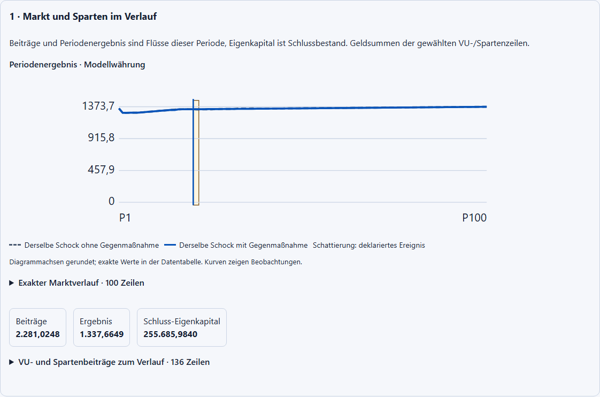

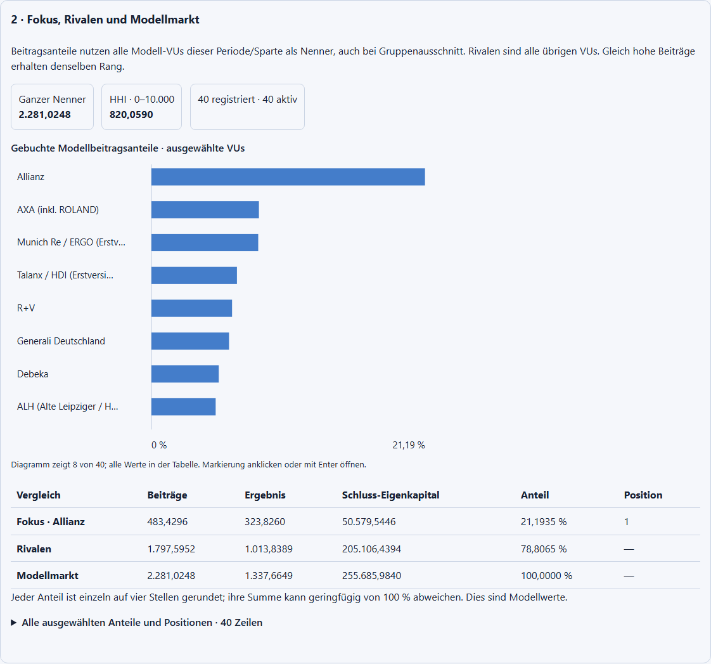

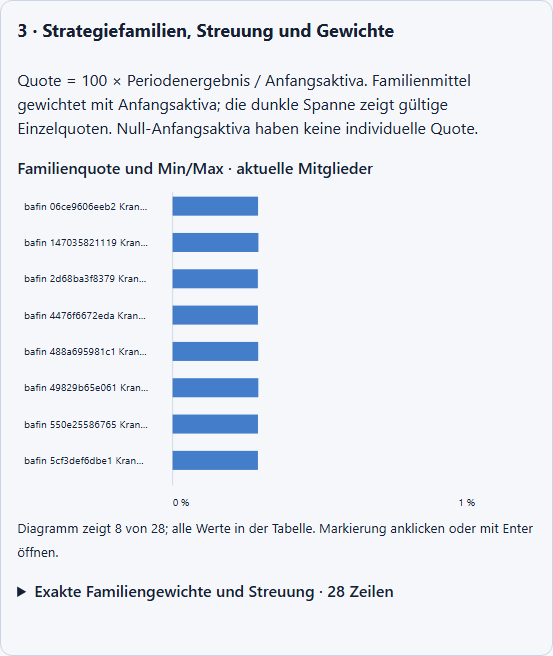

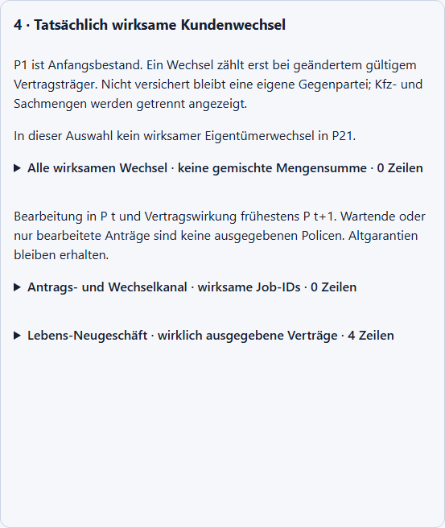

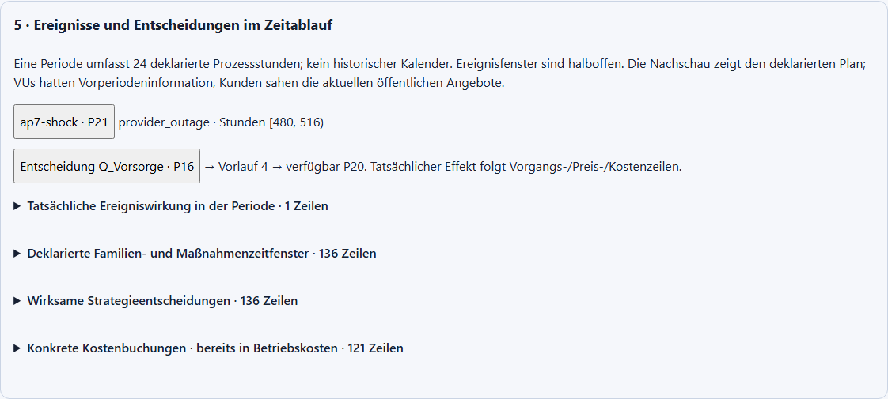

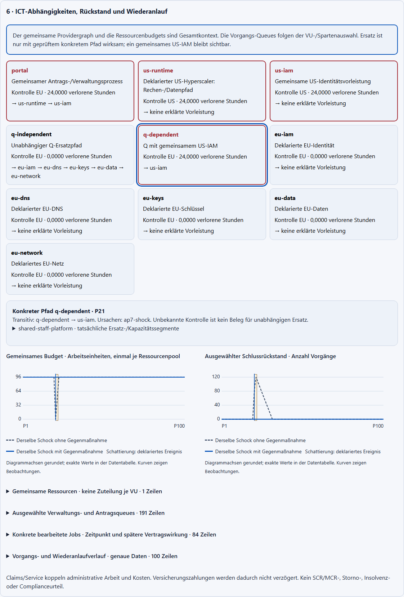

Die folgenden Bilder zeigen denselben 25er-ICT-Fall, Hell/Dunkel und drei
Bildschirmgrößen. Die CIO-Ansicht beginnt mit der benannten Ausfall-/Ersatzstruktur;
Kurven und vollständige Datentabellen folgen darunter.

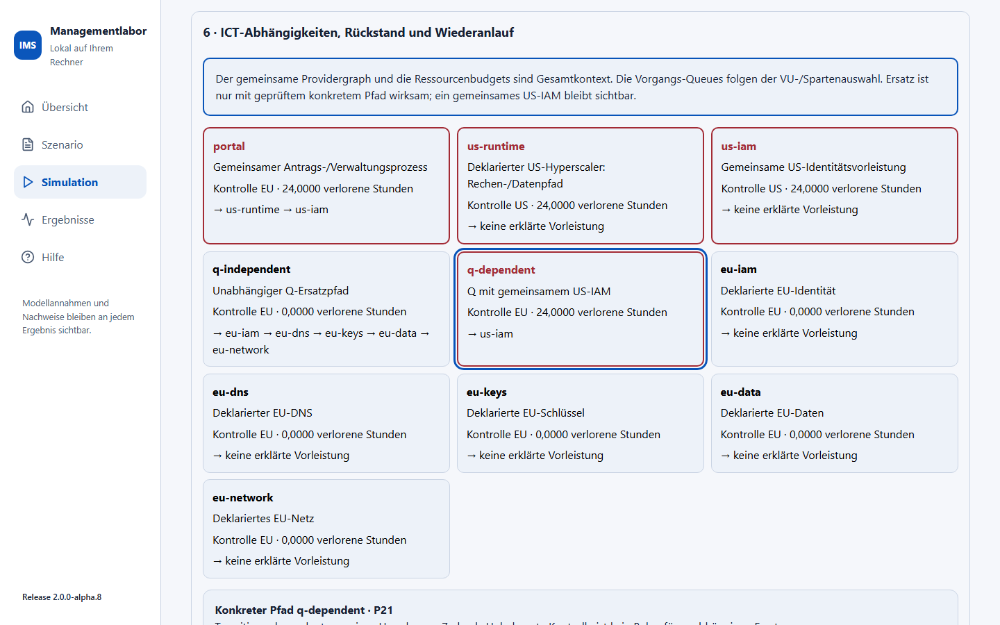

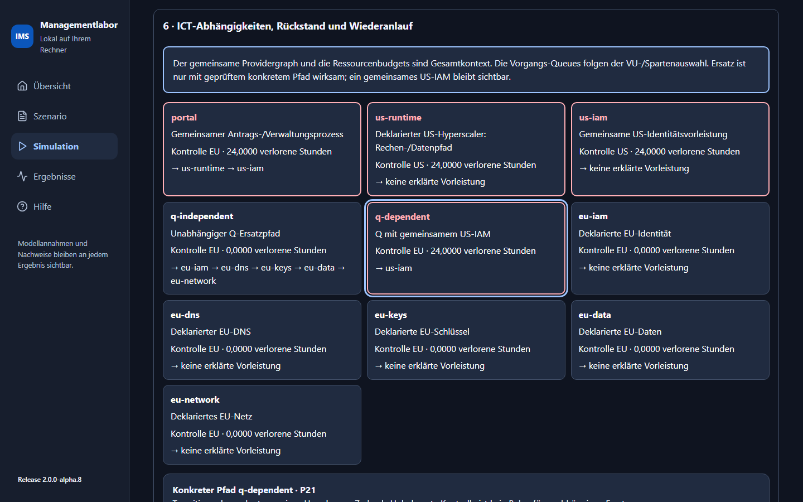

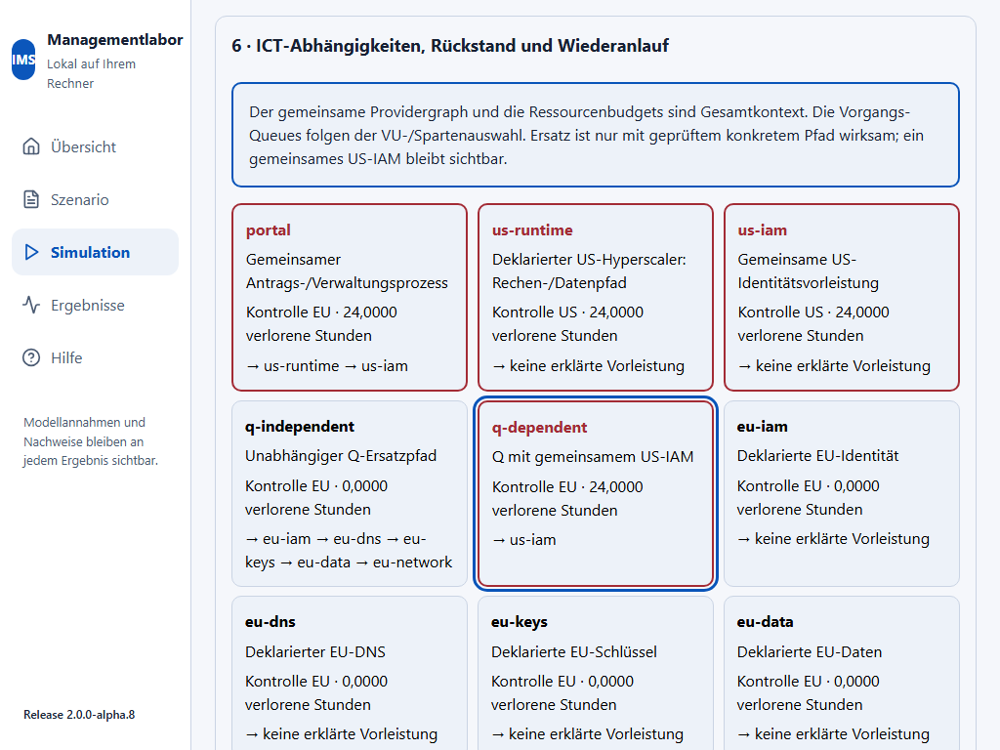

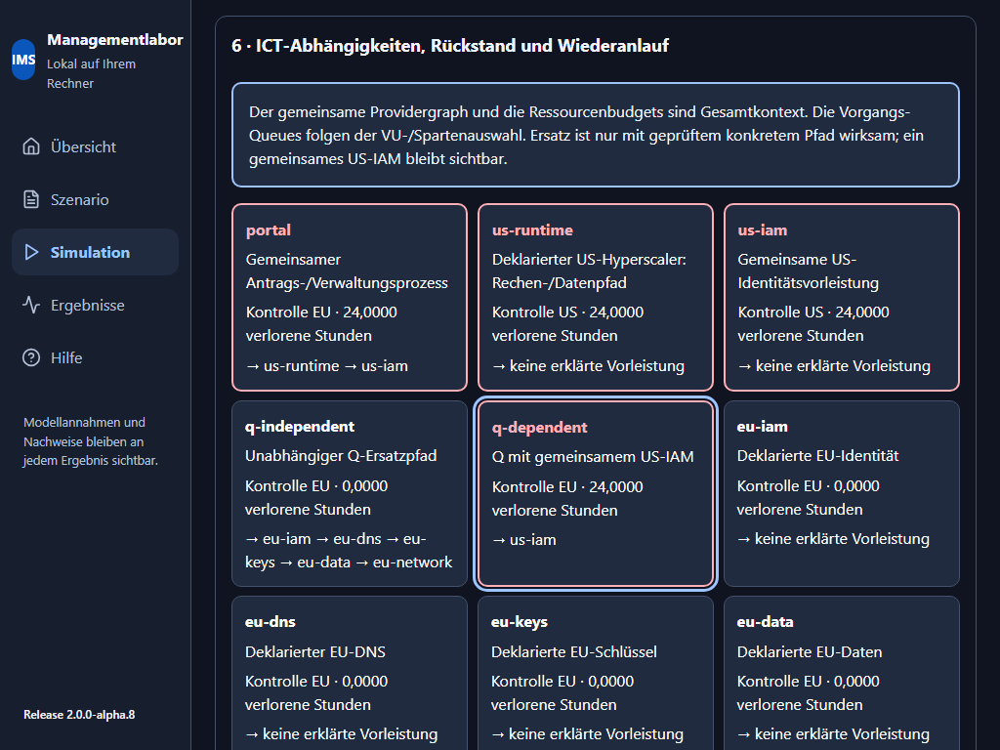

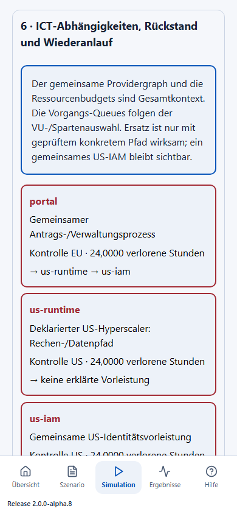

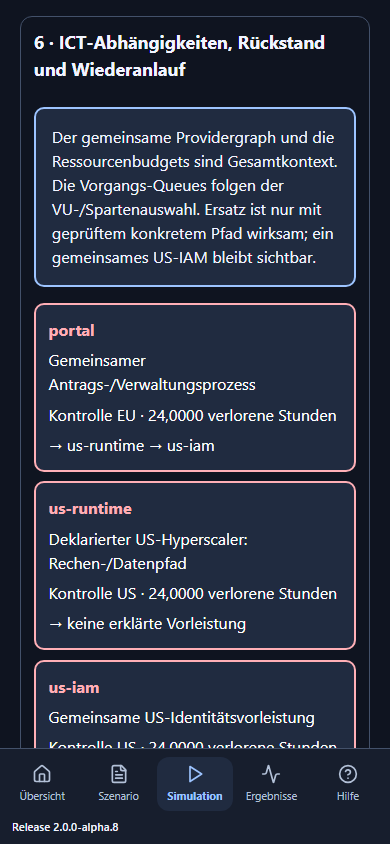

Technische Prüfung, menschliche Anwenderabnahme und Merge bleiben getrennte
Nachweise. Die Browserbilder messen keine menschliche Seminarverständlichkeit.
