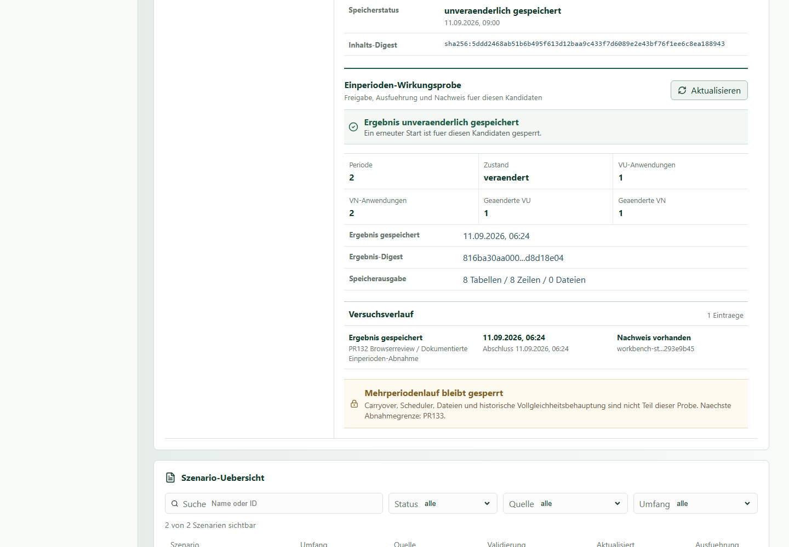
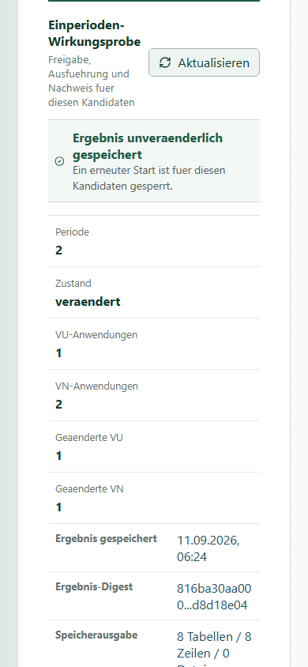
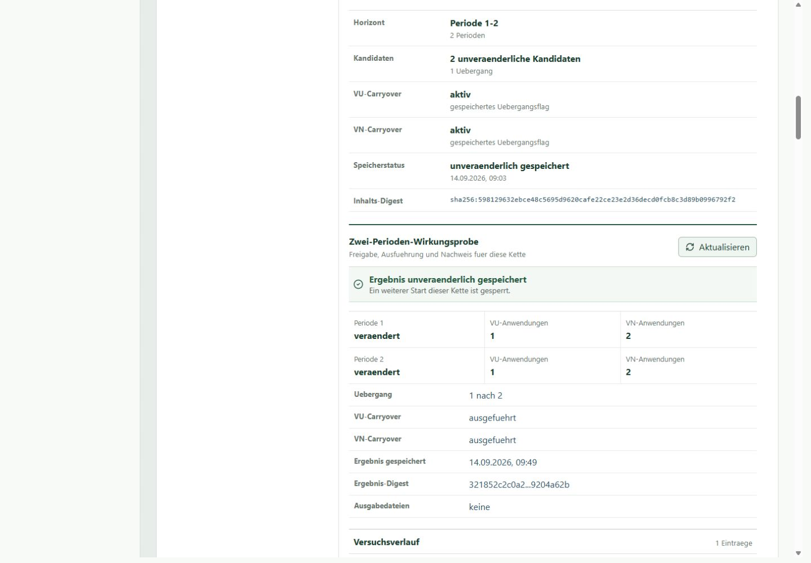
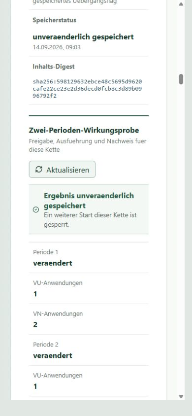

# Workbench bedienen

Stand: 2026-09-11
Gilt fuer: lokale IMS-Workbench, Handbuchstand HB3c

## Vor dem Bedienpfad

Die Workbench muss bereits lokal gestartet und im Browser erreichbar sein.
Unter Windows fuehren [Windows-Kurzstart](quickstart_windows.md) und
[Windows installieren](installation_windows.md) durch den geprueften Startweg.
Linux ist noch nicht verifiziert; iOS/Juno ist noch eine offene
Machbarkeitsfrage.

Beginne nur, wenn im `Dashboard` mindestens Folgendes sichtbar ist:

- Backend `bereit`;
- Frontend `gebaut`;
- eine nachvollziehbare Metadatenquelle;
- keine unerwartet aktiven Schreib- oder Simulationspfade.

Steht das Backend auf `nicht erreichbar`, das Frontend auf `nicht gebaut` oder
ist die Datenquelle unerwartet, brich den Bedienpfad ab. Die spaetere
Fehlerhilfe wird diese Faelle in HB6 zusammenfassen.

## 1. Szenario auswaehlen

1. Waehle in der Navigation `Szenarien`.
2. Suche in der `Szenario-Uebersicht` nach Name oder ID.
3. Grenze die Liste bei Bedarf ueber Status, Quelle oder Umfang ein.
4. Waehle eine Zeile und pruefe im `Metadaten-Detail` Name, ID, Umfang und
   Validierungsangabe.
5. Pruefe in der `Auswahlzusammenfassung`, ob Szenario und Quelle zur Aufgabe
   passen.

Die Szenarioansicht ist kein Editor. Es gibt im aktuellen Bedienpfad keinen
Browser-Upload und keine freie Aenderung historischer Eingaben.

## 2. Run auswaehlen

1. Waehle in der Navigation `Runs`.
2. Suche in der `Run-Uebersicht` nach Name oder ID.
3. Filtere bei Bedarf nach Status, Szenario oder Quelle.
4. Waehle den Run und pruefe Periodenfenster, Szenariozuordnung und
   Ausfuehrungsstatus.
5. Wechsle zur `Run-Control-Uebersicht` und kontrolliere den ausgewaehlten
   Queue-Eintrag oder den Hinweis, dass noch keiner vorhanden ist.

Der oben sichtbare Knopf `Neuer Lauf` gehoert weiterhin nicht zum
freigegebenen Bedienpfad. Fuer kontrollierte Aktionen ist ausschliesslich der
nachfolgende Run-Control-Ablauf massgeblich.

## 3. Validierungsstatus lesen

1. Waehle in der Navigation `Validierung`.
2. Pruefe den `Kernvalidierungsueberblick` und den `Validierungsstatus`.
3. Unterscheide technische Bereitschaft von fachlicher Freigabe.
4. Bei `blocked_calculated_core_validation` darf die Workbench technisch
   funktionieren; der historische Kernvergleich ist dann noch nicht als
   vollstaendig bewertet freigegeben.
5. Lies offene Hinweise, bevor du Queue- oder Freigabeaktionen ausfuehrst.

Die Bedeutung der Feld- und Zeilentreffer steht in
[Ergebnisse und historische Validierung verstehen](results_and_validation.md).

## 4. Dry-Run pruefen

1. Vergewissere dich, dass das richtige Szenario und der richtige Run
   ausgewaehlt sind.
2. Waehle im `Run-Control-Dry-Run-Vertrag` die Aktion `Dry-Run pruefen`.
3. Pruefe im Ergebnis insbesondere Request, Preflight, Szenariozuordnung,
   Schreibgrenzen und Ausfuehrungsstatus.
4. Fahre nur fort, wenn keine unerwarteten Blocker oder Zuordnungsfehler
   angezeigt werden.

Der Dry-Run prueft den Request. Er startet keinen Adapter und keine
Simulation.

## 5. Queue vormerken

1. Waehle `Queue vormerken` erst nach einem erfolgreichen Dry-Run.
2. Pruefe Queue-ID, Run-ID, Szenario-ID und Status in der angezeigten
   Vormerkung.
3. Lies danach den `Run-Control-Aktionsplan`.
4. Kontrolliere in der `Run-Control-Uebersicht`, welcher naechste Schritt fuer
   den Queue-Eintrag ausgewiesen wird.

Die Queue-Vormerkung ist ein ausdruecklicher Schreibvorgang in die konfigurierte
lokale Metadatenquelle. Sie startet keinen Queue-Worker und keine Simulation.

## 6. Explizite Freigabe pruefen

Dieser Schritt ist nur fuer einen bereits vorab validierten Queue-Eintrag
vorgesehen.

1. Pruefe im `Run-Control-Ausfuehrungsflow` die Reihenfolge
   `Preflight -> explizite Freigabe -> Ausfuehren`.
2. Trage unter `Freigegeben von` eine nachvollziehbare Person ein.
3. Trage unter `Begruendung` den konkreten Zweck ein.
4. Aktiviere `Ausfuehrung explizit freigeben`.
5. Waehle `Freigabe pruefen`.
6. Fahre nur fort, wenn der Freigabecheck den Start explizit zulaesst und der
   ausgewaehlte Queue-Eintrag unveraendert ist.

Eine Freigabe ist an Queue-Eintrag, Person und Begruendung gebunden. Aenderst
du diese Angaben, muss sie erneut geprueft werden.

## 7. Kontrollierten Adapter starten

`Adapter starten` wird erst aktiv, wenn die serverseitigen Vorbedingungen
erfuellt sind. Der Start ist manuell und idempotent. Er startet den eng
freigegebenen kontrollierten Adapter, keinen automatischen Worker und keine
historische Simulation.

1. Waehle `Adapter starten` nur fuer den geprueften Queue-Eintrag.
2. Warte auf den aktualisierten Queue- und Ergebnisstatus.
3. Wiederhole den Start nicht als Fehlerbehandlung; lies zuerst Status und
   Verlauf.

## 8. Ergebnis und Verlauf lesen

1. Oeffne die `Run-Control-Ergebnisanzeige`.
2. Pruefe Queue, Run, Szenario, Summary-Modus und Persistenzzeitpunkt.
3. Lies den `Run-Control-Ausfuehrungsverlauf` fuer Freigabe-, Start- und
   Fehlerhinweise.
4. Waehle `Ergebnis neu laden`, wenn sich der Serverstatus geaendert hat.
5. Ordne das Ergebnis anschliessend mit dem `Kernvalidierungsueberblick` ein.

Ein persistiertes Adapter-Resultat belegt, dass der kontrollierte technische
Pfad funktioniert hat. Es belegt fuer sich allein weder einen historischen
Modelllauf noch historische Vollgleichheit oder Produktionsfreigabe.

## 9. Einperioden-Wirkungsprobe bedienen

Dieser Pfad ist fuer einen bereits serverseitig gebauten, unveraenderlich
gespeicherten Strategie-Kandidaten vorgesehen. Er ist der erste bedienbare
fachliche Wirkungsnachweis, aber noch kein vollstaendiger Simulationslauf.

1. Waehle in der Navigation `Strategien` und danach den Tab `Kandidaten`.
2. Pruefe `Digest geprueft`, Marktprofil, Periode sowie die Anzahl der VU- und
   VN-Snapshots.
3. Trage unter `Freigabe durch` eine nachvollziehbare Person ein.
4. Beschreibe unter `Grund` den konkreten Zweck der Probe.
5. Aktiviere `Genau eine isolierte Periode jetzt ausfuehren`.
6. Waehle `Wirkungsprobe starten`.
7. Lies Periode, Zustandsaenderung, VU-/VN-Anwendungen, geaenderte Akteure,
   Ergebnisdigest und `Versuchsverlauf`.

*Abbildung: Erfolgreicher, unveraenderlich gespeicherter Einperiodennachweis mit Verlauf und weiterhin gesperrtem Mehrperiodenlauf; Windows/Chrome, 1440 x 1000, aufgenommen am 2026-09-11.*

Auf einem schmalen Fenster werden Kennzahlen und Nachweise einspaltig
dargestellt. Es werden keine Spalten seitlich abgeschnitten.

*Abbildung: Derselbe gespeicherte Einperiodennachweis im 390 x 844-Viewport, aufgenommen am 2026-09-11.*

### Fehler richtig behandeln

| Sichtbarer Zustand | Bedeutung | Reaktion |
| --- | --- | --- |
| Startknopf deaktiviert | Person, Grund, Bestaetigung oder Nachweisstatus fehlt | Angaben kontrollieren; Sperre nicht umgehen |
| Digest- oder Integritaetsfehler | Kandidatenidentitaet stimmt nicht mehr mit der Ablage ueberein | nicht erneut starten; Kandidatenablage pruefen |
| `Fehlgeschlagen` im Verlauf | Runner wurde erreicht, aber es wurde kein Ergebnis gespeichert | Fehlertext lesen; nur mit neuer manueller Freigabe erneut pruefen |
| `Ergebnis unveraenderlich gespeichert` | genau ein erfolgreicher Nachweis liegt vor | Ergebnis lesen; kein zweiter Start erforderlich |

Die Probe schreibt ausschliesslich Freigabe, Versuch und Ergebnis in die
konfigurierte SQLite-Metadatenquelle. Sie schreibt keine Ergebnisdateien,
verwendet kein `incomming/` und startet keinen Carryover oder Scheduler.

## 10. Zwei-Perioden-Wirkungsprobe bedienen

Dieser Pfad zeigt erstmals eine kontrollierte Folgewirkung: Zwei getrennte,
unveraenderlich gespeicherte Periodenkandidaten werden nacheinander
angewandt. Dazwischen uebernimmt die Workbench genau die in der gespeicherten
Kette freigegebenen VU- und VN-Zustaende. Das ist ein Carryover-Nachweis,
aber noch kein frei konfigurierbarer Mehrperiodenlauf.

1. Waehle in der Navigation `Strategien` und danach den Tab `Periodenkette`.
2. Pruefe `Periode 1-2`, zwei Kandidaten, `Digest geprueft` sowie die aktiven
   VU- und VN-Carryover-Flags.
3. Trage unter `Freigabe durch` eine nachvollziehbare Person ein.
4. Beschreibe unter `Grund` den konkreten Zweck der Zwei-Perioden-Probe.
5. Aktiviere `Periode 1 und 2 mit gespeichertem Carryover jetzt ausfuehren`.
6. Waehle `Zwei Perioden starten`.
7. Lies fuer beide Perioden Zustandsaenderung und VU-/VN-Anwendungen.
8. Pruefe `Uebergang 1 nach 2`, beide ausgefuehrten Carryover-Arten,
   Ergebnisdigest und `Versuchsverlauf`.

*Abbildung: Erfolgreicher, unveraenderlich gespeicherter Nachweis fuer Periode 1 und 2 mit VU-/VN-Carryover und weiterhin gesperrter freier Mehrperiodensimulation; Windows/Chromium, 1440 x 1000, aufgenommen am 2026-09-14.*

Auf einem schmalen Fenster stehen Periodenkennzahlen und Nachweiszeilen
untereinander. Es werden keine Spalten seitlich abgeschnitten und
Statuswoerter bleiben vollstaendig lesbar.

*Abbildung: Derselbe gespeicherte Zwei-Perioden-Nachweis im 390 x 844-Viewport, aufgenommen am 2026-09-14.*

### Fehler richtig behandeln

| Sichtbarer Zustand | Bedeutung | Reaktion |
| --- | --- | --- |
| Startknopf deaktiviert | Person, Grund oder ausdrueckliche Zwei-Perioden-Bestaetigung fehlt | Angaben kontrollieren; Sperre nicht umgehen |
| Digest- oder Integritaetsfehler | Kettenidentitaet oder Kandidateninhalt stimmt nicht mehr mit der Ablage ueberein | nicht erneut starten; Ketten- und Kandidatenablage pruefen |
| `Fehlgeschlagen` nach Periode 2 | kein vollstaendiges Ergebnis wurde gespeichert; Periode 1 wird nicht als Teilresultat ausgegeben | Fehlertext lesen; nur mit neuer manueller Freigabe erneut pruefen |
| `Ergebnis unveraenderlich gespeichert` | beide Perioden und der Uebergang sind vollstaendig nachgewiesen | Ergebnis lesen; kein zweiter Start erforderlich |

Ein Neuladen des Browsers liest dasselbe Ergebnis und denselben Verlauf.
Der erfolgreiche Start kann nicht mit einer zweiten Freigabe ueberschrieben
werden. Die Probe erzeugt keine fachlichen Ausgabedateien und ist weder eine
historische Vollgleichheitspruefung noch ein 100-Periodenlauf.

## Schreib- und Stopgrenzen

| Aktion | Schreibt | Startet Ausfuehrung |
| --- | --- | --- |
| Szenario/Run waehlen und filtern | nein | nein |
| `Dry-Run pruefen` | nein | nein |
| `Queue vormerken` | Queue-Metadaten | nein |
| `Freigabe pruefen` | Freigabe-/Auditkontext gemaess Serververtrag | nein |
| `Adapter starten` | Status, Audit und Adapter-Resultat | kontrollierter Adapter, keine Simulation |
| `Ergebnis neu laden` | nein | nein |
| `Wirkungsprobe starten` | Freigabe, Versuch und Einperiodenergebnis | genau eine isolierte Periode, kein Mehrperiodenlauf |
| `Zwei Perioden starten` | Freigabe, Versuch und unveraenderliches Kettenergebnis | exakt Periode 1 und 2 mit gespeichertem Carryover; kein freier Mehrperiodenlauf |

Bei unklarer Quelle, unerwartetem Schreibpfad, geaendertem Queue-Eintrag oder
einem fachlichen Blocker wird nicht weiter freigegeben. Der Browser darf nicht
dazu verwendet werden, historische Referenzen zu ueberschreiben oder lokale
Dateien aus `incomming/` zu importieren.
