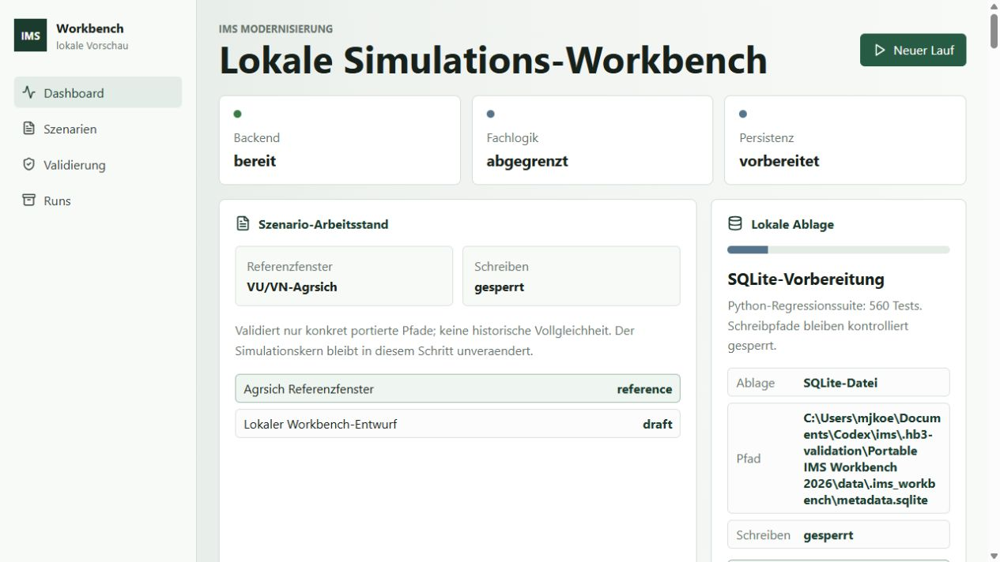
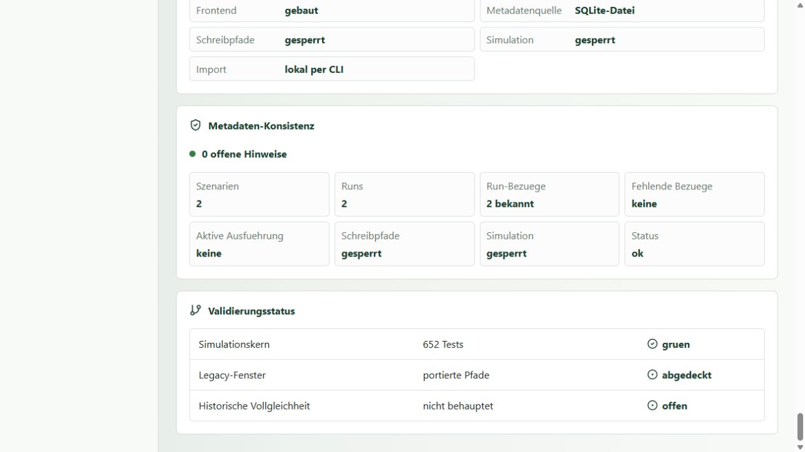

# Windows-Kurzstart

Stand: 2026-09-01
Handbuchstand: HB3a
Gepruefter Pfad: vorbereiteter portabler Workbench-Ordner unter Windows

Dieser Kurzstart fuehrt von einem bereits bereitgestellten portablen Ordner
zur lokalen Browser-Workbench. Er startet weder einen Run noch einen Adapter
oder eine Simulation.

## Voraussetzungen

- Windows mit PowerShell;
- Python 3.12 oder neuer, erreichbar als `python`;
- ein vorbereiteter portabler Workbench-Ordner mit
  `check-workbench.cmd`, `start-workbench.cmd`, `app` und `data`;
- ein freier lokaler Port, standardmaessig `8000`.

Node.js ist fuer diesen Weg nicht erforderlich, weil das Frontend bereits
gebaut im portablen Ordner liegt. Das Paket ist portabel, aber kein
eigenstaendiger Installer: Python muss auf dem Rechner vorhanden sein. Das
mitgelieferte Installationsskript richtet die Web-Abhaengigkeiten lokal ein.

## 1. Ordner oeffnen und Python pruefen

Das Beispiel verwendet absichtlich einen Pfad mit Leerzeichen:

```powershell
Set-Location "C:\IMS Tests\IMS Workbench 2026"
python --version
```

Die Ausgabe muss mindestens Python 3.12 nennen.

## 2. Lokale Python-Umgebung einrichten

Einmalig im portablen Workbench-Ordner:

```powershell
.\install-workbench.cmd
```

Das Skript legt `.venv` nur im Workbench-Ordner an, installiert das Web-Extra
und fuehrt den technischen Check aus. Check und Start verwenden diese Umgebung
danach automatisch.

## 3. Workbench pruefen

```powershell
.\check-workbench.cmd
```

Der Check ist erfolgreich, wenn Diagnose und Readiness jeweils
`"status": "ok"` melden. Er startet keinen dauerhaften Server und erzeugt
keine fehlende Metadatendatenbank.

## 4. Workbench starten

```powershell
.\start-workbench.cmd
```

Das Fenster bleibt waehrend des Betriebs geoeffnet. Die erwartete Adresse ist:

```text
http://127.0.0.1:8000/
```

Die Startansicht zeigt den erreichbaren Backend- und Frontendzustand:



*Abbildung: Workbench-Startzustand, HB3, aufgenommen am 2026-09-01. Die
Abbildung belegt Bedienbarkeit, keine historische Vollgleichheit.*

## 5. Health pruefen

In einem zweiten PowerShell-Fenster:

```powershell
(Invoke-WebRequest -UseBasicParsing "http://127.0.0.1:8000/api/health").Content
```

Erwartet wird eine Antwort mit:

```json
{"status":"ok","service":"ims-workbench-api","version":"0.1.0","frontend_available":true}
```

Unter `Validierung` bleiben technische Bereitschaft und historische Aussage
sichtbar getrennt:



*Abbildung: Health-/Validierungszustand, HB3, aufgenommen am 2026-09-01.
Statische Zaehler in der Beispielansicht sind Teil der ausgelieferten
Metadaten und nicht die aktuelle Gesamtzahl der Repository-Tests.*

## 6. Workbench stoppen

Wechsle in das PowerShell-Fenster mit dem laufenden Server und druecke
`Strg+C`. Erst nach dem vollstaendigen Stop duerfen Metadaten kopiert, eine
Version gewechselt oder der Ordner entfernt werden.

## Wenn der Standardport belegt ist

Vor Check und Start kann ein anderer Loopback-Port gesetzt werden:

```powershell
$env:IMS_WORKBENCH_PORT = "8138"
.\check-workbench.cmd
.\start-workbench.cmd
```

Die Browseradresse lautet dann `http://127.0.0.1:8138/`.

## Aussagegrenzen

- Ein gruener Health-Check belegt den technischen lokalen Start.
- Ein gruener Start ist keine fachliche Produktionsfreigabe.
- Historische Dateien sind diagnostische Referenzen und werden nicht als
  Eingabe in die moderne Berechnung zurueckgespielt.
- `incomming/` ist kein Installations- oder Importordner.

Ausfuehrliche Voraussetzungen und der Entwicklerweg stehen in
[Windows installieren](installation_windows.md). Datenpflege und
Versionswechsel stehen in [Daten, Backup und Updates](data_and_updates.md).
