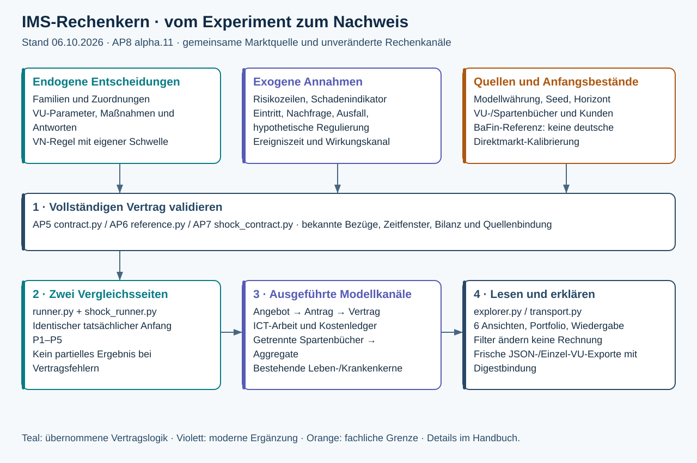
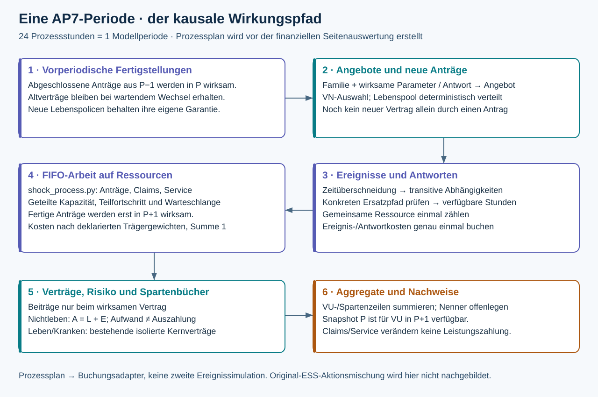
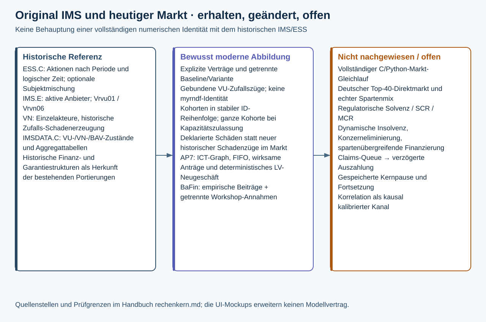

# Der IMS-Rechenkern verständlich erklärt

Stand: 06.10.2026 · AP8, Produktfassung 2.0.0-alpha.11. Diese Dokumentation erklärt die tatsächlich implementierten gemeinsamen Marktkanäle AP5–AP8. Die neue Oberfläche verändert diese Rechnungen nicht. Anwenderabnahme und Merge von AP8 stehen weiterhin aus.

## Die Grundidee

IMS untersucht, wie eine äußere Veränderung auf einen Markt trifft, dessen Anbieter und Nachfrager Strategien ausführen. Vorstände setzen Anbieterparameter und entscheiden über Maßnahmen. Die Kunden folgen ihren eigenen Verhaltensregeln. Schocks, regulatorische Workshop-Annahmen und Nachfrageentwicklungen werden als äußere Eingaben deklariert. Ein Versuch vergleicht zwei vollständig berechnete Seiten mit einem tatsächlich gleichen Anfang in P1–P5.

Die [Eingabeliste](eingabeinventar.html) beschreibt die notwendigen Felder. Die [Bedienanleitung](market_ap8.html) führt durch die Oberfläche. Die Grafiken sind skalierbare SVG-Dateien; ihr bearbeitbarer Generator liegt in `scripts/documentation/render_core_diagrams.py`.

## Was eine Rechnung erhält

Ein normaler Markt verwendet `ims.modern-market.v1`: Anbieter mit getrennten Spartenbeständen, Nachfragegruppen, vollständige Regelparameter, zeitliche Familienzuordnungen, Maßnahmen, Risikozeilen, Seed und Horizont. Das AP7-Schockbündel ergänzt Ereignisse, Antworten, ICT-Struktur und Lebens-Neugeschäft. Es enthält eine unveränderte BaFin-Referenz und daneben den ausdrücklich abgeleiteten eigenen Modellfall. Referenz und eigene Annahmen bleiben getrennt.

Geld wird als Dezimaltext in **Modellwährung** übergeben. Die vier Nachkommastellen sind Teil des Vertrags. Im Kern arbeiten Decimal-Werte; die Oberfläche summiert die ausgegebenen Geldzeilen mit Ganzzahlen. Fließkommazahlen werden bei Diagrammgeometrie verwendet. Quellenbeträge in Mio. EUR sind keine Modellgeldbeträge.

Die vollständige Prüfung lehnt unbekannte Felder, fehlende Zuordnungen, widersprüchliche Maßnahmenfenster, unbekannte Kostenträger und zyklische Abhängigkeiten ab. Eine fehlerhafte Quelle liefert kein gültiges Teilergebnis. Dass eine Datei geladen ist, ersetzt diese Prüfung nicht.

## Wie eine Periode funktioniert

Der technische Ablauf besteht aus zwei aufeinander abgestimmten Teilen. `ShockPlan._build` erstellt die zeitlich geordnete Prozess- und Kostenplanung für jede Vergleichsseite. `runner.side_result` übernimmt daraus wirksame Eigentümer, Angebote, zusätzliche Kosten, Eintrittskapital und Lebenspolicen in die Spartenrechnung. Es handelt sich um einen vorberechneten Brückenplan; die Buchungsrechnung simuliert die Ereignisse nicht ein zweites Mal.

1. Am Anfang von P werden die in P−1 vollständig bearbeiteten Anträge wirksam. Ein wartender Wechsel lässt den alten Vertrag bestehen. Ein noch nicht ausgegebener Lebensantrag ist keine Police.
2. Anbieter führen die für P geltende Familie und wirksame Maßnahmen aus. VU-Zufallszüge sind an Seed, Anbieter, Periode und Kanal gebunden. Die Nachfrageregel vergleicht aktuelle öffentliche Angebote. Bei Nichtleben werden ganze Kundengruppen in stabiler Gruppen-ID-Reihenfolge zugelassen, solange die Kapazität reicht.
3. Äußere Ereignisse wirken während ihres deklarierten Zeitfensters. Eine Periode enthält 24 Prozessstunden, ohne Anspruch auf einen kalibrierten Kalendertag. Die Überlappung des Ereignisses mit der Periode bestimmt den Kapazitätsverlust. Ersatzpfade werden einschließlich ihrer transitiven Abhängigkeiten geprüft.
4. Die geteilte Ressource bearbeitet ihre FIFO-Arbeit mit möglichem Teilfortschritt. Fertige Anträge werden für P+1 vorgemerkt. Laufende und einmalige Kosten werden im Kostenledger getrennt erfasst und auf die deklarierten VU-/Spartenkostenträger verteilt. Eine gemeinsame Ressource wird einmal gezählt.
5. Das wirksame Eigentum bestimmt die Beiträge und den Risikoträger. Neue Nichtleben-Schäden erhöhen den Versicherungsaufwand und zunächst die Verpflichtungen; Zahlungen vermindern Aktiva und Verpflichtungen. Nicht versicherter Schaden wird separat ausgewiesen und gehört nicht in ein VU-Buch.
6. Der Kern summiert die tatsächlichen VU-/Spartenzeilen zu Markt-, Familien-, Peer- und Versicherungsgruppenwerten. Ein Ergebnissnapshot aus P ist für VU-Entscheidungen erst in P+1 verfügbar. Die Anzeigeauswahl verändert diesen Ablauf nicht.

## Warum Aufwand und Auszahlung verschieden sind

Für Nichtleben gilt je Buch: Schlussaktiva = Anfangsaktiva + Beiträge + Anlageertrag + Kapitalzuführung − Zahlungen − Betriebskosten − Ausschüttung. Schlussverpflichtungen = Anfangsverpflichtungen + neuer Risikoschaden − Zahlungen. Periodenergebnis = Beiträge + Anlageertrag − neuer Risikoschaden − Betriebskosten. Das Eigenkapital folgt aus Anfangs-Eigenkapital + Ergebnis + Kapitalzuführung − Ausschüttung. Jede Zeile muss die Bilanzidentität **Aktiva = Verpflichtungen + Eigenkapital** erfüllen.

Wer Schadenaufwand und Schadenzahlung beide vom Ergebnis abzieht, zählt denselben Schaden doppelt. Ebenso sind Maßnahmen- und ICT-Kosten bereits in den ausgewiesenen Betriebskosten enthalten. Ihre Nachweistabellen erklären diese Kosten und stellen keinen zusätzlichen Abzug dar.

Leben und Kranken verwenden vorhandene, isolierte Spartenverträge mit lokalem Versicherer 1; der Adapter ordnet ihre Zeilen dem äußeren Marktanbieter zu. AP5 enthält einen geschlossenen Lebensbestand. AP7 ergänzt tatsächlich ausgegebene neue Policen über den vorhandenen Lebensvertrag. Eine geringere Neugeschäftsnachfrage verändert die bestehenden Altgarantien nicht. Die [AP7-Migrationsnotiz](../migration/ap7_shock_contract.md) beschreibt die genauen Vertragsgrenzen.

## Was gegenüber dem ursprünglichen IMS abweicht

| Thema | Historische Herkunft | Heutige fachliche Entsprechung oder Abweichung |
| --- | --- | --- |
| Akteurszustände und Aggregate | `IMSDATA.C`, classVU 226–244, classVN 278–294, BAV-Aggregate 309–350 | Explizite Eingabeobjekte, VU-/Spartenzeilen und daraus abgeleitete Summen. Moderne Gruppen sind zusätzliche benannte Auswertungen; keine Konzernkonsolidierung. |
| Aktive Anbieter | `IMS.E`, etwa 231–246, `aktiVU` | Deklarierte Anbieter/Sparten, Aufnahmekapazität und in AP7 Eintrittsaktivierung. Dynamische Insolvenz wird nicht daraus abgeleitet. |
| Anbieterangebot | `IMS.E`, `Vrvu01`; heutiger vorhandener VU-Regelkern | Familie `vu.vrvu01` führt die portierte Regel aus; `offer.fixed` ist ein ausdrücklich modernes Festangebot. Nicht alle historischen Regeln werden gleichzeitig ausgeführt. |
| Kundenwahl | `IMS.E`, `Vrvn06`, etwa 3533–3591 | Portierter Best-Information-Regelkern, ergänzt um ganze Kohorten und Kapazitätszulassung. AP7 ergänzt Bearbeitung und spätere Vertragswirksamkeit. Kein individueller VN-Gleichlauf. |
| Zufall und Schäden | Historische `normal()`- und `myrndf`-Aufrufe | VU-Züge sind reproduzierbar gebunden; heutige Marktschäden sind deklarierte Periodenzeilen. Keine Identität des historischen gesamten Zufallsstroms behauptet. |
| Zeit und Aktionen | `ESS.C`, `sy_simltp`/`sy_xaktion`, etwa 88–149 | Der gemeinsame Markt verwendet eine explizite Periodenschleife und AP7-Stundenplanung. ESS-Subjektmischung und alle außerplanmäßigen Aktionen werden hier nicht als identisch nachgebildet. |
| Leben, Kranken und Bücher | Historische Finanz-/Spartenstrukturen, bestehende Python-Portierungen | Isolierte bestehende Kernverträge; neue Lebens-Nachfrage und Prozesskopplung sind AP7-Erweiterungen, keine ursprünglichen IMS-Kanäle. |
| ICT und Regulierung | Kein entsprechender vollständiger AP7-Kanal im ursprünglichen IMS-Vertrag | Deklarierter Graph, Ressourcen, FIFO-Arbeit, Ersatzpfade, Kostenledger. DORA 2.0 ist ein hypothetischer Fall; administrative Claims/Service-Kopplung ist begrenzt. |
| Marktquelle | Historische Modellfälle | BaFin 2024: verdiente Beiträge inkl. Ausland und Rückversicherung; redaktionelle Gruppierung ohne konzerninterne Eliminierung. Kein belegter deutscher Direktmarkt. Modellmix und Provider sind Annahmen. |
| Auswertung | Historische BAV-Aggregate | Sechs AP8-Ansichten, offene Nenner/Gewichte und kontrastierende Seiten. Addition, Modellkanal, Wechselwirkung und beobachtete Korrelation bleiben unterschiedliche Aussagen. |

Die Grafiken erklären diese Abbildung. Sie belegen keinen vollständigen numerischen Gleichlauf des heutigen Marktes mit C. Kleine Regel- und Handfallprüfungen sowie reproduzierbare aktuelle Ergebnisdigests sind engere, getrennte Nachweise. Historische Prüfberichte werden durch neue Oberflächenbilder nicht erweitert.

## Technische Wegkarte

| Aufgabe | Zuständige Dateien |
| --- | --- |
| Marktvertrag und vollständige Feldprüfung | `python_port/ims/market/contract.py` |
| Vorlagen, Referenz und Quellenbindung | `presets.py`, `reference.py`, `shock_presets.py`, `shock_contract.py` im selben Verzeichnis |
| Angebote, Kundenwahl, Spartenbücher und Aggregate | `runner.py`; bestehende Regel-/Leben-/Krankenmodule in `python_port/ims` |
| Ereignisse, Antworten und seitenspezifische Planung | `shock_runner.py`, `shock_plan.py` |
| Abhängigkeiten, Arbeitskapazität und FIFO | `shock_process.py` |
| Neue Lebenspolicen mit erhaltenen Garantien | `shock_life.py` |
| Erklärbare Rechenzeilen, Übertragung und Export | `explorer.py`, `transport.py`, `export.py` |
| HTTP-Eingang und Digestbindung | `python_port/ims/api/market.py` |
| Gemeinsame Bedienführung und reine Anzeige | `frontend/src/MarketExplorerWorkbench.tsx`, `MarketExperimentEditor.tsx`, `MarketModelWorld.tsx`, `ProviderNetwork.tsx` |

## Anzeige, Prüfung und Grenzen

Die neue „Laufansicht“ spielt vorhandene Ergebnisse ab. Pause und Einzelschritt sind Anzeigeaktionen. Der Kern speichert keinen fortsetzbaren Zwischenstand; eine neue Vorstandsvariante verlangt eine neue vollständige Rechnung. Änderungen an Eingaben verwerfen das bisherige Ergebnis. Ein Fokuswechsel oder ein Anzeigefilter lässt den Modellnachweis erhalten. Export führt eine frische Rechnung aus und bindet sie an den erwarteten Modelldigest.

Regulatorische SCR-/MCR-/Solvenzquoten, dynamische Insolvenz, spartenübergreifende Finanzierung, echte Konzerneliminierung und Schadenzahlungsverzögerung aus Claims-Queues bleiben außerhalb dieses Vertrags. Eine im Mockup gezeigte Solvenzquote, frei ergänzbare Modellbausteine oder ein Fortsetzen ab Monat 8 sind keine gelieferten Rechenfähigkeiten.

Die historischen [AP8-alpha.10-Prüfbelege](../reports/ims_ap8_cockpit_produktpruefung.md) gelten für ihren eingefrorenen Produktpunkt. Die alpha.11-Erweiterung benötigt eigene Produkt- und Installerprüfungen. Die aktuelle [Dokumentationsprüfung](../reports/ims_ap8_documentation_audit.md) unterscheidet gültige Einstiegstexte und historische Nachweise.
