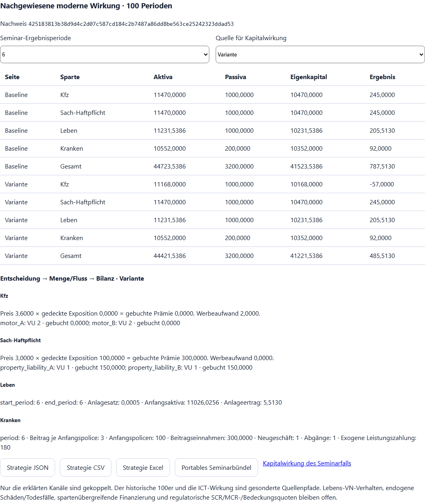
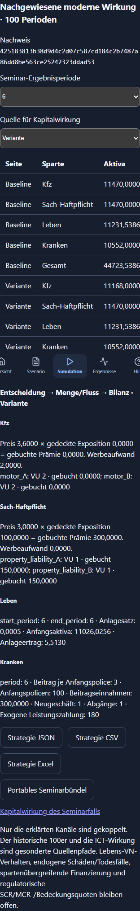
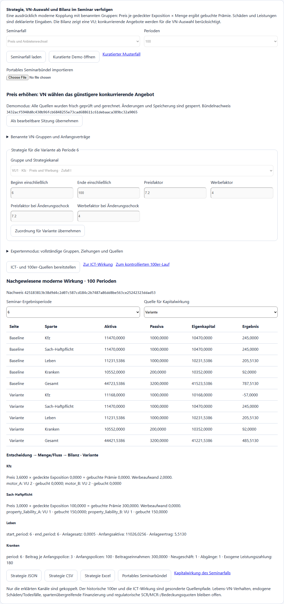
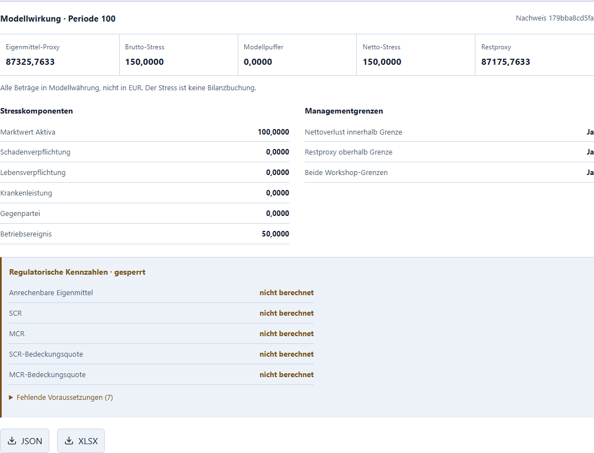
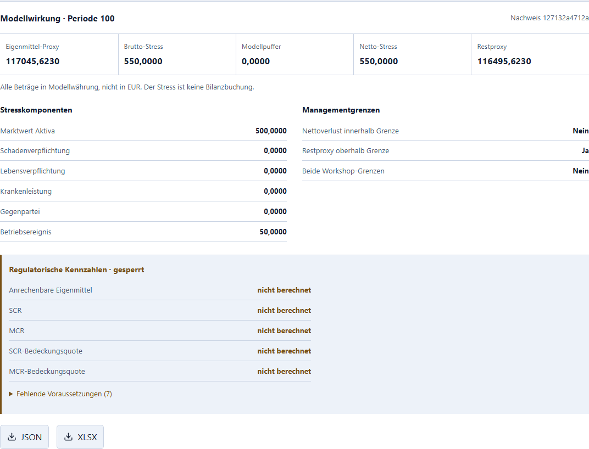

# Managementseminar mit AP3

Stand 01.10.2026, PR #290. Aktuelle moderne Workshop-Kopplung; die gesamte
Installerabnahme wird im AP3-Bericht belegt. Die Beispiele sind unkalibrierte
Modellfälle. Preise, Expositionen und Abrechnung wurden ausdrücklich als
moderne Annahmen bestätigt. Die historische Spartenidentität ist nicht belegt.

## Ohne Quellcode beginnen

Starten Sie die installierte IMS Workbench und wählen Sie **Modellwerkzeuge →
Managementseminar**. Drei vorbereitete Fälle sind direkt verfügbar. Mit
**Kuratierte Demo öffnen** werden alle Quellen neu geprüft und gerechnet;
die Demo ist gegen Änderungen gesperrt und legt keine neuen Kandidaten oder
Ergebnisse in der Datenbank ab. **Als bearbeitbare Sitzung übernehmen** öffnet
eine eigene bearbeitbare Sitzung. **Seminarfall laden** erzeugt dagegen direkt
den editierbaren vollständigen Quellenvertrag.

Erklären Sie die modernen Einheiten, Gruppen und exogenen Annahmen über die
Checkbox, dann **Moderne Kopplung berechnen**. Wählen Sie zunächst Perioden
2 und 5, danach 6 und 100. Baseline und Variante haben denselben Anfang 1–5.

## Drei kuratierte 100er-Fälle

| Fall | Gemeinsame Annahme / Änderung ab Periode 6 | Modell-Eigenkapital P100 Baseline / Variante | Moderationsfrage |
| --- | --- | --- | --- |
| Preis und Anbieterwechsel | VU1 verlangt 3,00 je Exposition, Konkurrent 3,20; Variante erhöht auf 3,60 und zahlt 2,00 Werbung je Periode. Zwei Kfz-Gruppen zu je 50 Expositionen wählen den günstigeren Anbieter. Schäden bleiben exogen, auch nach einem Wechsel. | 116.015,7633 / 87.325,7633 | Weshalb wächst der Umsatz nicht einfach mit dem Preis? Welcher Fluss verändert sich vor der Bilanz? |
| Kosten und Beitragsreaktion | Exogene Nichtlebenkosten steigen von 30 auf 45, Krankenleistung je Anfangspolice von 1,80 auf 2,40. Variante erhöht eigene Nichtlebenpreise auf 3,40 unter dem konkurrierenden Angebot 3,50, Krankenbeitrag auf 3,40. | 107.465,7633 / 118.865,7633 | Welche Wirkung stammt aus Kosten, welche aus Preisentscheidung, und weshalb bleiben hier die VN-Gruppen beim Anbieter? |
| Lebens-Anlageentscheidung und Kapitaldruck | Baseline schreibt 0,0005 der tatsächlichen Lebens-Anfangsaktiva gut; Variante ab P6 0,001. Garantien, Ablaufleistung und explizit leere Todesfalllisten bleiben gleich. In der Kapitalansicht separat deklarierter Stress 550, oberhalb der Workshop-Verlustgrenze 200. | 116.015,7633 / 117.045,6230 | Was ist der Anfangsaktiva-Effekt, was die Folge der Vorperioden? Weshalb kann die Rendite steigen und dennoch eine deklarierte Verlustgrenze verletzt sein? |

Die Werte sind Modellwährung. Die vier Anfangsbilanzen sind getrennt; die
bilanzierte VU ist VU1. VU2 ist ein konkurrierendes Preisangebot, kein zweites
vollständig bilanziertes Unternehmen. Beide Nichtleben-Sparten sind moderne
benannte Kanäle des Regeladapters, keine behauptete Übersetzung alter Positionen.
Die vier uniformen Draws je VU/Periode sind in diesen kontrollierten Beispielen
ausdrücklich 0,5. Das ist kein Monte-Carlo-Mittel oder kalibrierter Zufallsmarkt.

Im Preisfall ergibt sich ab P6 pro Periode eine Differenz von 302,00:
300,00 entfallene Prämie plus 2,00 Werbung. Über 95 Perioden sind es 28.690,00.
Die VN-Zeile nennt den tatsächlich gewählten Anbieter und die eigene gebuchte
Prämie. Preisziel, gedeckte Menge, Einnahme und Eigenkapital sind getrennte Werte.

## Eine eigene Entscheidung prüfen

Unter **Benannte VN-Gruppen und Anfangsverträge** sind die Expositionsgewichte
sichtbar und editierbar. Beide Varianten nutzen denselben Anfangsbestand.
Unter **Gruppe und Strategiekanal** wählen Sie eine VU-/VN-Gruppe und Sparte.
Bearbeiten Sie die benannten Parameter und das inklusive Fenster, frühestens
ab P6. **Zuordnung für Variante übernehmen** übernimmt den Entwurf;
danach erneut bestätigen und rechnen. Überlappende Fenster, unzugeordnete
Gruppen und unbekannte Regelkerne sind gesperrt.

Verfügbar sind Preis/Werbung (historischer Kern „Zufall I“), VN-Auswahl
(„Beste Information“), Lebens-Anlagesatz, Krankenbeitrag, Kranken-Neugeschäft
und deklarierte Kranken-Abgänge. Bei Kranken wird der Beitrag auf den
Anfangsbestand abgerechnet; Abgänge/Neugeschäft verändern den nächsten
Anfangsbestand. Bei Leben bleibt der garantierte Altbestand erhalten.
Außerhalb eines Fensters gilt der explizite Ausgangsplan. Lebens-Anlagesätze
benötigen eine vollständige Periodenabdeckung des vorhandenen Quellenmodus.

Neue Eingaben entwerten Ergebnis, Kapitalquelle und Freigabe. Im Expertenmodus
stehen sämtliche Gruppen, Kontexte, Ziehungen, Strategien und vier
Bilanzquellen. Ein Fehler in der letzten Periode blockiert den ganzen Fall.

## Portable Quellen und geprüfte Demo

**Strategie JSON/CSV/Excel** exportiert die neu gerechnete moderne Wirkung mit
demselben Digest. JSON enthält alle Eingaben, erzeugten Spartenquellen und
Entscheidungsketten. Excel enthält zusätzlich ein Blatt Entscheidungskette
und die vollständigen Quellen, auch wenn sie mehrere Textzellen benötigen.

**Portables Seminarbündel** enthält die vollständigen modernen Eingaben,
ICT-Eingaben sowie alle 100 anonymen historischen Kontexte einschließlich Seed
1300, vollständiger Profile, Ziehungen und 99 Übergänge. Drei Inhaltsnachweise
und ein gemeinsamer Bündelnachweis sind enthalten. Das Bündel enthält
ganzzahlige JSON-Zahlen in Ganzzahldarstellung, damit Browser und Python
dieselben Nachweise bilden; die ursprünglichen Quellen werden vor dieser
Darstellungsnormalisierung vollständig validiert. **Portables Seminarbündel
importieren** rechnet die moderne und ICT-Wirkung frisch und materialisiert
alle 107 historischen Kandidaten neu. Erst identische Nachweise öffnen die
schreibfreie Demo. Eine passende Hülle mit manipuliertem Inhalt wird ebenfalls
abgewiesen. Der Inhaltsnachweis ist keine kryptographische Autorensignatur.

Die drei Originalbündel liegen im Repository unter `seminar_cases/` und werden
in den Installer aufgenommen. **Kuratierter Musterfall** lädt das ausgewählte
Original ohne Quellcode. Alle Wege arbeiten auf dem lokalen Rechner offline.
Eigene Kapitalannahmen und tatsächliche 100er-Ergebnis-ZIPs zusätzlich sichern.

## Den gesamten Seminarpfad durchführen

1. Preisfall laden/rechnen oder kuratierte Demo öffnen; gemeinsamen Anfang,
   Strategieentscheidung, VN-Auswahl und P100-Bilanz interpretieren. JSON,
   CSV, Excel und ein portables Bündel herunterladen.
2. **Kapitalwirkung des Seminarfalls** öffnet die geprüfte gewählte
   Baseline/Variante. P100 auswählen, Modellstresse und zwei Workshop-Grenzen
   erklären, ausdrücklich bestätigen und rechnen. Das kuratierte Bündel
   enthält den festen Bezugsstand 01.10.2026, einen Kfz-Aktivastress von 100
   und einen Betriebsverlust von 50, keinen Modellpuffer, Höchstverlust 200
   und Mindesteigenkapital 1.000. Der Netto-Modellstress ist 150; die Variante
   des Preisfalls hat danach einen Restproxy von 87.175,7633. Diese Angaben
   sind unkalibrierte Workshop-Annahmen. JSON/Excel herunterladen.
   SCR, MCR und regulatorische Bedeckung bleiben gesperrt.
   Im Lebens-Anlage-/Kapitaldruckfall ist stattdessen eine Kfz-Aktiva-Teilmenge
   von 5.000 mit Stresssatz 0,1 deklariert: 500 plus Betriebsverlust 50 ergibt
   Netto-Modellstress 550. Die Verlustgrenze 200 ist verletzt; die Eigenkapital-
   grenze bleibt eingehalten. Das ist eine zweite unkalibrierte Workshop-
   Annahme, keine Schätzung eines gesetzlichen Kapitalbedarfs.
3. Nach Übernahme als bearbeitbare Sitzung **ICT- und 100er-Quellen
   bereitstellen**, danach **Zur ICT-Wirkung**. Baseline/Variante rechnen,
   Ausfall des gemeinsamen Anbieters um P50, Rückstand und Erholung betrachten.
   Eine lokale Gegenmaßnahme neu rechnen und das Dossier herunterladen.
4. **Zum kontrollierten 100er-Lauf**. Die vollständigen importierten Kontexte
   prüfen, Kandidaten/Ketten ausdrücklich unveränderlich speichern,
   tatsächliche 2er-/5er-Referenzen kontrolliert vorbereiten. Die zugehörige
   100er-Kette und ihren Prefix wählen, Lauf ausdrücklich bestätigen und
   das tatsächliche Ergebnis-ZIP herunterladen. Auch nach Bündelimport
   wird kein historischer Runner automatisch gestartet.
5. Kosten-/Beitrags- und Lebens-Anlagefall neu laden, P6/P100 vergleichen,
   und vollständige Quellen/Nachweise sichern. Ein beschädigtes Bündel
   oder eine ungültige späte Periode muss alle neuen Resultate sperren.

Moderne Vier-Sparten-Rechnung, anonymer historischer 100er und ICT-Kette sind
drei ausdrücklich getrennte Quellenpfade im selben Seminar. Die ICT-Bilanz
wird nicht unbemerkt ein zweites Mal in die moderne Gesamtbilanz eingebucht.
Historische Spartenidentität, Lebens-VN-Strategie, endogene Schäden/Mortalität,
vollständiger Versicherungsmarkt und gegenseitige Spartenfinanzierung bleiben
ungekoppelt. Die Veranstaltung belegt keine gesetzliche Bilanz,
regulatorischen Kapitalquoten, DORA-Konformität oder historische Vollgleichheit.

## Arbeitsblatt für 90 Minuten

| Zeit | Tätigkeit | Festhalten |
| --- | --- | --- |
| 0–10 min | Einheiten, Gruppen, Anfangsbilanzen und Quellen prüfen | Welcher Bestandteil ist Modellannahme? Was wäre für eine historische Aussage nötig? |
| 10–30 min | Preisfall und einen eigenen Parameter/P6-Fenster ausprobieren | Preis, gewählte VU, Exposition, gebuchte Prämie und Bilanz separat notieren |
| 30–45 min | Kostenfall und Lebens-Anlagefall vergleichen | Exogener Schock, Entscheidung und Carryover voneinander trennen |
| 45–60 min | Modellkapital und ICT-Ausfall/Gegenmaßnahme | Deklarierte Grenze, verbleibender Modellproxy, Dienstabhängigkeit und Kosten |
| 60–80 min | Historischen 100er kontrolliert starten, Exporte/Bündel sichern | Seed, Quellen, Prefixbelege und Ergebnis-/Bündeldigest |
| 80–90 min | Import/Demo und bewussten Fehler prüfen; Schlussdiskussion | Welche Aussage ist belegt, welche bleibt offen? Welche Daten wären der nächste Schritt? |

Aktive Bearbeitungszeit des Pakets ist nicht gemessen. 90 Minuten sind ein
Moderationsvorschlag, keine gemessene Laufdauer. Technische Prüfzeiten und
konkreter Installer/SHA-256 stehen im [AP3-Bericht](../reports/ims_ap3_abschlussbericht.md).
