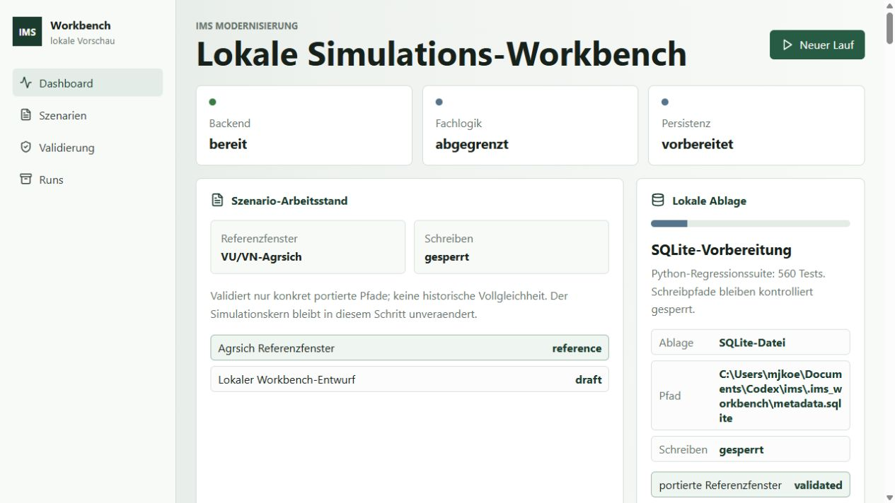
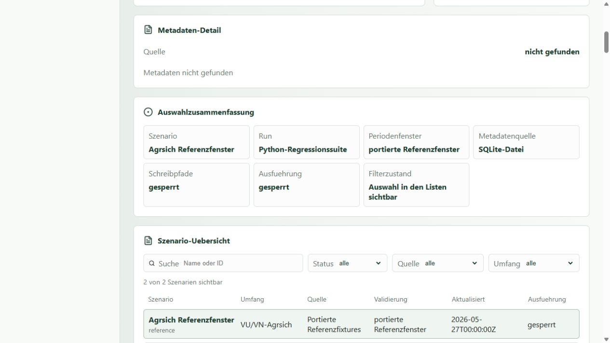
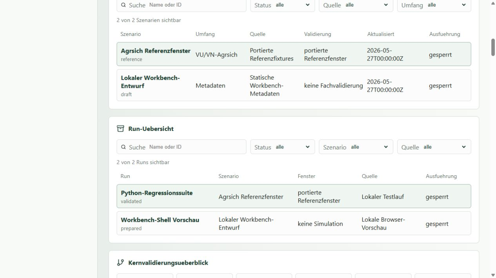
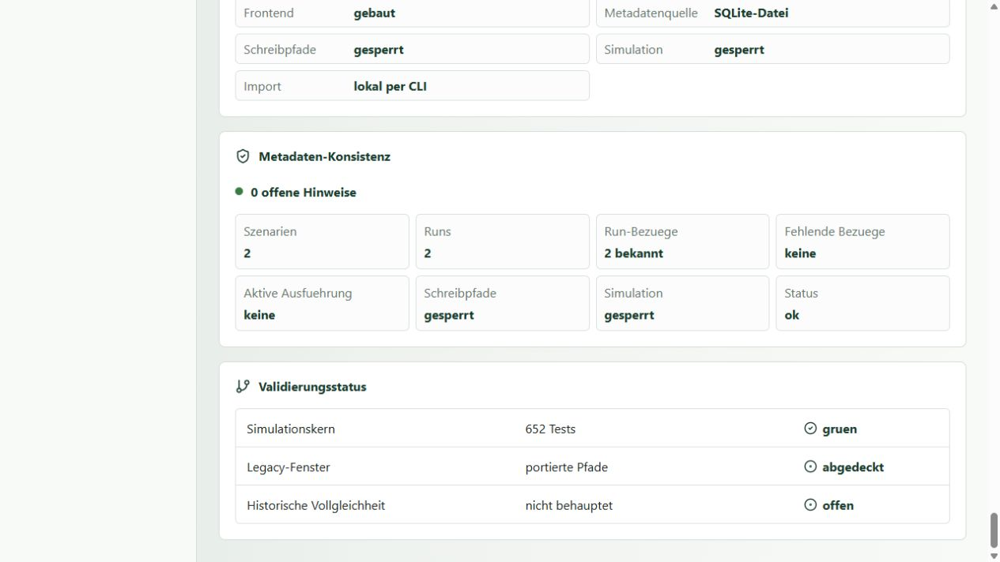
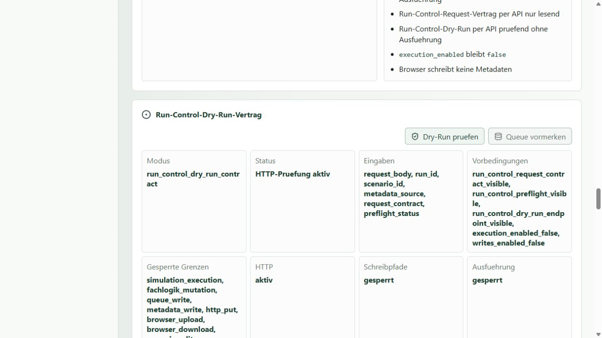

# IMS Workbench 2026 - Bedienungsanleitung fuer das Testpaket

Stand: 2026-09-01
Umfang: 8 Seiten
Zielgruppe: Versicherungsfachleute, Wissenschaftler und Entscheider ohne Kenntnis der Dissertation oder des Quellcodes

## Seite 1 - Was kann ich mit IMS heute machen?

Die IMS Workbench macht den modernisierten Stand des historischen
Versicherungsmarktmodells sichtbar und pruefbar. Sie ist derzeit vor allem ein
transparentes Analyse- und Demonstrationswerkzeug.

Als Anwender koennen Sie heute:

- die technische Betriebsbereitschaft der Anwendung pruefen;
- vorbereitete Szenarien und Runs suchen, auswaehlen und einordnen;
- Herkunft, Zeitraum und Validierungsstatus eines Datenstands nachvollziehen;
- den historischen Vergleich fuer 15 Tabellen und 6.300 Ergebniszeilen lesen;
- erkennen, welche Unterschiede exakt, toleriert oder fachlich offen sind;
- einen vorbereiteten Run-Control-Pfad per Dry-Run und expliziter Freigabe
  kontrollieren, sofern eine passende lokale Metadatenquelle bereitgestellt ist;
- gespeicherte Adapterresultate und ihren Ausfuehrungsverlauf lesen;
- die Oberflaeche und den kuenftigen Bedienablauf aus fachlicher Sicht bewerten.

Noch nicht moeglich sind ein freier Szenarioeditor, der Upload eigener
Marktdaten, eine beliebige neue Simulation im Browser, eine automatische
Kalibrierung auf reale Marktdaten oder eine belastbare Wirkungsanalyse neuer
Regulierung. Diese Funktionen gehoeren zum Ausbau von IMS 2.x.

Das historische Material dient als diagnostischer Legacy-Benchmark. Exakte
Zufallsfolgen aus 35 Jahre alten Bibliotheken sind kein Produktziel. Wichtig
sind nachvollziehbare Annahmen, moderne Reproduzierbarkeit, fachliche
Invarianten und erklaerbare Wirkungsrichtungen.

<!-- PAGE BREAK -->

## Seite 2 - Der Rundgang in zehn Minuten

Starten Sie auf `Dashboard` und pruefen Sie die drei Statusfelder. `Backend`
muss `bereit` sein. `Fachlogik abgegrenzt` und `Persistenz vorbereitet` sind
bewusste Hinweise auf den Teststand, keine fachliche Produktionsfreigabe.

*Abbildung 1: Dashboard, Handbuchstand HB3a, Aufnahme 2026-09-01.*

Gehen Sie danach in dieser Reihenfolge durch die Navigation:

1. `Szenarien`: Referenz oder Entwurf auswaehlen und Herkunft lesen.
2. `Runs`: vorhandenen Lauf, Szenario und Periodenfenster zuordnen.
3. `Validierung`: Abdeckung und fachliche Aussagegrenzen unterscheiden.
4. `Runs`: nur bei vorbereiteten Metadaten den kontrollierten Dry-Run lesen.

Der Knopf `Neuer Lauf` gehoert noch nicht zum freigegebenen Anwenderpfad. Ein
guter Test beantwortet deshalb zuerst: Ist klar, was nur angesehen werden kann,
was gesperrt ist und welche Aussage ein angezeigter Status tatsaechlich traegt?

<!-- PAGE BREAK -->

## Seite 3 - Szenarien verstehen

Ein Szenario beschreibt einen fachlichen Ausgangsstand und dessen Herkunft.
Es ist nicht automatisch ein bereits ausgefuehrter Simulationslauf.

In der `Szenario-Uebersicht`:

1. nach Name oder ID suchen;
2. nach Status, Quelle oder Umfang filtern;
3. eine Zeile auswaehlen und die `Auswahlzusammenfassung` kontrollieren;
4. Herkunft, Umfang und Validierungsangabe lesen.

*Abbildung 2: Szenarioauswahl, Handbuchstand HB3a, Aufnahme 2026-09-01.*

Beachten Sie drei Statusarten:

- `reference`: historischer oder versionierter Vergleichsstand;
- `draft`: vorbereiteter Entwurf ohne fachliche Freigabe;
- `planned`: beschriebener, aber noch nicht nutzbarer Ausbau.

Sie koennen heute beantworten, welche Referenz gezeigt wird, aus welcher Quelle
sie stammt und welcher Ausschnitt gemeint ist. Eigene Zinssaetze, Strategien
oder Regulierungsvarianten koennen noch nicht eingegeben werden. Die Ansicht ist
bewusst kein Editor und nimmt weder `incomming/` noch Browser-Uploads an.

<!-- PAGE BREAK -->

## Seite 4 - Vorhandene Runs lesen

Ein Run ist einem Szenario zugeordnet und besitzt ein Periodenfenster, einen
Status und eine Validierungsaussage. Ein vorhandener Run kann ein
Regressionstest, eine Vorschau oder ein kontrolliert vorbereitetes Ergebnis
sein. Er ist nicht automatisch eine historische Simulation.

*Abbildung 3: Run-Auswahl, Handbuchstand HB3a, Aufnahme 2026-09-01.*

Gehen Sie fuer einen sicheren Lesepfad so vor:

1. Run in der `Run-Uebersicht` auswaehlen.
2. Szenario, Fenster, Quelle und Status gemeinsam pruefen.
3. `validated` nur als Aussage fuer den konkret bezeichneten Test lesen.
4. `prepared` als vorbereiteten Stand ohne fachliche Freigabe verstehen.
5. Gesperrte Ausfuehrung nicht durch andere Startwege umgehen.

Die `Python-Regressionssuite` belegt automatisierte technische Tests. Die
`Workbench-Shell Vorschau` zeigt den Bedienstand ohne Simulation. Erst ein
zusaetzliches, versioniertes Run-Manifest koennte spaeter einen fachlichen
Szenariolauf mit Annahmen, Seed und Ergebnisgrenzen belegen.

<!-- PAGE BREAK -->

## Seite 5 - Historische Validierung richtig lesen

Die historischen Dateien sind wertvoll, aber sie stammen nicht sicher aus
einem einzigen identischen Lauf. Parameter, Zinssaetze, Compilerplattform und
Zufallszahlengenerator koennen sich unterschieden haben.

*Abbildung 4: Validierungsstatus, Handbuchstand HB3a, Aufnahme 2026-09-01.*

Der aktuelle Korpus umfasst:

- 15 von 15 vereinbarten Tabellen;
- 6.300 von 6.300 vereinbarten Ergebniszeilen;
- mehrere getrennte Laeufe von jeweils hoechstens 100 Perioden;
- VU-, VN-, Klassen- und SK1/all-Sichten.

Lesen Sie die Kennzahlen so:

- `Abdeckung`: Die vereinbarten Referenzdaten sind vorhanden und parserfaehig.
- `exakt`: Ein modernes Feld entspricht innerhalb des Vertrags der Referenz.
- `toleriert`: Eine kleine, vorher definierte numerische Differenz ist
  akzeptiert.
- `abweichend`: Das Feld unterscheidet sich und benoetigt Einordnung.
- `blocked`: Eine Freigabe ist nicht erteilt; die Anwendung kann trotzdem
  technisch funktionieren.

Eine abweichende stochastische Trajektorie ist nicht automatisch ein
fachlicher Fehler. Entscheidend sind verletzte Bilanz-, Bestands- oder
Aggregatinvarianten, nicht reproduzierbare moderne Laeufe und unerwartete
Wirkungsrichtungen. `6.300/6.300` ist ein Vollstaendigkeitsnachweis des
Vergleichskorpus, kein historischer Vollgleichheitsnachweis.

<!-- PAGE BREAK -->

## Seite 6 - Kontrollierter Dry-Run und Ergebnisse

`Dry-Run pruefen` kontrolliert Request, Zuordnung und Vorbedingungen, ohne eine
Simulation auszufuehren. `Queue vormerken` bleibt gesperrt, bis diese Pruefung
erfolgreich ist und eine passende lokale Metadatenquelle bereitsteht.

*Abbildung 5: Kontrollierter Dry-Run, Handbuchstand HB3a, Aufnahme 2026-09-01.*

Ein Ergebnis ist erst dann belastbar, wenn vier Dinge gemeinsam sichtbar sind:

1. **Ausgangslage:** Datenquelle, Zeitraum und Population.
2. **Annahmen:** Regeln, Parameter, Regulierung und Strategien.
3. **Reproduzierbarkeit:** Version, Seed-Policy und Run-Manifest.
4. **Aussagegrenze:** Was darf aus diesem Lauf geschlossen werden?

Bei vorbereiteten Adapterresultaten zeigt die Workbench Queue, Run, Szenario,
Summary-Modus, Persistenzzeitpunkt und Verlauf. Ein technisch erfolgreiches
Resultat ist noch keine fachliche Freigabe. Fuer IMS 2.x sollen deterministische
Formeln exakt getestet und stochastische Ergebnisse ueber Verteilungen,
Wirkungsrichtung, Effektstaerke und mehrere Seeds bewertet werden. Die
bytegleiche Einzelzahl eines unvollstaendig dokumentierten Laufs von 1995 ist
dagegen kein Produktziel.

<!-- PAGE BREAK -->

## Seite 7 - Wofuer soll IMS 2.x ausgebaut werden?

Das Zielbild ist eine gemeinsame, erweiterbare Plattform fuer
Versicherungsmarktsimulationen. Der heutige Teststand zeigt die technische und
wissenschaftliche Grundlage; die folgenden Anwendungen benoetigen weitere,
jeweils eigene Validierung.

### Kalibrierte Marktrekonstruktion

Reale Marktkennzahlen dienen als Kalibrierungs- und Backtesting-Ziele. IMS soll
nicht behaupten, die Realitaet punktgenau vorherzusagen, sondern erklaeren,
welche Modellannahmen beobachtete Strukturen plausibel erzeugen.

### Management-Simulation

Versichererstrategien koennen spaeter als kontrollierte Szenarien verglichen
werden, etwa Preis, Werbung, Reservepolitik oder Informationssuche. Ergebnisse
muessen relativ zu einer Basislinie und mit Unsicherheit gezeigt werden.

### Regulierungs-Wirkungsanalyse

Regeln oder Eingriffe koennen als versionierte Gegenwelten verglichen werden.
Wichtig sind Wirkungsrichtung, Verteilungsfolgen, Robustheit und erklaerbare
Annahmen. Dies ist das empfohlene erste oeffentliche Leuchtturmthema.

### Forschung und Publikation

Kuratierte, schreibgeschuetzte Szenarien koennen Methoden, historische
Entwicklung und moderne Erweiterungen nachvollziehbar zeigen. Provenienz und
Run-Manifeste machen Ergebnisse zitier- und reviewbar.

Die vier Richtungen sollen denselben Kern, dasselbe Szenarioformat und dieselbe
Ergebnis- und Nachweisschicht verwenden. So bleibt IMS ausbaubar, ohne zu vier
unvereinbaren Spezialprogrammen zu werden.

<!-- PAGE BREAK -->

## Seite 8 - Grenzen, Feedback und Kurzglossar

### Bitte testen Sie besonders

- Ist nach dem Start sofort klar, wo Szenarien, Validierung und Runs liegen?
- Verstehen Sie den Unterschied zwischen technischer Bereitschaft und
  fachlicher Freigabe?
- Ist bei jeder Kennzahl erkennbar, worauf sie sich bezieht?
- Finden Sie einen vorbereiteten Run und dessen Herkunft ohne Zusatzwissen?
- Bleiben gesperrte oder noch geplante Funktionen ehrlich erkennbar?
- Welche zwei fachlichen Diagramme oder Vergleiche wuerden Ihnen fuer eine
  echte Management- oder Regulierungsfrage zuerst fehlen?

### Nicht mit diesem Testpaket tun

- keine vertraulichen oder personenbezogenen Daten einspielen;
- den lokalen Server nicht ins Netzwerk freigeben;
- historische Referenzdateien nicht ueberschreiben;
- angezeigte Vergleichswerte nicht als Prognose oder Produktfreigabe verwenden;
- `incomming/` nicht als Benutzerimport behandeln.

### Kurzglossar

| Begriff | Bedeutung |
| --- | --- |
| Szenario | dokumentierte Ausgangslage mit Annahmen und Herkunft |
| Run | einem Szenario zugeordneter Lauf- oder Ergebnisdatensatz |
| Queue | kontrollierte Vormerkung fuer einen Ausfuehrungsschritt |
| Dry-Run | Request-Pruefung ohne Ausfuehrung |
| Adapter | eng begrenzte technische Verbindung zum vorbereiteten Laufpfad |
| Legacy-Benchmark | historische Daten fuer Herkunft, Struktur und Diagnose |
| Seed | Startwert einer modernen reproduzierbaren Zufallsfolge |
| Invariant | fachliche Bedingung, die unabhaengig vom Zufall gelten muss |

Zum Beenden wechseln Sie in das Serverfenster und druecken `Strg+C`. Installation
und Fehlerhilfe stehen in `INSTALLATION.pdf`.
