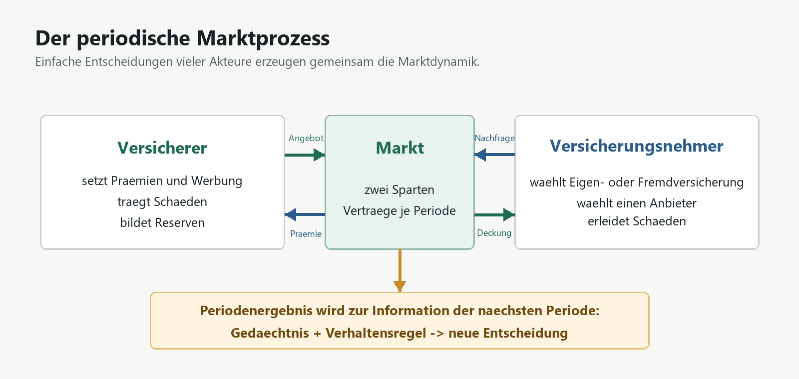
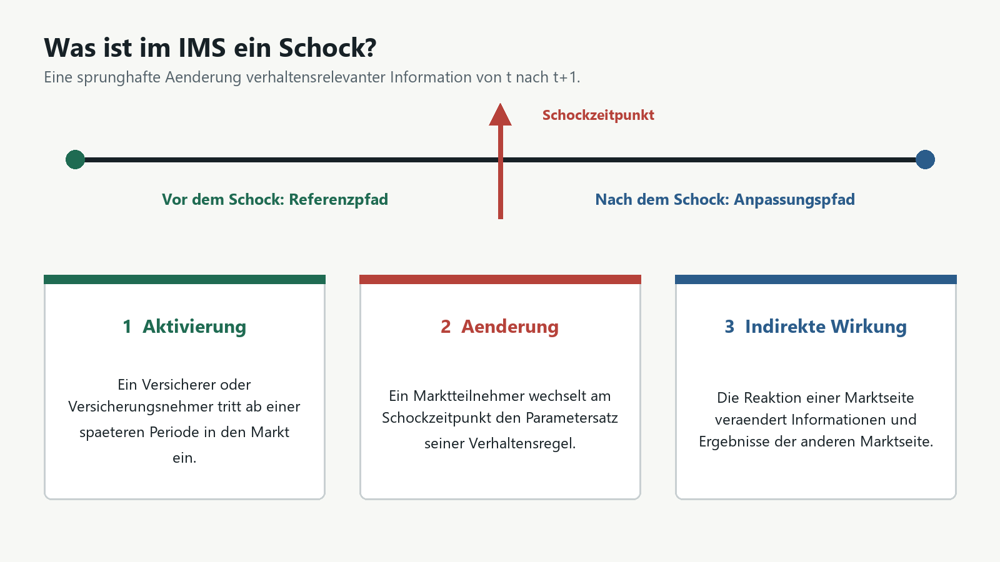
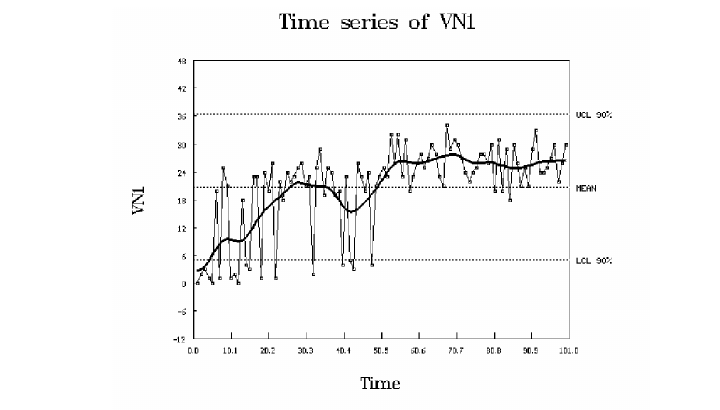
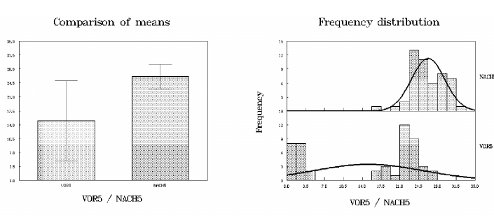
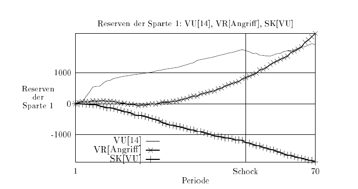

# IMS 1995-2026 - Modell verstehen, Experimente planen, Ergebnisse lesen

Stand: 2026-09-01
Umfang: 10 Seiten
Zielgruppe: Forscher, Versicherungsmanager und fachlich interessierte Anwender ohne Kenntnis der Dissertation oder des Quellcodes
Fachliche Quelle: `DISS.pdf`, insbesondere S. 2-3, 31-43, 81-95 und 103-109

## Seite 1 - Die urspruengliche Idee

IMS fragt nicht zuerst: **Wie hoch ist morgen eine bestimmte Marktziffer?**
Die Forschungsfrage lautet vielmehr:

> Was geschieht in einem Versicherungsmarkt, wenn sich seine
> Rahmenbedingungen sprunghaft aendern und unterschiedlich informierte
> Marktteilnehmer darauf reagieren?

Die Dissertation bezeichnet die Computersimulation sinngemaess als
Forschungslabor. In diesem Labor entsteht ein kuenstlicher Versicherungsmarkt
aus einzelnen Versicherern und Versicherungsnehmern. Ihre Entscheidungen
werden Periode fuer Periode wiederholt. Das Ergebnis einer Periode veraendert
die Informationsgrundlage der naechsten Periode.

*Abbildung 1: Vereinfachter Marktprozess nach `DISS.pdf`, S. 2-3 und 33.*

IMS berechnet deshalb keinen Gleichgewichtspreis und unterstellt keine
vollstaendig informierten Optimierer. Der Markt ist dauerhaft in Bewegung.
Beobachtet wird, wie einfache Verhaltensregeln zusammen Marktdynamik erzeugen
und wie gut sie ploetzliche Aenderungen verarbeiten.

Das urspruengliche Ziel ist **Prozessrealitaet**: Ein plausibler Marktprozess
ist wichtiger als die punktgenaue Reproduktion realer Marktzahlen. Ergebnisse
sind Szenarioaussagen und keine Prognosen oder historischen Rekonstruktionen.

<!-- PAGE BREAK -->

## Seite 2 - Was kann das Modell?

Das historische IMS bildet einen disaggregierten Versicherungsmarkt mit zwei
Schadenversicherungssparten ab. Jeder Marktteilnehmer besitzt eine eigene
Verhaltensregel und nur die darin vorgesehene Information.

### Versicherungsnehmer entscheiden in jeder Periode

1. Trage ich mein Risiko selbst oder versichere ich mich?
2. Wenn ich mich versichere: Welchen Versicherer waehle ich?

Die Wahl kann zufaellig, praferenzgesteuert, erinnerungsbasiert oder ueber die
Suche nach Praemieninformationen erfolgen. Ein Versicherungsnehmer kann den
Versicherungsstatus und den Anbieter in jeder Periode wechseln.

### Versicherer entscheiden in jeder Periode

- welche Praemie sie in jeder der beiden Sparten verlangen;
- wie viel sie in jeder Sparte fuer Werbung ausgeben.

Sie tragen die Schaeden ihrer Versicherten und bilden daraus Reserven. Ihre
Regeln koennen ohne Information, mit eigenen Vergangenheitswerten oder mit
Informationen ueber andere Anbieter arbeiten. So lassen sich monopolistische
Konkurrenz, oligopolistisches Verhalten und Mischformen untersuchen.

| Informationsbasis | Versicherer-Regeln | Versicherungsnehmer-Regeln |
| --- | --- | --- |
| ohne Information | Zufall I/II | Zufall I/II |
| eigene Information | Mark-Up I-III, Erwartungsschaden | Praeferenz, Totale Erinnerung |
| fremde Information | Dumping, Durchschnitt, Angriff | Suche, Beste Information |

### Damit lassen sich Fragen untersuchen wie

- Welche Strategien gewinnen oder verlieren nach einem Nachfrageschock
  Marktanteile?
- Wie schnell passen sich Praemien an eine veraenderte Schadenlage an?
- Welche Versicherer geraten bei gleicher Marktveraenderung unter
  Reservendruck?
- Welche Versicherungsnehmer tragen hoehere Praemien oder mehr Eigenschaden?
- Sieht der Effekt beim einzelnen Akteur anders aus als im Gesamtmarkt?

Das Modell liefert keine automatisch optimale Strategie. Es zeigt
Wirkungsverlaeufe unter offen gelegten Annahmen.

<!-- PAGE BREAK -->

## Seite 3 - Was ist ein Schock?

Die Dissertation definiert einen Schock als sprunghafte Aenderung einer
verhaltensrelevanten Information von einer Periode zur naechsten. Der Schock
ist also kein roter Alarm im Programm, sondern ein klar benannter Eingriff in
den laufenden Marktprozess.

*Abbildung 2: Schockbegriff nach `DISS.pdf`, S. 41-43.*

### Drei Schockarten

1. **Aktivierungsschock:** Ein Versicherer oder Versicherungsnehmer wird erst
   in einer spaeteren Periode aktiv. Dadurch entstehen neues Angebot, neue
   Nachfrage und moegliche Wechselbewegungen.
2. **Aenderungsschock:** Ein Marktteilnehmer wechselt am Schockzeitpunkt vom
   bisherigen zum vorbereiteten Parametersatz seiner Verhaltensregel.
3. **Indirekter Schock:** Die Reaktion einer Marktseite wirkt ueber Preise,
   Werbung, Nachfrage oder Schaeden auf die andere Marktseite weiter.

Auch allgemeine Marktparameter wie der Zins auf Reserven oder die Kosten einer
Praemieninformation koennen veraendert werden. Mehrere Schockarten koennen zu
einem Szenario verbunden werden.

Ein Schock wird sichtbar, indem man einen Referenzpfad vor dem Eingriff mit dem
Anpassungspfad danach vergleicht. Relevant sind Niveau, Streuung,
Anpassungsgeschwindigkeit, Wirkungsrichtung und Unterschiede zwischen
Akteursgruppen.

<!-- PAGE BREAK -->

## Seite 4 - Experiment aufsetzen

Die Dissertation gliedert eine Untersuchung in vier Phasen:

1. **Modell konfigurieren:** Verhaltensregeln zuordnen, Startwerte und
   Parameter setzen, Schockzeitpunkt und Schockparameter bestimmen.
2. **Messgroessen waehlen:** Zum Beispiel Marktanteil, Praemie, Reserve,
   Versicherungsstatus oder Vermoegen.
3. **Messmethoden festlegen:** Zeitreihen, Vorher/Nachher-Vergleich,
   Verteilungen, mehrere Laeufe und Aggregationsebenen.
4. **Aussagen ableiten:** Ergebnisse fachlich interpretieren und ihre Grenzen
   benennen.

*Abbildung 3: Die heutige Szenarioansicht zeigt Herkunft und Status, ist aber noch kein fachlicher Szenarioeditor.*

Im Wiedervereinigungsbeispiel umfasst jeder Lauf genau 100 Perioden. Der
Schock liegt in Periode 50. Die Dissertation wertet 30 Laeufe zu je 100
Perioden aus; dadurch enthaelt eine Aggregatdatei 3.000 Periodenergebnisse.

Fuer eine neue Untersuchung muessen Basis- und Schockszenario bis auf den
bewusst veraenderten Eingriff vergleichbar sein. Seed-Policy, Modellversion,
Parameter und Messgroessen gehoeren in ein Run-Manifest. Erst dann kann ein
Forscher oder Manager einen Unterschied dem Szenario statt einem verdeckten
Eingabewechsel zuschreiben.

<!-- PAGE BREAK -->

## Seite 5 - Wo ist der Output?

Die kurze und ehrliche Antwort fuer das aktuelle Windows-Testpaket lautet:
**Die Workbench zeigt noch keinen fachlichen Modelloutput als Zeitreihe oder
Diagramm.** Sie zeigt Szenarien, Run-Metadaten, technische Ausfuehrungsgrenzen
und historische Validierung.

*Abbildung 4: Die Run-Uebersicht weist einen Lauf nach; sie zeigt noch keine Praemien-, Marktanteils- oder Reservenreihe.*

Die Dissertation beschreibt den historischen Output als
**Aggregationsdateien mit Simulationsrohdaten**. Grafiken konnten
programmintern vorbereitet werden; statistische Auswertungen erfolgten mit
externen Programmen (`DISS.pdf`, S. 106-107).

Heute sind drei Orte zu unterscheiden:

| Ort | Inhalt | Anwenderbedeutung |
| --- | --- | --- |
| `tests/references/legacy_agrsich/` | historische `.DAT`-Referenzen | Diagnosematerial, kein neuer Lauf |
| explizit gewaehltes `output_dir` eines Diagnose-Runners | neu berechnete `.dat`-Tabellen | nur bei gezieltem Entwickler-/Validierungslauf |
| Workbench `Runs` / Ergebnisanzeige | Status, Herkunft, Freigabe und Adapterprotokoll | noch keine fachliche Datenanalyse |

Beim normalen Start des ZIP-Testpakets wird keine Simulation gestartet und
deshalb auch kein neuer Ergebnisordner erzeugt. Ein sichtbarer
Ergebnis-Arbeitsbereich mit Diagrammen, Tabellen und Export ist eine noch
offene Produktfunktion von IMS 2.x.

<!-- PAGE BREAK -->

## Seite 6 - Welche Daten liefert IMS?

Jede Zeile einer historischen Aggregationsdatei beschreibt eine Periode. Die
Spalten mit der Endung `1` oder `2` gehoeren zur jeweiligen Sparte.

### Daten der Versicherer

| Gruppe | Fachliche Groessen |
| --- | --- |
| Entscheidungen | Praemie `Pr`, Werbeaufwand `Wa` |
| Ergebnisse | Reserve `Rs`, Anzahl Versicherungsnehmer `Vn` |
| Folgewirkungen | Schadenanzahl `Sa`, Schadenhoehe `Sh` |

### Daten der Versicherungsnehmer

| Gruppe | Fachliche Groessen |
| --- | --- |
| Entscheidungen | gewaehlter Versicherer `Vu`, Versicherungsstatus `Vs` |
| Ergebnisse | gezahlte Praemie `Vp`, selbst getragener Schaden |
| Folgewirkungen | Schadenhoehe `Sh`, Endvermoegen je Risiko `Ev` und gesamt `Vm` |

Die Dateinamen kennzeichnen die Betrachtungsebene:

| Muster | Sicht |
| --- | --- |
| `imsvuNNN.dat` / `imsvnNNN.dat` | einzelner Versicherer / Versicherungsnehmer |
| `imsvurNN.dat` / `imsvnrNN.dat` | eine Verhaltensregel |
| `imsvuvkN.dat` / `imsvnvkN.dat` | eine Regelklasse |
| `imsvusk1.dat` / `imsvnsk1.dat` | Gesamtmarkt `SK1/all` |

Eine Zahl wird erst durch ihren Kontext aussagefaehig: Akteur oder Aggregat,
Sparte, Periode, Szenario, Schockzeitpunkt, Lauf und Seed. Fuer Manager sollte
die kuenftige UI diese technischen Spalten in fachliche Kennzahlen uebersetzen:
Marktanteil, Praemienbelastung, Reservenentwicklung, Schadenlast,
Wechselbewegung und Erholungsdauer nach dem Schock.

<!-- PAGE BREAK -->

## Seite 7 - Wie sieht ein Schock in einer Zeitreihe aus?

Die folgende Originalgrafik aus der Dissertation zeigt den Marktanteil des
Versicherers VU[14] ueber 100 Perioden. Die duenne Linie ist der beobachtete
Periodenwert, die dicke Linie ein gleitender Durchschnitt. Der Schock liegt in
Periode 50.

*Abbildung 5: Historisches Beispiel aus `DISS.pdf`, Abb. 5.8, S. 92. Kein Ergebnis der modernisierten Workbench.*

So wird die Grafik gelesen:

- **Vor dem Schock:** Der Marktanteil schwankt stark und besitzt einen
  erkennbaren Referenzverlauf.
- **Am Schock:** Es erscheint kein einzelner magischer Messpunkt. Entscheidend
  ist, ob sich Verlauf, Niveau oder Streuung danach nachhaltig aendern.
- **Nach dem Schock:** Der geglaettete Marktanteil liegt in diesem Beispiel
  hoeher und schwankt weniger stark.

Ein einzelner stochastischer Lauf kann Zufall und Wirkung vermischen. Deshalb
werden mehrere Laeufe und robuste Kennzahlen benoetigt. Der gleitende
Durchschnitt hilft beim Sehen des Verlaufs, beweist allein aber noch keine
kausale Wirkung.

<!-- PAGE BREAK -->

## Seite 8 - Vom Bild zur Aussage

Die Dissertation teilt die Zeitreihe am Schockzeitpunkt in einen Vorher- und
einen Nachher-Abschnitt. Danach werden nicht nur zwei Einzelwerte, sondern
Mittelwerte, Streuungen und Verteilungen verglichen.

*Abbildung 6: Historischer Vergleich von Mittelwert und Verteilung aus `DISS.pdf`, Abb. 5.9, S. 93. Kein aktueller Programmlauf.*

Fuer einen heutigen Schockversuch bedeutet das:

1. Definiere eine Basislinie ohne Schock und ein sonst gleiches
   Schockszenario.
2. Wiederhole beide Szenarien mit einer dokumentierten Seed-Policy.
3. Vergleiche Niveau, Streuung und Verteilung der Zielgroesse.
4. Berichte Effektstaerke und Unsicherheit, nicht nur einen p-Wert.
5. Pruefe, ob der Befund in beiden Sparten und bei anderen
   Aggregationsebenen bestehen bleibt.

Die historische Grafik zeigt, wie aus dem sichtbaren Niveausprung eine
pruefbare Aussage wird. Sie ist kein Beleg, dass derselbe Effekt mit heutigen
Parametern oder Zufallszahlen erneut auftreten muss.

<!-- PAGE BREAK -->

## Seite 9 - Warum die Aggregationsebene entscheidend ist

Die Dissertation vergleicht Aggregatstufen mit den Vergroesserungsstufen eines
Mikroskops. Stufe I zeigt ein Einzelsubjekt, Stufe II eine Verhaltensregel,
Stufe III eine Regelklasse und Stufe IV den Gesamtmarkt `SK1/all`.

*Abbildung 7: Historischer Reservenvergleich aus `DISS.pdf`, Abb. 5.10, S. 93. VU[14], Regelgruppe und Gesamtmarkt reagieren verschieden.*

Die Abbildung macht die eigentliche Staerke des Modells sichtbar: Beim
einzelnen Versicherer kann der Schock deutlich sein, waehrend der Mittelwert
einer Regelgruppe oder des Gesamtmarkts wenig zeigt oder sogar in die andere
Richtung laeuft.

Das beantwortet eine typische Managementfrage: **Wer ist betroffen, auch wenn
der Markt insgesamt stabil aussieht?** Ein Gesamtmittel kann Gewinner und
Verlierer verdecken. Deshalb sollte eine Wirkungsanalyse mindestens auf vier
Ebenen lesen:

- einzelner Versicherer oder Versicherungsnehmer;
- konkrete Verhaltensregel;
- Informations-/Regelklasse;
- Gesamtmarkt.

Die Dissertation fand entsprechend Schockwirkungen, die auf hoher Aggregation
kaum nachweisbar, in staerker disaggregierten Daten aber deutlich waren.

<!-- PAGE BREAK -->

## Seite 10 - Beispiel und heutiger Nutzen

Die deutsche Wiedervereinigung war das Anwendungsbeispiel, nicht die Grenze
des Programms. Im historischen Szenario:

- umfasst jeder Lauf 100 Perioden;
- werden in Periode 50 die Versicherungsnehmer VN[151] bis VN[200] aktiviert,
  also 25 Prozent zusaetzliche Nachfrage;
- erzeugt ein als Allianz-Effekt bezeichneter Verhaltensunterschied bei VU[14]
  eine staerkere Werbereaktion und bindet neue praferenzgesteuerte Nachfrage;
- werden Marktanteile, Praemien und Reserven vor und nach dem Schock sowie auf
  mehreren Aggregationsebenen untersucht.

Die Dissertation berichtet unter diesen Annahmen unter anderem einen hoeheren
durchschnittlichen Praemienwert nach dem Schock, unterschiedliche Belastungen
der Versicherungsnehmer-Regelgruppen und einen hoeher stabilisierten
Marktanteil von VU[14]. Das sind Aussagen des damaligen kuenstlichen
Experiments, keine Rekonstruktion realer Versicherungsmarktzahlen.

*Abbildung 8: Die heutige Workbench macht Betriebs- und Nachweisstatus sichtbar; fachliche Schockkonfiguration und Ergebnisanalyse fehlen noch.*

### Was ein Forscher oder Manager damit kuenftig tun soll

- alternative Markt- und Regulierungsschocks gegen eine Basislinie vergleichen;
- erkennen, welche Akteure gewinnen, verlieren oder sich langsam anpassen;
- Praemienbelastung, Marktanteil und Reservenstress gemeinsam beurteilen;
- robuste Wirkungsrichtungen ueber mehrere Laeufe und Seeds pruefen;
- Annahmen, Modellversion und Ergebnisgrenzen nachvollziehbar publizieren.

Im aktuellen Testpaket koennen Sie Bedienweg, Quellen, Referenzkorpus und
technische Nachweise pruefen. Einen neuen fachlichen Schock konfigurieren,
ausfuehren und als Diagramm auswerten koennen Sie dort noch nicht. Genau diese
drei Schritte bilden den benoetigten Anwenderpfad fuer IMS 2.x:
**Szenario bauen -> Schock ausfuehren -> Wirkung erklaeren.**

Installation und Fehlerhilfe stehen in `INSTALLATION.pdf`.
