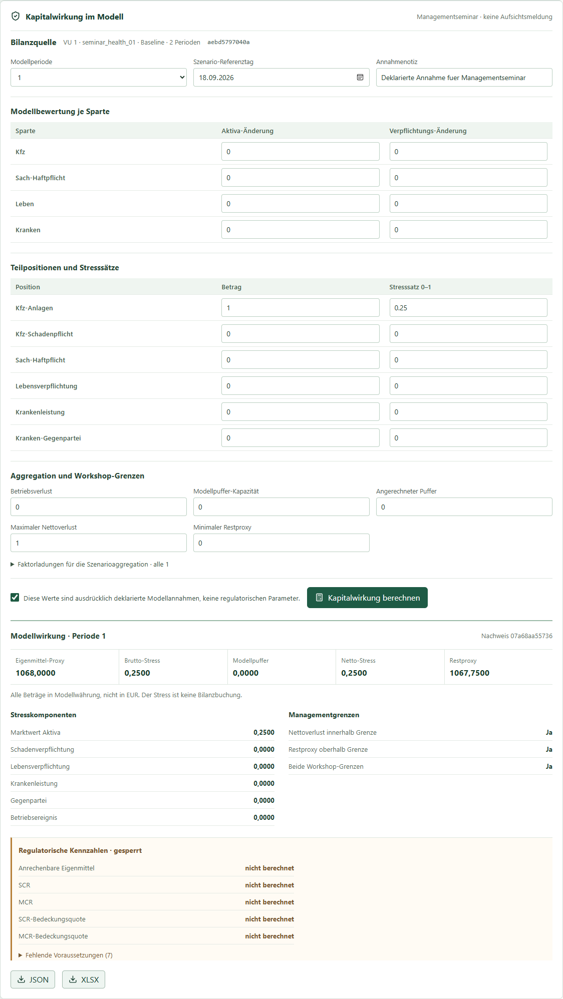

# IMS 1995-2026: Modell verstehen und selbst untersuchen

Stand: 2026-09-18 | Bedienungsanleitung zum Windows-Testpaket, 10 Seiten
Fuer Studierende, Forschende und Managementseminare. Installation:
[Windows-Testpaket](installation_test_package_windows.md). Fachliche Grundlage:
[DISS.pdf](../../DISS.pdf), besonders S. 10-16, 31-43, 81-99.

## Seite 1 - Die Frage hinter IMS

**Was geschieht mit einem Versicherungsmarkt, wenn sich seine Umwelt ploetzlich
aendert und die Beteiligten unterschiedlich darauf reagieren?** Diese Frage
traegt die Dissertation *Eine Computersimulation zur Analyse der Auswirkungen
von exogenen Schocks auf Versicherungsmaerkte - am Beispiel der deutschen
Wiedervereinigung* (1996). Die Wiedervereinigung ist das damalige
Untersuchungsbeispiel, nicht die Grenze des Modells.

Die oekonomische Idee ist ein **Marktprozess unter Risiko**. Versicherer
setzen Praemien und Werbung; Versicherungsnehmer entscheiden ueber Schutz und
Anbieter; Schaeden, Zahlungen und Erfahrungen veraendern den naechsten
Entscheidungsstand. Niemand kennt alle Preise, Risiken und Absichten. Die
Teilnehmer folgen einfachen Regeln mit jeweils begrenzter Information. IMS
setzt keinen Auktionator und keinen automatisch erreichten Gleichgewichtspreis
voraus (DISS.pdf, S. 10-13 und 31-33). Es beobachtet Anpassung, Suche,
Wettbewerb und Rueckkopplung ueber die Zeit.

*Abb. 1: Vereinfachte Leseskizze zur Dissertation, kein Bildschirmfoto.*

Ein IMS-Ergebnis ist damit eine **bedingte Aussage**: *Wenn* diese Akteure,
Regeln, Anfangswerte und Eingriffe gelten, *dann* zeigt der Modellmarkt
diesen Verlauf. Es ist keine Vorhersage realer Marktzahlen. Der heutige
IMS-2.x-Stand ergaenzt eigenstaendige Modellfaelle; er reproduziert nicht
einfach jeden Lauf von 1995.

<!-- PAGE BREAK -->

## Seite 2 - Wer tut was, und was ist neu?

Im historischen IMS gibt es zwei Schadenrisiken bzw. -sparten. Ein
**Versicherer (VU)** waehlt je Sparte Praemie und Werbung und traegt
versicherte Schaeden. Ein **Versicherungsnehmer (VN)** entscheidet, ob er
versichert ist und welchen Anbieter er waehlt. Informationssuche kann etwas
kosten; Erinnerung und Praeferenzen beeinflussen die Wahl. Entscheidungen
werden wiederholt, statt einmal fuer alle Perioden optimiert. Das erklaert,
warum ein Eingriff Gewinner und Verlierer hervorbringen kann, auch wenn die
Marktsumme wenig veraendert aussieht (DISS.pdf, S. 33-41).

| Begriff 1995 | Heute im Testpaket | Wichtige Grenze |
| --- | --- | --- |
| VU / VN | Akteure und Regel-Snapshots unter `Strategien` | noch kein freier grafischer Marktgenerator |
| Verhaltensregel | Strategiekatalog und Zuordnungsentwurf | Entwurf ist noch kein Lauf |
| Periode | Zeitachse und expliziter Uebergang | nur freigegebene Ketten ausfuehrbar |
| Sparte 1 / 2 | historischer Schadenkern; daneben Kfz und Sach-Haftpflicht als IMS-2.x-Modellbilanz | keine automatische Gleichsetzung der alten Sparten |
| Reserve / Aggregat | historische Diagnose unter `Validierung`; heutige Modellbilanz unter `Bilanz` | andere Definitionen nicht vermischen |
| Ergebnisdatei | Browser-Ergebnis und ausdruecklicher Download | kein automatischer Export beim Start |

Leben und Kranken, Vier-Sparten-Gesamtbilanz und Kapitalwirkung sind **neue,
vereinfachte IMS-2.x-Modelle**. Sie machen Sparten-, Bilanz- und
Managementfragen sichtbar; sie sind weder direkte Portierungen der zwei
historischen Sparten noch gesetzliche Bilanz- oder Aufsichtswerte.

<!-- PAGE BREAK -->

## Seite 3 - Was ist ein Schock?

In der Dissertation ist ein Schock die sprunghafte Aenderung einer
verhaltensrelevanten Information zwischen zwei Perioden. Er prueft, ob und
wie Regeln eine neue Marktumgebung verarbeiten (DISS.pdf, S. 32-33, 41-43).

| Historische Art | Anschauliches Beispiel | Woran man die Wirkung sucht |
| --- | --- | --- |
| **Aktivierung** | Ab Periode 50 treten zusaetzliche VN oder VU auf. | Nachfrage, Angebot, Marktanteile und Wechsel |
| **Aenderung** | Ein Akteur wechselt zum vorbereiteten Parametersatz seiner Regel. | Praemie, Werbung, Versicherungswahl |
| **Indirekt** | Andere Akteure reagieren erst auf die geaenderten Preise oder Marktanteile. | verzoegerte, verteilte Folgeeffekte |

*Abb. 2: Die dritte Art beschreibt eine Folgewirkung, nicht zwingend einen
weiteren Schalter im Programm.*

Auch ein anderer Zins fuer Reserven oder andere Informationskosten koennen
eine Marktumgebung aendern. Die Dissertation beschreibt fuer einen
historischen Lauf hoechstens einen Aenderungsschock, aber mehrere
Aktivierungen. **Das ist keine Zusage, dass alle diese Eingriffe heute in
der Workbench frei editierbar sind.**

Die heutigen Modellfaelle benutzen den Begriff *Schock* auch enger: In
`Kranken` kann eine Leistungsannahme ab einer gewaehlten Periode steigen;
in `Kapitalwirkung` werden deklarierte Stresssaetze auf Teilpositionen
angewandt. Beides illustriert Wirkungen, ist aber **kein** vollstaendiger
historischer Markt- oder regulatorischer Schocklauf. Der geplante
DORA-/Regulierungseditor ist noch nicht vorhanden.

<!-- PAGE BREAK -->

## Seite 4 - So wird aus einer Frage ein Versuch

1. **Frage und Ebene waehlen.** Beispiel: Was bewirkt ein hoeherer
   Leistungsanfall fuer den betrachteten Krankenversicherer? Beobachtet
   werden Kasse, Verpflichtung und Eigenkapital je Periode.
2. **Baseline festhalten.** Das ist der Verlauf mit unveraenderten
   Annahmen. Variante und Baseline muessen denselben Anfangsbestand,
   dieselbe Dauer und moeglichst denselben Zufallsplan verwenden.
3. **Einen Eingriff benennen.** Welche Groesse aendert sich ab wann?
   Was bleibt gleich? Ohne diese Trennung ist eine Differenz keine
   interpretierbare Schockwirkung.
4. **Beide Seiten berechnen und vergleichen.** Zuerst gleiche Perioden
   vor dem Eingriff pruefen, danach Richtung, Groesse und Dauer ansehen.
5. **Herkunft und Grenzen sichern.** Eingaben, Version, Ergebnis und
   Download gehoeren zusammen. Fuer stochastische Marktfragen braucht
   eine belastbare Aussage mehrere Laeufe und eine dokumentierte
   Seed-Policy.

*Abb. 3: `Szenarien` zeigt vorhandene Faelle und ihren Status; es ist noch
kein freier fachlicher Schockeditor.*

Im historischen Wiedervereinigungsbeispiel werden 30 Laeufe mit je 100
Perioden untersucht. In Periode 50 werden VN[151] bis VN[200] aktiviert.
Die Dissertation vergleicht Vorher/Nachher-Werte und Verteilungen auf
mehreren Aggregationsebenen (DISS.pdf, S. 81-95). Archivdateien mit
300/500 Zeilen sind **kein** Beleg fuer historische Einzel-Laeufe ueber
300/500 Perioden: Solche Fenster koennen mehrere 100er-Laeufe enthalten.

<!-- PAGE BREAK -->

## Seite 5 - Die Workbench bedienen

Nach dem Start `http://127.0.0.1:8000/` oeffnen. Die Navigation springt
innerhalb einer langen Seite zu `Dashboard`, `Szenarien`, `Strategien`,
`Bilanz`, `Leben`, `Kranken`, `Gesamtbilanz`, `Kapitalwirkung`,
`Validierung` und `Runs`. Ein gruenes Dashboard belegt Erreichbarkeit,
nicht die fachliche Freigabe eines Experiments.

**Ein sofort nachvollziehbarer Versuch:** Unter `Kranken` den vorbereiteten
Fall lesen, `2` oder `100` Perioden waehlen und `Beide Faelle berechnen`
druecken. Die Baseline bleibt konstant; die vorbereitete Variante aendert
ab Periode 6 Leistungsanfall und Auszahlung. Bei zwei Perioden bleiben
beide Seiten deshalb gleich. Mit 100 Perioden wird der Unterschied in
Kurve und Tabelle ab der Aenderungsperiode sichtbar. Die Kennzahl ueber
dem Diagramm wechseln und den Periodenwert in der Tabelle kontrollieren.

*Abb. 4: Eigener IMS-2.x-Krankenfall; kein historischer VN-Schock.*

Unter `Leben` stehen kleine vorbereitete Faelle fuer Todesfall,
Neugeschaeft sowie Anlage und Kapital zur Wahl. Auch dort rechnet
`Beide Faelle berechnen` Baseline und Variante ueber zwei Perioden.
`Bilanz` bietet Kfz und Sach-Haftpflicht mit expliziten Zahlungs- und
Schadenwerten. Aenderungen an Eingaben machen zuvor berechnete Ergebnisse
ungueltig: neu berechnen, bevor man einen Wert interpretiert oder exportiert.

<!-- PAGE BREAK -->

## Seite 6 - Wo stehen Ergebnisse und Dateien?

**Beim Start allein entsteht kein Simulationslauf.** Der Output erscheint
jeweils dort, wo ein Fall ausdruecklich berechnet oder gestartet wurde.

| Ansicht | Was man sieht | Speicherung und Download |
| --- | --- | --- |
| `Strategien -> Ergebnisse` | vorbereitete VU-/VN-Kette bis 100 Perioden, Akteurs-Zeitreihe und Tabelle | 100er-Ergebnis fluechtig; `ZIP herunterladen` mit JSON/CSV/XLSX |
| `Kranken` | Baseline/Variante bis 100 Perioden, genaue Periodentabelle | nur nach ausdruecklicher Freigabe gespeichert; CSV/JSON/Excel im Verlauf |
| `Leben` | zwei Perioden, Policen- und Bilanzwerte | nur nach ausdruecklicher Freigabe gespeichert; Excel im Verlauf |
| `Bilanz` | Kfz, Sach-Haftpflicht und Summe | XLSX nach gueltiger Berechnung |
| `Gesamtbilanz` | vier Sparten und Gesamt je zwei Perioden | nur aktuelle Browseransicht, noch kein Export |
| `Kapitalwirkung` | Stress, Modellpuffer, Managementgrenzen | fluechtig; JSON und XLSX nach gueltiger Rechnung |
| `Runs` | Betriebsstatus und Adapterverlauf | nicht automatisch fachlicher Modelloutput |
| `Validierung` | historische Referenz-/Vergleichsdiagnose | keine neue Simulation |

*Abb. 5: Ein vorbereiteter, kontrollierter VU-/VN-Teststand. Die zweite
Linie ist erst bei gleichem Prefix vergleichbar; sie beweist fuer sich
keine Kausalitaet.*

Fuer den VU-/VN-100er-Pfad braucht es bereits gespeicherte Einzelkandidaten,
eine Kette und einen Fuenf-Perioden-Nachweis. Einen eigenen Marktfall frei
zusammenklicken kann man noch nicht. Das 100er-Ergebnis verschwindet beim
Neuladen; **ZIP vorher herunterladen**. Bei gespeichertem Leben/Kranken
bleibt der Fall im lokalen Verlauf erhalten. Heruntergeladene Dateien
liegen im Downloadordner **des Browsers**, nicht in einem von IMS
festgelegten Ergebnisordner. Ein Digest kennzeichnet denselben
Eingabe-/Ergebnisstand, nicht die fachliche Guete.

<!-- PAGE BREAK -->

## Seite 7 - Vier Sparten zu einem Versicherer verbinden

Die heutige gemeinsame Sicht ist eine **einfache Modellbilanz fuer zwei
Perioden**, kein gemeinsamer Vier-Sparten-Marktprozess ueber 100 Perioden.
Der Ablauf ist bewusst in Einzelrechnungen zerlegt:

1. Unter `Bilanz` Kfz und Sach-Haftpflicht fuer denselben VU ueber zwei
   Perioden berechnen.
2. Unter `Leben` einen vorbereiteten Fall waehlen und `Beide Faelle
   berechnen`; unter `Kranken` dieselbe VU-ID, `2 Perioden` und ebenfalls
   `Beide Faelle berechnen` waehlen.
3. In `Gesamtbilanz` `Baseline` oder `Variante` waehlen. Die vier
   Quellenmarken kontrollieren. Der gleiche Versicherer und die gleiche
   Periodenzahl sind technisch erforderlich; die fachliche
   Zusammengehoerigkeit der Annahmen muss der Anwender bestaetigen.
4. `Gesamtbilanz berechnen` druecken. `Gesamt` und die vier Sparten
   nacheinander waehlen. Die Tabelle zeigt Vermoegen, Verpflichtungen,
   Eigenkapital und Periodenergebnis. Es gilt Vermoegen = Verpflichtungen
   + Eigenkapital. Policenzahlen werden **nicht** spartenuebergreifend
   addiert.

*Abb. 6: Vier separat gepruefte Quellen und ihre gemeinsame Modellbilanz.*

Die Schadenwerte gelten in beiden Varianten gleich; die neuen Lebens-
und Krankenwerte stammen aus eigenen IMS-2.x-Annahmen. Wird eine Quelle
geaendert, muss die Gesamtbilanz neu geprueft werden. Die Ansicht wird
derzeit nicht gespeichert und bietet keinen eigenen XLSX-Download.

<!-- PAGE BREAK -->

## Seite 8 - Kapitalwirkung als Managementuebung

Erst nach der `Gesamtbilanz` ist `Kapitalwirkung` nutzbar. Dort eine der
zwei Modellperioden waehlen, ein Referenzdatum und eine Annahmenotiz
eintragen. Je Sparte koennen Aktiva und Verpflichtungen fuer die
Modellbewertung angepasst werden. Sechs **Teilpositionen** erhalten
jeweils Betrag und Stresssatz zwischen 0 und 1. Betriebsverlust,
Faktorladungen, Modellpuffer und zwei Workshop-Grenzen werden bewusst
deklariert, nicht aus der Bilanz erraten.

Die Bestaetigung setzen, dass dies Modellannahmen sind, und
`Kapitalwirkung berechnen` waehlen. Oben erscheinen Eigenmittel-Proxy,
Brutto-Stress, Modellpuffer, Netto-Stress und Restproxy; darunter die
Stresskomponenten und die beiden selbst gesetzten Managementgrenzen.
**Der Stress ist keine Bilanzbuchung.** Betragswerte sind Modellwaehrung,
nicht EUR. Ein gruenes `Ja` bedeutet nur, dass die gewaehlte
Workshop-Grenze im Modellfall eingehalten wird.

*Abb. 7: Echter PR178-Bildschirm. Im unteren Teil bleiben SCR, MCR,
anrechenbare Eigenmittel und Bedeckungsquoten ausdruecklich
`nicht berechnet`.*

`JSON` und `XLSX` geben die gepruefte Modellrechnung samt Annahmen und
Herkunft aus. Sie berechnen **keine** Solvency-II-Quote. Das Ergebnis
ist fluechtig; vor einem Neuladen herunterladen. Die Eingaben sind
kein DORA- oder Aufsichtsformular.

<!-- PAGE BREAK -->

## Seite 9 - Ergebnis lesen statt nur ansehen

Die historische Arbeit fragt nicht nur, *ob* eine Kurve springt, sondern
*wer*, *wann* und *auf welcher Ebene* betroffen ist. Abb. 5.8 der
Dissertation zeigt den Marktanteil eines VU ueber 100 Perioden mit
gleitendem Durchschnitt; der Eingriff liegt in Periode 50. Eine einzelne
gezackte Linie beweist noch keine Wirkung.

*Abb. 8: DISS.pdf, Abb. 5.8, S. 92. Historischer Lauf, **kein** Ergebnis
der Workbench 2026.*

Fuer eine Aussage zuerst Niveau und Streuung vor und nach dem Eingriff
vergleichen, dann mehrere Laeufe und passende Aggregationsebenen
betrachten (DISS.pdf, S. 92-94). Stufe I ist der einzelne VU/VN,
Stufe II die Regel, Stufe III die Regelklasse und Stufe IV die
Subjektklasse bzw. der Gesamtmarkt. Ein Gesamtdurchschnitt kann einen
deutlichen Effekt fuer eine Teilgruppe verdecken.

*Abb. 9: DISS.pdf, Abb. 5.10, S. 93. Unterschiedliche Aufloesung
derselben historischen Fragestellung.*

Bei jedem neuen Diagramm fragen: Sind Baseline und Variante bis zum
Eingriff wirklich gleich? Wann beginnt die Abweichung? Ist sie gross
gegenueber der normalen Streuung? Welche Sparten oder Akteure tragen sie?
Welche Modellannahme koennte die Deutung umkehren? Ein Download bewahrt
die Zahlen, ersetzt aber keine fachliche Interpretation.

<!-- PAGE BREAK -->

## Seite 10 - Grenzen und ein erster Seminarversuch

**Was heute fachlich nicht behauptet werden darf:**

- Die heutigen Zufallszahlen, Zinssaetze und Parameter reproduzieren
  keine bestimmten historischen Laeufe. Die `.DAT`-Dateien sind
  diagnostische Referenzen, kein Vollgleichheitsnachweis.
- Kfz/Sach-Haftpflicht, Leben und Kranken sind vereinfachte IMS-2.x-
  Rechnungen. Sie bilden weder den deutschen Markt empirisch kalibriert
  ab noch koppeln sie alle vier Sparten an einen gemeinsamen
  100-Perioden-Marktprozess.
- Der allgemeine VU-/VN-100er-Pfad setzt vorbereitete Kandidaten voraus,
  ist fluechtig und besitzt noch keinen frei bedienbaren Schockeditor.
- Historische Schadenziehungen und Verhaltensregeln sind nicht die
  Modellannahmen der neuen Lebens- und Krankenfaelle. Aus deren
  Ergebnissen darf keine historische Aequivalenz abgeleitet werden.
- Modellbilanz und Kapital-Proxys sind weder HGB/IFRS-Bilanz noch
  Solvency-II-Standardformel. SCR, MCR, anrechenbare Eigenmittel und
  Bedeckungsquoten bleiben gesperrt. DORA-Wirkungsketten fehlen noch.
- Eine einzelne Zeitreihe, ein Digest oder eine bestandene technische
  Pruefung beweist weder Kausalitaet noch Prognosequalitaet. Fuer
  belastbare Forschung braucht es Varianten, mehrere Seeds,
  Sensitivitaeten und externe Marktdaten.

**30-Minuten-Einstieg:** Formulieren Sie vor dem Bildschirm eine Hypothese
zum Krankenfall. Lassen Sie Baseline und Variante erst fuer zwei, dann
fuer 100 Perioden rechnen. Zeigen Sie die erste abweichende Periode,
Kasse, offene Leistungen und Eigenkapital. Speichern Sie **eine**
ausdruecklich freigegebene Seite und laden Sie CSV oder Excel herunter.
Diskutieren Sie dann: Welche Differenz folgt direkt aus der geaenderten
Leistungsannahme, und welche Marktreaktion ist hier noch gar nicht
modelliert? Genau diese letzte Frage ist fuer ein gutes Seminar oft
wertvoller als eine einzelne Zahl.

Weiterlesen: [Managementseminar](management_seminar_guide.md),
[Ergebnisse und Validierung](results_and_validation.md),
[technische Quellen](technical_reference.md).
