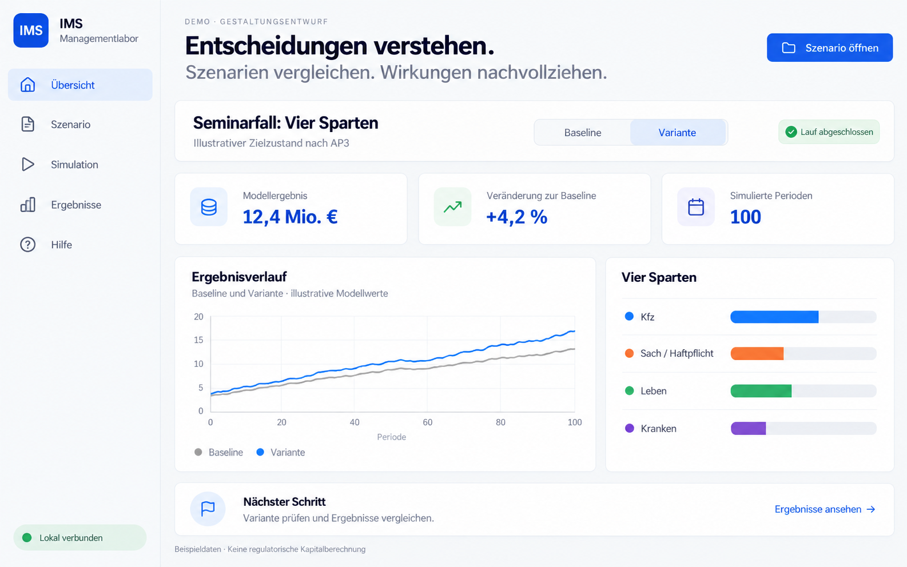

# Arbeitspakete für das erklärbare IMS Managementlabor

Stand 01.10.2026. Vorschlag auf Grundlage des Nutzerauftrags und des beigefügten
Mockups. Empfohlen sind sechs zusammenhängende Lieferungen AP4 bis AP9.
**AP4 macht den bestehenden Seminarpfad erklärbar und einsteigertauglich.**
AP5 bis AP8 erweitern ihn zum Markt mit 40 Versicherungsgruppen, vier
Schockfällen und Auswertungen von Strategiefamilien. AP9 nimmt den gemeinsamen
Seminarpfad ab. Jedes Paket enthält Implementierung, API und Oberfläche,
passende Tests, Anleitung und einen versionierten Windows-Installer.

Dies ist eine Folgeplanung. Der angenommene AP1–AP3-Plan und seine historischen
Anforderungs-IDs bleiben erhalten. Das neue Paketmanifest
[ims_explainable_market_plan.json](ims_explainable_market_plan.json) ist ein
Vorschlag und wird noch nicht vom bestehenden AP1–AP3-Auftragsgenerator verwendet.

## Ausgangspunkt und bestätigte Abgrenzung

AP3-Produktbasis: **2.0.0-alpha.3**, Commit
`ee4b659007d50e92058551fcc1f31a48b8ce8ba1`, [PR 290](https://github.com/junker-joerg/ims/pull/290).
AP3 ist technisch geprüft, aber zum Planungszeitpunkt nicht nach main übernommen.
Verifiziertes main: `2e70b8f814870807a7c8c34d8fc384f8f6a5bb3c`.
Die Implementierung von AP4 setzt die angenommene Folgeplanung und AP3 in main
voraus. Diese Planungsänderung lässt den vorhandenen Produktstand bestehen.

Der Auftraggeber bestätigt **40 Versicherungsgruppen, deutsches Geschäft,
alle Sparten**. In- und ausländische Gruppen mit deutschem Erstversicherungsgeschäft
gehören zum Auswahlraum. Konzern und Tochtergesellschaften werden nicht doppelt
gezählt. Rückversicherung und weltweites Geschäft sind keine Rankinggrundlage.
Die 40 Gruppen sind eine Auswahl des deutschen Markts; ihre Summe wird in IMS
als **40er-Modellmarkt** bezeichnet. Sein Anteil am erfassten deutschen Markt
und der nicht simulierte Rest bleiben sichtbar.

Das Ranking umfasst alle Erstversicherungssparten. Die Simulation baut zunächst
auf den vier vorhandenen Modellsparten Kfz, Sach/Haftpflicht, Leben und Kranken
auf. Weitere Geschäftszweige, etwa Unfall oder Rechtsschutz, werden im
Marktdossier als nicht modellierter Anteil ausgewiesen. Sie werden nicht still
Sach/Haftpflicht zugerechnet. Fehlende Spartenaufteilungen bleiben als fehlend
oder als ausdrücklich angenommener Workshop-Mix erkennbar.

Die aktuelle moderne AP3-Brücke erlaubt höchstens 25 Anbieter und bilanziert
eine ausgewählte VU. Andere VUs liefern Angebote. Leben hat bisher keine
ausführbare VN-Nachfrageregel; ICT wird in einer getrennten Wirkungskette
gerechnet. Damit sind 40 vollständige Unternehmen, eine neue LV-Nachfrage und
gekoppelte Markt-/ICT-Wirkungen eigene fachliche Erweiterungen.

Das Mockup bestimmt Ergebnisvorrang, Baseline-/Variantenvergleich, Verlauf,
Spartenübersicht und nächsten Schritt. Die abgebildeten 12,4 Mio. Euro und
4,2 Prozent sind illustrative Entwurfswerte. Die Umsetzung zeigt neu berechnete
Werte mit ihrer tatsächlichen Einheit und Bezugsperiode. Modellwährung erhält
keine Eurobeschriftung ohne dokumentierte Umrechnung.

## Die Oberfläche folgt Fragen der vier Rollen

Die Rolle ist eine wählbare Sicht auf denselben Fall. Beim Wechsel bleiben
Eingaben, Baseline, Variante, Ergebnis und Freigaben erhalten. Die Grundbereiche
Übersicht, Szenario, Simulation, Ergebnisse und Hilfe bleiben wiedererkennbar;
innerhalb dieser Bereiche werden Aufgaben und Ergebnisse passend angeordnet.

| Rolle | Einstiegsfrage | Vorgeschlagene Aufgaben und Ergebnisse |
| --- | --- | --- |
| CEO | Was verändert sich im Markt und welche Entscheidung trägt zum Ergebnis bei? | Marktüberblick, Spartenmix, Ergebnis/Eigenkapital, Marktposition, Strategiefamilien vergleichen. |
| CIO | Welche technischen Abhängigkeiten bedrohen das Geschäft und welche Alternative wirkt? | Anbieter und Abhängigkeiten, ICT/DORA-Schocks, digitale Souveränität, Konzentration, Ausfall und Wiederanlauf. |
| COO | Was passiert mit Prozessen und Kunden während des Schocks? | Prozesskapazität, Bearbeitungsrückstand, Durchlauf, Wiederanlauf und einmal gebuchte Betriebsfolgen. |
| CSO Vertrieb | Welche Kundengruppen wechseln und wie wirken Preis und Vertriebsentscheidung? | Nachfrage, Kundensegmente, Angebote, Wechselströme, Neugeschäft und Strategiefamilien je Sparte. |

Die Persona ersetzt keine Ausführungsfreigabe. Sie ist auch kein neues
Berechtigungssystem. Modellgrenzen und die jeweilige Herkunft eines Werts
bleiben für jede Rolle an derselben Entscheidung erreichbar.

## Lieferreihenfolge

| Paket | Nutzbarer Abschluss | Voraussetzung |
| --- | --- | --- |
| AP4 | Erklärbarer Einstieg, vier Rollensichten, erste Diagramme und Anfängeranleitung auf vorhandenen Fällen. | AP3 in main; Folgeplanung angenommen. |
| AP5 | Gemeinsam berechneter Markt, VU-/VN-Gruppen und auswertbare Strategiefamilien. | AP4 in main; Marktvertrag geklärt. |
| AP6 | Ladbares Szenario Deutscher Versicherungsmarkt mit 40 belegten Gruppen. | AP5 in main; Auswahl- und Datenmethode geprüft. |
| AP7 | Vier vollständige Schock-Demos mit nachvollziehbaren Gegenmaßnahmen. | AP6 in main; Nachfrage-/ICT-Kopplung erklärt. |
| AP8 | Marktprozesse, Gruppen und Strategiefamilien überwiegend direkt in IMS erkunden. | AP7 in main. |
| AP9 | Gemeinsame Rollen-/Seminarabnahme, vollständiges Einsteigerhandbuch und geprüfte Verteilung. | AP8 in main. |

Ein Paket umfasst einen Branch und Draft-PR, auch über mehrere Sitzungen.
Interne Meilensteine sind keine weiteren Pflicht-PRs. Die fachlichen
Entscheidungstore werden im betreffenden PR konkret dokumentiert; die jeweils
fertige Lieferung ist bereits bedienbar. Aufwandsschwerpunkte sind AP5 und AP7.
Belastbare Zeit- oder Laufzeitwerte werden nach deren kleinen Referenzversuchen
gemessen; dieser Plan verspricht keine Fertigstellung in einer Woche.

## AP4 Erklärbare Oberfläche und geführter Einstieg

**Ergebnis:** Ein Einsteiger öffnet einen vorhandenen AP3-Demofall und versteht,
was eingegeben, entschieden und berechnet wurde. CEO, CIO, COO und CSO finden
einen passenden Einstieg. Im nächsten Arbeitspaket beginnt damit sofort der
gewünschte Ausbau der Oberfläche.

Die Übersicht erhält Szenario öffnen, Rollenauswahl, Baseline/Variante,
Kennzahlen, einen echten Ergebnisverlauf, Spartenvergleich und nächsten Schritt.
Jede Kennzahl erklärt Was bedeutet das?, Vergleich zu was? und Warum verändert
sich der Wert?. Ergebnis, Eigenkapital und kumulierte Flüsse sind getrennt;
Prozentdifferenzen bei Null-Baseline erscheinen als nicht definiert.
Der Laufstatus und die Periodenzahl stammen aus dem tatsächlich abgeschlossenen
Lauf. Neue Eingaben kennzeichnen oder entwerten den alten Ergebnisstand sichtbar.

Ein Klick auf eine Änderung führt von der Eingabe über die ausgeführte Regel
und Entscheidung zum gebuchten Fluss. Preis × gedeckte Menge, Werbeaufwand,
Anfangsaktiva und Carryover werden am vorhandenen AP3-Preisfall erklärt.
Die aktuelle Ein-VU-Rechnung heißt ausdrücklich Seminarfall einer VU.
Marktaggregate erhalten ihren Platz erst mit einer tatsächlichen Marktrechnung.

Ein geführter Einstieg mit den vorhandenen drei Demofällen, Glossar und
Begriffskarte führt ohne JSON oder Quellcode durch Laden, Vergleichen und
Interpretieren. Die Begriffskarte verbindet VU mit Anbieter, VN mit Kunden,
BAV mit historischem Markt-/Koordinationskontext und Verhaltensregel mit
Strategieregel. Periode wird als Modellperiode erklärt. Für Wiedereinsteiger
werden alte Begriffe und moderne Modellgrenzen nebeneinander erläutert.
Technische Quellen bleiben über Details erreichbar. Ziel für die erste
Bedienübung sind 15 Minuten; die tatsächliche Zeit wird bei der Abnahme erfasst.

**Abnahme:** Einsteigerpfad ohne Expertenformular; richtige Kennzahlen und
Diagrammwerte gegenüber API/Export; erklärter Preisfall 302 × 95 = 28.690;
Rollentausch ohne Datenverlust; Leer-, Lade-, Fehler- und veraltete Ergebnisse;
Tastatur und mindestens 4,5:1 Textkontrast in beiden Farbmodi sowie
1440×900, 1024×768 und 390×844. Die Offline-Anleitung ist aus IMS erreichbar.

## AP5 Marktmodell und auswertbare Strategiefamilien

**Ergebnis:** Ein gemeinsamer Periodenlauf bilanziert alle aktiven Modell-VUs
und erzeugt echte Marktsummen. Vier verschiedene Gruppierungsbegriffe werden
explizit getrennt: Versicherungsgruppe, VU-Vergleichsgruppe, VN-Kundengruppe
und Strategiefamilie. Eine Strategiefamilie bezeichnet eine ausführbare
Regel samt erklärtem Parameterprofil, keine bloße Farbe in einer Grafik.

Vor dem Ausbau wird der neue moderne Marktvertrag mit kleinem Referenzmarkt
kartiert. VU-Angebote, VN-Auswahl, Exposition, Prämien, Werbung, zugeordnete
Schäden/Leistungen und Bestandsfortschreibung müssen pro Periode zusammenpassen.
Insbesondere bleiben die bisher exogenen AP3-Schäden nicht stillschweigend
unverändert bei einer VU, wenn im neuen Vertrag die zugehörigen Risiken wechseln.
Die Risikozuordnung wird ausdrücklich definiert und gegen historische
Zustands-/Aggregatlogik geprüft. Zusätzliche Lebens-Nachfrage und alternative
Strategiefamilien brauchen ebenfalls benannte Quellen und Annahmen.

Der neue Vertrag unterstützt 40 bestehende Gruppen und mindestens einen
zusätzlichen Modellanbieter. Die bisherigen Größen- und Quellenlimits werden
an 40/41 VUs × 100 Perioden gemessen; sie werden nicht pauschal deaktiviert.
Nur genutzte Sparten werden aktiviert. Eine nicht betriebene Sparte ist etwas
anderes als ein unbekannter Datenwert. Bestehende AP3-Fälle bleiben lesbar und
reproduzierbar; die neue Erweiterung erhält einen eigenen versionierten Vertrag.

Strategiefamilien haben benannte Regeln, Parameter, Zeitfenster und belegte
Wirkung. Vorgesehen sind zunächst kartierte Preis-/Werbe- und VN-Auswahlregeln
sowie die vorhandenen begrenzten Lebens-/Krankenkanäle. Weitere Familien werden
erst mit einer wirksamen Regel angeboten. Zuordnung je VU, Sparte und Periode
bleibt nachvollziehbar; echte Unternehmen erhalten keine behauptete reale
Strategiezuordnung. Auswertungen unterscheiden Summen, gewichtete Mittel und
Verteilungen. Überlappende Vergleichsgruppen werden nicht als Partition addiert.

Reproduzierbare Zufallswerte werden nach Akteur und Periode gebunden. Ein neuer
Anbieter darf nicht allein durch eine geänderte Schleifenreihenfolge die
Zufallswerte aller bestehenden VUs verändern. Gleiche Preise behalten den
dokumentierten Tie-Break. Ein gemeinsamer Anfang und kurze Prefixe werden geprüft.
Die API liefert Perioden-/Sparten-/VU-/Gruppenwerte und Herkunft; die Oberfläche
bietet eine erste nutzbare Marktsicht samt Gruppenfilter. Excel enthält die
ausgewählte Einzel-VU und ihren Modell-/Quellenbezug.

**Abnahme:** Handrechnung für zwei/drei VUs; Prämien- und Mengenverteilung ohne
Doppelbuchung; Markt = Summe der VUs und disjunkte Familien = Markt; unveränderte
Gesamtrechnung bei bloßem Filterwechsel; A = L + E und Carryover; Zeitwechsel
einer Familie; unversicherte Nachfrage; deterministischer 40/41-VU-100er-Lauf;
identische Werte/Nachweise in API, IMS und Einzel-VU-Export. Offene Kanäle und
Grenzen erscheinen am Ergebnis. Die neue Marktanleitung wächst in diesem Paket.

## AP6 Deutscher Versicherungsmarkt mit 40 Gruppen

**Ergebnis:** Ein versionierter, offline ladbarer Ausgangsfall mit den Namen
der bestätigten 40 Versicherungsgruppen und belegter deutscher Marktstruktur.
Anzeige, stabile Modell-ID, Gruppenzugehörigkeit, Tochtergesellschaften und
Sparten werden getrennt geführt.

Als Rankingmaßstab wird deutsches direktes Erstversicherungsgeschäft nach
gebuchten Bruttobeiträgen vorgeschlagen. Das gemeinsame Datenjahr und die
Vergleichbarkeit werden vor Auswahl geprüft. Weltweite Konzernbeiträge,
verdiente Beiträge und IFRS-17-Versicherungsumsatz werden nicht vermischt.
Wenn nur eine andere vollständige gemeinsame Kennzahl belastbar ist, wird
deren Umstellung vor der Top-40-Auswahl im Methodendokument begründet.
Das Datenjahr ist das jüngste nachgewiesene gemeinsame Jahr; 2025 wird nicht
allein aus dem heutigen Kalenderdatum abgeleitet.

BaFin-/GDV-Statistiken dienen zur Einordnung, veröffentlichte Geschäfts- und
SFCR-Berichte zur Gruppen-/Deutschlandzuordnung. Je Datensatz werden Quelle,
Bezugsjahr, Kennzahl, geografischer Umfang, Abdeckung und Annahme gespeichert.
Mutter und Tochter gehen nur einmal ein; deutsche Anteile ausländischer Gruppen
werden nach derselben Methode behandelt. Die Auswahl wird an der Grenze
Rang 40/41 geprüft, Gleichstände werden nachvollziehbar aufgelöst. Eine bloße
Liste bekannter Namen wird nicht als nachgewiesene Top-40-Rangfolge ausgegeben.

Belegte Namen und Strukturgewichte bleiben von synthetischen Anfangsbilanzen,
Preisen, Kundengruppen, Strategien und ICT-Abhängigkeiten unterscheidbar.
Unbekannte tatsächliche Cloud-Anbieter einzelner Versicherer werden nicht
erfunden. Das geladene Szenario erklärt, welche Ebene beobachtet, abgeleitet
oder für den Workshop angenommen ist. Primärdatentabellen bleiben editierbar
separat vom unveränderlichen Demooriginal. Ein Quellen-Dossier liegt offline bei.

**Abnahme:** Genau 40 eindeutig belegte Gruppen; gemeinsame Auswahlmethode,
Grenzprüfung, Quellen und Jahr; keine Doppelzählung oder globalen Beiträge;
Spartenmix und beobachtete Gewichtssummen überprüfbar; fehlende Werte explizit;
weitere Geschäftszweige und nicht modellierte Anteile ausgewiesen;
Modellmarktanteile mit bezeichnetem Nenner; DEMO frisch ladbar, importierbar
und reproduzierbar. Bei unvollständiger Rangbasis wird die offene Datenfrage
dokumentiert und die Top-40-Abnahme nicht als erfüllt ausgegeben.

## AP7 Vier Schock Demos mit erklärten Gegenmaßnahmen

**Ergebnis:** Jeder gewünschte Fall lässt sich aus der Szenariobibliothek
öffnen. Jeder enthält Ausgangsmarkt, gemeinsame Anfangsperioden 1–5, benannten
Schock, ausgeführte Reaktionen, Ergebnis und verständliche Moderationsfragen.
Vorgeschlagener Schockbeginn ist Periode 21 eines 100-Perioden-Falls; das ist
eine editierbare Workshop-Annahme, keine Datierung oder Prognose.

| Ladbarer Fall | Zu implementierende Wirkung | Beispielentscheidung und sichtbare Frage |
| --- | --- | --- |
| Google kommt in die Kfz-Versicherung | Ein ausdrücklich fiktiver 41. Anbieter wird aktiv. Angebote, Reichweite/Kundenauswahl, gedeckte Risiken, Prämien und Werbung werden gemeinsam gebucht. Seine Finanzierung ist explizit. | Preis-/Werbeantwort und ausführbare VN-Regel vergleichen: Welche Gruppen wechseln, wer verdient die Prämie, wo liegen die Risiken? |
| LV wird unattraktiv | Deklarierte Attraktivität verändert Lebens-Neugeschäft nach einem neu erklärten Nachfragevertrag. Altbestände, Garantien und Ablauf bleiben bestehen. | Nachfrage-/Vertriebs- oder Anlageantwort vergleichen: Was stammt aus weniger Nachfrage, was aus Bestand und Kapitalanlage? Storno ist erst mit eigener Bestands-/Auszahlungslogik verfügbar. |
| Regulierungsschock ICT DORA 2.0 | Hypothetisch verschärfte Resilienzanforderungen erzeugen erklärte Umstellungs-, Betriebs- und Maßnahmenkosten mit Aktivierungsfenstern. | Konzentration reduzieren, Fallback/Wiederanlauf testen: Welche Geschäftsfolgen werden vermindert und welchen Preis hat die Maßnahme? |
| Digitale Souveränität Alle US Hyperscaler fallen aus | Alle im Szenario deklarierten US-kontrollierten Hyperscaler fallen gleichzeitig im festgelegten Zeitfenster aus; transitive Abhängigkeiten wirken auf die betroffenen VUs und Prozesse. | Tatsächlich unabhängige Alternative mit Multi-Cloud vergleichen: Hängt auch der Ersatz an ausgefallenem IAM, DNS oder Schlüsselverwaltung? |

DORA 2.0 ist hier der gewünschte Name eines hypothetischen Seminarschocks.
Die reale DORA-Grundlage und die zusätzlich angenommenen Anforderungen werden
nebeneinander dokumentiert. Für den Souveränitätsschock werden Kontrollkriterium,
Anbietermenge, Dauer, betroffene Dienste und gemeinsame Vorleistungen deklariert.
Ein Standort in Europa allein begründet im Modell keine Unabhängigkeit.

Die Markt-/ICT-Brücke führt die physische ICT-Zeit ausdrücklich auf Modellperioden
zurück. Sie trennt entgangene Prämien/Prozessmargen, spätere Aufholung und
Maßnahmenkosten. Dieselbe ausgefallene Transaktion darf nicht als Marktverlust
und erneut als ICT-Verlust gebucht werden. Gemeinsame Providerkosten werden
einmal verteilt. Das gilt auch für mehrfach abhängige Gruppen.

Jede Demo öffnet zunächst schreibfrei und kann als eigene Sitzung übernommen
werden. Original, geänderte Variante, Quellen, Seed, Strategien, Ereignisse
und Ergebnisse gehören zu einem portablen, frisch geprüften Bündel.
Die Bibliothek erklärt Geschichte, Bedienelemente, Gegenmaßnahmen und
Erwartung der Wirkung ohne erfundene tatsächliche Unternehmensabhängigkeiten.

**Abnahme:** Vier echte 100er-Fälle; frische Offline-Ladung/Übernahme; gemeinsamer
Anfang, unveränderte Quellen und Seed; erwartete Reaktionen in kleinen
Handprüffällen; neue Parameter entwerten alte Ergebnisse; Gruppenbilanz und
Marktsumme; Anbieter 41 aktiv erst zum vorgesehenen Zeitpunkt; Lebens-Bestand
korrekt; keine doppelte ICT-Verlustbuchung; unabhängiger Fallback erhält Wirkung,
abhängiger nicht. CIO/COO- und CSO-Erklärpfade sind vollständig bedienbar.

## AP8 Marktprozesse und Strategiefamilien in IMS visualisieren

**Ergebnis:** CEO und CSO vergleichen Märkte und Strategien in IMS; CIO und
COO erkunden Abhängigkeiten und Prozessfolgen. Einzel-VU-Detailtabellen lassen
sich weiterhin als Excel ausgeben. Der fachliche Vergleich verlangt keinen
Wechsel nach Excel.

Vorgesehen sind sechs miteinander verknüpfte Ansichten: Markt-/Spartenverläufe,
Marktanteile und Konzentration im ausgewiesenen Modellmarkt, Familienvergleiche
mit Streuung und Gewichten, Kunden-Wechselströme, eine Ereignis-/Entscheidungs-
Zeitlinie und Provider-/Prozessabhängigkeiten mit Rückstand und Wiederanlauf.
Periode, Sparte und Vergleichsgruppe filtern dieselben neu berechneten Werte.
Aus einem Diagramm führt der Weg zum betroffenen Akteur und seiner Buchung.

Eine Ursachenansicht zeigt Schock → aktive Strategie → Kunden-/Prozessreaktion
→ gebuchter Fluss → Ergebnis. Exakte Additionen werden von Wechselwirkungen
und nur beobachteter Korrelation unterschieden. Ein Diagramm macht eine
Zuordnung nicht automatisch zu einer kausalen Zerlegung. Formeln, Nenner,
Einheit, Zeitraum und Marktumfang sind direkt erklärbar. Alle Diagramme haben
eine zugängliche Datentabelle, Tastaturbedienung und verständliche Leerzustände.
Die vorhandene React-Oberfläche bleibt Basis; neue Frameworks sind kein Ziel.

**Abnahme:** Jeder Grafikpunkt stimmt mit API/Buchungen/Export überein;
Familien-/VU-Auswahl ändert keinen Lauf; korrekt gewichtete Mittel und
Marktanteilsnenner; Strategie-/Mitgliedschaftswechsel über die Zeit;
Wechselmengen ohne Doppelzählung; Ausfall/Gegenmaßnahme zeitlich richtig;
Filter über alle sechs Ansichten konsistent; responsive Hell-/Dunkelansichten
und bedienbare Alternativen. Eine Gruppe lässt sich vollständig ohne Excel
interpretieren. Die Markt- und Rollenhilfe enthält echte aktuelle Bilder.

## AP9 Einsteigerhandbuch und gemeinsame Seminarabnahme

**Ergebnis:** Ein Einsteiger und ein zurückkehrender Altprogrammierer können
IMS mit installiertem Handbuch und Demo-Bibliothek selbst bedienen. Die in
AP4 begonnene Anleitung wird über alle Pakete gepflegt und hier vollständig
abgenommen. Enthalten sind der schnelle Einstieg, die alte/neue Begriffskarte,
vier Rollenwege, vier Schockgeschichten, Gruppen-/Strategieauswertung,
Diagrammlesen, Modellgrenzen, Einheiten, Quellen und Fehlersuche.

Ein gemeinsamer Seminarpfad führt vom Deutschland-Fall über Laden, Parameter,
Strategiegruppen, Baseline/Variante, Marktprozess und Gegenmaßnahme zum
Einzel-VU-Export. Die Rollen fragen unterschiedlich, rechnen aber denselben Fall.
Moderatorenvorschlag und Übungen verwenden die ausgelieferten Fälle und
reale Bilder. Verstehen heißt: Die Person kann eine Veränderung bis zur
Eingabe/Buchung zurückverfolgen und eine Modellannahme benennen.

**Abnahme:** Alle vier Rollen durchlaufen alle vier Demos; gemessene
Einsteiger-/Wiedereinsteigeraufgaben statt behaupteter Verständlichkeit;
Dokumentation offline aus der installierten Anwendung; tatsächlicher
Windows-Installer, Installation/Update/Datenerhalt und reale Browserabnahme;
aktueller Release-Stand unten links stimmt mit Backend und Installer überein.
Messungen für Laufzeit, Speicher, Anleitung und Seminar werden getrennt von
Schätzungen dokumentiert. Offene wissenschaftliche Grenzen bleiben sichtbar.

## Wissenschaftliche Herkunft und Entscheidungstore

| Ausgangspunkt | Zu prüfende Entsprechung im Ausbau |
| --- | --- |
| ESS.C sy_simltp und sy_xaktion | Zeitordnung und explizite Aktionen vor der Periodenabrechnung. |
| IMSDATA.C Pr/Wa/Rs/Vn/Sa/Sh sowie classBAV Vuag/Vnag | Preis, Werbung, Bestände, Schäden und unterschiedliche Aggregatdimensionen bleiben getrennt. Historische Aktivitätszählungen sind keine Prämien- oder Eigenkapitalsummen. |
| IMS.E Vrvu01 und Vrvn06; portierte VU-/VN-Regelkerne | Regel-/Zufallssemantik und historische Zuordnung bleiben geprüft. Moderne Sparte/Exposition und zusätzliche Regeln werden ausdrücklich deklariert. |
| AP3 modern_bridge, life_period_chain und four_sector_balance | Neue gemeinsame Mehr-VU-Buchung, Lebens-Nachfrage und Marktaggregate erhalten ein Mapping statt einer stillen Änderung des Ein-VU-Vertrags. |
| AP3 ict.contract und ict.simulation | Gemeinsame Ausfälle, Zeitintervalle, Rückstand und einmalige Kosten werden mit Marktflüssen abgeglichen. |

AP5 entscheidet den Mehr-VU-/Risiko-/Gruppenvertrag anhand kleiner Handfälle.
AP6 prüft Ranking, Datenjahr und Deutschland-/Gruppenkonsolidierung.
AP7 dokumentiert Lebens-Nachfrage und Markt-/ICT-Kopplung einschließlich
Verlustvermeidung. Die Zustimmung zur begrenzten modernen AP3-Kopplung ersetzt
nicht automatisch diese neuen fachlichen Entscheidungen.

Jede neue an Anwender gelieferte Produktfassung verwendet eine höhere,
noch nicht vergebene Releasenummer aus der gemeinsamen Versionsquelle;
Installer, Windows-Version, Backend und Startbildschirm müssen zusammenpassen.
Ein Paket wird mit echten Belegen abgenommen und im selben PR fortgesetzt.
Für abhängige Pakete zählt die Übernahme nach main. Technische Prüfung,
externe Benutzerabnahme und fachliche Gleichwertigkeit bleiben getrennte Belege.

## Externe Quellen und Grenzen des Recherchebefunds

Abrufstand 01.10.2026. Der [GDV zur Marktkonzentration](https://www.gdv.de/gdv/statistik/statistiken-zur-deutschen-versicherungswirtschaft-uebersicht/branche-insgesamt/konzentration-in-der-erstversicherung-137778)
unterscheidet Einzelunternehmen und Gruppen und beschreibt verdiente
Bruttobeiträge sowie kumulierte Anteile der größten 5, 10 und 15. Diese Seite
ist keine vollständige Top-40-Liste und begründet nicht die vorgeschlagene
gebuchte Beitragsrangfolge. Das [BaFin-Statistikportal](https://bafin.de/DE/PublikationenDaten/Statistiken/statistiken_node.html)
weist Erstversicherungsstatistiken aus; die einzelnen aktuellen Tabellen konnten
in dieser Planung wegen HTTP 403 nicht geprüft werden. Die vollständige
40er-Auswahl und Datenharmonisierung bleiben daher Liefergegenstand von AP6.

[EIOPA beschreibt DORA](https://www.eiopa.europa.eu/digital-operational-resilience-act-dora_en)
mit Anwendungsbeginn 17.01.2025, ICT-Risikomanagement, Drittparteien,
Resilienztests und Vorfällen. Diese belegte Grundlage wird vom zusätzlichen
hypothetischen Schock DORA 2.0 getrennt. Die vier Demos sind kontrollierte
Seminarannahmen. Reale Firmennamen und technische Testnachweise begründen
keine Prognose ihrer tatsächlichen Strategie, Cloud-Abhängigkeit oder Ergebnisse.

## Prüfung dieses Planungsvorschlags

Der Plan wird vor der Übergabe auf Anforderungsabdeckung, eindeutige IDs,
Abhängigkeiten ohne Zyklen, vollständige Paketabnahmen, Quellenbezug und passende
Rollen-/Demozuordnung geprüft. Der bestehende angenommene Sprintplan bleibt
unverändert und wird separat mit seinem vorhandenen Prüfer validiert.
Diese Prüfungen belegen die Konsistenz der Planung; Produktabnahmen der
vorgeschlagenen AP4–AP9 sind erst nach deren Umsetzung möglich.
